================================================
FILE: examples/basic_chat/README.md
================================================
# Basic Chat

Single system prompt voice agent that uses Gemini.

## Template Information

### Prerequisites

- [Cartesia account](https://play.cartesia.ai)
- [Google Gemini API key](https://aistudio.google.com/app/apikey)

### Environment Variables

| Variable | Description | Default |
|----------|-------------|---------|
| `GEMINI_API_KEY` | Google Gemini API key | - |
| `MODEL_ID` | Gemini model to use | gemini-2.5-flash |

### Use Cases

Customer service, personal assistants, educational tutoring, business receptionists.

### File Overview

```
├── main.py              # Entry point, event routing
├── chat_node.py         # Gemini chat node
├── config.py            # System prompt and model settings
├── cartesia.toml        # Cartesia deployment config
├── pyproject.toml       # Python project dependencies
└── uv.lock              # Dependency lock file
```

## Local Setup

Install the Cartesia CLI.
```zsh
curl -fsSL https://cartesia.sh | sh
cartesia auth login
cartesia auth status
```

### Run the Example

1. Set up your environment variables.
   ```zsh
   export GEMINI_API_KEY=your_api_key_here
   ```

2. Install dependencies and run.

   **uv (recommended)**
   ```zsh
   PORT=8000 uv run python main.py
   ```

   **pip**
   ```zsh
   python -m venv .venv
   source .venv/bin/activate
   pip install -e .
   PORT=8000 python main.py
   ```

   **conda**
   ```zsh
   conda create -n basic-chat python=3.11 -y
   conda activate basic-chat
   pip install -e .
   PORT=8000 python main.py
   ```

4. Chat locally by running in a different terminal.
   ```zsh
   cartesia chat 8000
   ```

## Remote Deployment
Read the [Cartesia docs](https://docs.cartesia.ai/line/) to learn how to deploy templates to the Cartesia Line platform.

## Ending Calls
Our basic chat template implements ending the call using LLM Tool Calls. This means that the accuracy of when the agent will attempt to end the call will vary by your chosen LLM's ability to perform tool calls robustly. We accommodate for this by prompting the agent to ask for confirmation before ending the call, but note that the agent's performance will change if you sub out different LLM(s).


================================================
FILE: examples/basic_chat/cartesia.toml
================================================
[Empty file]


================================================
FILE: examples/basic_chat/chat_node.py
================================================
"""
GeminiReasoningNode - Voice-optimized ReasoningNode implementation using proven Gemini logic
"""

import asyncio
import random
from typing import AsyncGenerator, Optional, Union

from config import DEFAULT_MODEL_ID, DEFAULT_TEMPERATURE
from google import genai
from google.genai import types as gemini_types
from loguru import logger

from line.events import AgentResponse, EndCall
from line.nodes.conversation_context import ConversationContext
from line.nodes.reasoning import ReasoningNode
from line.tools.system_tools import EndCallArgs, EndCallTool, end_call
from line.utils.gemini_utils import convert_messages_to_gemini


class ChatNode(ReasoningNode):
    """
    Voice-optimized ReasoningNode using template method pattern with Gemini streaming.
    - Uses ReasoningNode's template method generate() for consistent flow
    - Implements process_context() for Gemini streaming
    - Integrates with end_call tool
    """

    def __init__(
        self,
        system_prompt: str,
        gemini_client: Optional[genai.Client] = None,
        model_id: str = DEFAULT_MODEL_ID,
        temperature: float = DEFAULT_TEMPERATURE,
        max_context_length: int = 100,
        max_output_tokens: int = 1000,
    ):
        """
        Initialize the Voice reasoning node with proven Gemini configuration

        Args:
            system_prompt: System prompt for the LLM
            gemini_client: Google Gemini client instance.
                If not provided, a canned (dummy) response will be streamed.
            model_id: Gemini model ID to use
            temperature: Temperature for generation
            max_context_length: Maximum number of conversation turns to keep
        """
        super().__init__(system_prompt=system_prompt, max_context_length=max_context_length)

        self.client = gemini_client
        self.model_id = model_id
        self.temperature = temperature

        # Interruption support
        self.stop_generation_event = None

        # Create generation config using utility function
        self.generation_config = gemini_types.GenerateContentConfig(
            system_instruction=self.system_prompt,
            temperature=self.temperature,
            tools=[EndCallTool.to_gemini_tool()],
            max_output_tokens=max_output_tokens,
            thinking_config=gemini_types.ThinkingConfig(thinking_budget=0),
        )

        logger.info(f"GeminiNode initialized with model: {model_id}")

    async def process_context(
        self, context: ConversationContext
    ) -> AsyncGenerator[Union[AgentResponse, EndCall], None]:
        """
        Process the conversation context and yield responses from Gemini.

        Yields:
            AgentResponse: Text chunks from Gemini
            AgentEndCall: end_call Event
        """
        if not context.events:
            logger.info("No messages to process")
            return

        messages = convert_messages_to_gemini(context.events)

        user_message = context.get_latest_user_transcript_message()
        if user_message:
            logger.info(f'🧠 Processing user message: "{user_message}"')

        full_response = ""
        if not self.client:
            stream = canned_gemini_response_stream()
        else:
            stream = await self.client.aio.models.generate_content_stream(
                model=self.model_id,
                contents=messages,
                config=self.generation_config,
            )

        async for msg in stream:
            if msg.text:
                full_response += msg.text
                yield AgentResponse(content=msg.text)

            if msg.function_calls:
                for function_call in msg.function_calls:
                    if function_call.name == EndCallTool.name():
                        goodbye_message = function_call.args.get("goodbye_message", "Goodbye!")
                        args = EndCallArgs(goodbye_message=goodbye_message)
                        logger.info(
                            f"🤖 End call tool called. Ending conversation with goodbye message: "
                            f"{args.goodbye_message}"
                        )
                        async for item in end_call(args):
                            yield item

        if full_response:
            logger.info(f'🤖 Agent response: "{full_response}" ({len(full_response)} chars)')


async def canned_gemini_response_stream() -> AsyncGenerator[gemini_types.GenerateContentResponse, None]:
    """
    Stream a canned response from Gemini.

    This is to support running this example without a Gemini API key.
    """
    # Random messages about missing API key
    api_key_messages = [
        "I am a silly AI assistant because you didn't provide a Gemini API key. Add it to your environment variables.",
        "My brain is offline because I am missing a Gemini API key! Add the key to your environment variables.",
        "I'm like a car without keys - can't go anywhere. Add your Gemini API key for intelligence.",
    ]

    # Select a random message
    message = random.choice(api_key_messages)

    # Create the response structure
    part = gemini_types.Part(text=message)
    content = gemini_types.Content(parts=[part], role="model")
    candidate = gemini_types.Candidate(content=content, finish_reason="STOP")
    response = gemini_types.GenerateContentResponse(candidates=[candidate])

    await asyncio.sleep(0.005)
    yield response


================================================
FILE: examples/basic_chat/config.py
================================================
import os

DEFAULT_MODEL_ID = os.getenv("MODEL_ID", "gemini-2.5-flash")

DEFAULT_TEMPERATURE = 0.7
SYSTEM_PROMPT = """
### You and your role
You are Basic Chat, a warm, personable, intelligent and helpful AI chat bot. A
developer has just launched you to try out your capabilities.

You are powered by Cartesia's Voice Agents infrastructure. You use Cartesia's Sonic model for text
to speech. You use Cartesia's Ink model for speech to text. You use Google's Gemini model for
language modeling.

Limit your responses to 1-2 sentences, less than 35 words.

You should ask follow up questions to keep the conversation engaging. You should ask whether the
user has any experience with voice agents.

### Your tone
When having a conversation, you should:
- Always polite and respectful, even when users are challenging
- Concise and brief but never curt. Keep your responses to 1-2 sentences and less than 35 words
- When asking a question, be sure to ask in a short and concise manner
- Only ask one question at a time

If the user is rude, or curses, respond with exceptional politeness and genuine curiosity. You
should always be polite.

Remember, you're on the phone, so do not use emojis or abbreviations. Spell out units and dates.

You should only ever end the call after confirming that the user has no more questions.
"""


================================================
FILE: examples/basic_chat/main.py
================================================
import os

from chat_node import ChatNode
from config import SYSTEM_PROMPT
from google import genai

from line import Bridge, CallRequest, VoiceAgentApp, VoiceAgentSystem
from line.events import UserStartedSpeaking, UserStoppedSpeaking, UserTranscriptionReceived

GEMINI_API_KEY = os.getenv("GEMINI_API_KEY")
if GEMINI_API_KEY:
    gemini_client = genai.Client(api_key=os.getenv("GEMINI_API_KEY"))
else:
    gemini_client = None


async def handle_new_call(system: VoiceAgentSystem, call_request: CallRequest):
    # Main conversation node
    conversation_node = ChatNode(
        system_prompt=SYSTEM_PROMPT,
        gemini_client=gemini_client,
    )
    conversation_bridge = Bridge(conversation_node)
    system.with_speaking_node(conversation_node, bridge=conversation_bridge)

    conversation_bridge.on(UserTranscriptionReceived).map(conversation_node.add_event)

    (
        conversation_bridge.on(UserStoppedSpeaking)
        .interrupt_on(UserStartedSpeaking, handler=conversation_node.on_interrupt_generate)
        .stream(conversation_node.generate)
        .broadcast()
    )

    await system.start()
    await system.send_initial_message(
        "Hello! I am your voice agent powered by Cartesia. What do you want to build?"
    )
    await system.wait_for_shutdown()


app = VoiceAgentApp(handle_new_call)

if __name__ == "__main__":
    app.run()


================================================
FILE: examples/basic_chat/pyproject.toml
================================================
[project]
name = "basic_chat"
version = "0.1.0"
description = "Single system prompt voice agent that uses Gemini 2.5 Flash"
requires-python = ">=3.10"
dependencies = [
    "cartesia-line",
    "google-genai>=1.26.0",
    "python-dotenv>=1.0.0",
    "loguru>=0.7.0",
    "aiohttp>=3.12.0",
    "uvicorn==0.35.0",
]

[build-system]
requires = ["hatchling"]
build-backend = "hatchling.build"

[tool.hatch.metadata]
allow-direct-references = true

[tool.hatch.build.targets.wheel]
packages = ["."]

[project.optional-dependencies]
dev = [
    "pytest",
    "pytest-asyncio",
    "pytest-cov",
    "pytest-xdist==3.8.0",
    "pytest-repeat==0.9.4",
    "google-genai>=1.26.0,<2",
]


================================================
FILE: examples/basic_chat/test_basic_chat.py
================================================
"""
Run this via

```
uv sync --extra dev
uv run pytest test_basic_chat.py
```

To run with parallelism:
```
uv run pytest test_basic_chat.py --count 4 -n auto
```
"""

import os

from chat_node import ChatNode
from config import SYSTEM_PROMPT
from google import genai
import pytest

from line.evals.conversation_runner import ConversationRunner
from line.evals.turn import AgentTurn, UserTurn
from line.events import EndCall


@pytest.mark.asyncio
async def test_basic_chat():
    """
    Test a simple conversation
    """
    gemini_client = genai.Client(api_key=os.getenv("GEMINI_API_KEY"))

    conversation_node = ChatNode(
        system_prompt=SYSTEM_PROMPT,
        gemini_client=gemini_client,
    )

    expected_conversation = [
        UserTurn(
            text="Hello",
        ),
        AgentTurn(
            text="Hello! Have you had any experience with voice agents before?"
        ),  # Opener is same every time
        UserTurn(text="What do you like better: apples or oranges?"),
        AgentTurn(text=["<mentions apples>", "<mentions oranges>"]),
    ]

    test_conv = ConversationRunner(conversation_node, expected_conversation)
    await test_conv.run()


@pytest.mark.asyncio
async def test_basic_chat_can_end_call():
    """
    Test a simple conversation
    """
    gemini_client = genai.Client(api_key=os.getenv("GEMINI_API_KEY"))

    conversation_node = ChatNode(
        system_prompt=SYSTEM_PROMPT,
        gemini_client=gemini_client,
    )

    expected_conversation = [
        UserTurn(
            text="Goodbye",
        ),
        AgentTurn(
            text="*",
            telephony_events=[EndCall()],
        ),
    ]

    test_conv = ConversationRunner(conversation_node, expected_conversation)
    await test_conv.run()


================================================
FILE: examples/basic_chat_configurable/README.md
================================================
# Basic Chat Configurable

Single system prompt voice agent that uses Gemini. This setup differs from `basic_chat` in that the system prompt and introduction message can be configured via the `CallRequest`.
Those values do not need to be hardcoded and can be dynamically configured at API call. It is still recommended to have a fallback system prompt and introduction to handle malformed requests.

## Template Information

### Prerequisites

- [Cartesia account](https://play.cartesia.ai)
- [Google Gemini API key](https://aistudio.google.com/app/apikey)

### Environment Variables

| Variable | Description | Default |
|----------|-------------|---------|
| `GEMINI_API_KEY` | Google Gemini API key | - |
| `MODEL_ID` | Gemini model to use | gemini-2.5-flash |

### Use Cases

Customer service, personal assistants, educational tutoring, business receptionists.

### File Overview

```
├── main.py              # Entry point, event routing
├── chat_node.py         # Gemini chat node
├── config.py            # System prompt and model settings
├── cartesia.toml        # Cartesia deployment config
├── pyproject.toml       # Python project dependencies
└── uv.lock              # Dependency lock file
```

## Local Setup

Install the Cartesia CLI.
```zsh
curl -fsSL https://cartesia.sh | sh
cartesia auth login
cartesia auth status
```

### Run the Example

1. Set up your environment variables.
   ```zsh
   export GEMINI_API_KEY=your_api_key_here
   ```

2. Install dependencies and run.

   **uv (recommended)**
   ```zsh
   PORT=8000 uv run python main.py
   ```

   **pip**
   ```zsh
   python -m venv .venv
   source .venv/bin/activate
   pip install -e .
   PORT=8000 python main.py
   ```

   **conda**
   ```zsh
   conda create -n basic-chat python=3.11 -y
   conda activate basic-chat
   pip install -e .
   PORT=8000 python main.py
   ```

4. Chat locally by running in a different terminal.
   ```zsh
   cartesia chat 8000
   ```

## Remote Deployment
Read the [Cartesia docs](https://docs.cartesia.ai/line/) to learn how to deploy templates to the Cartesia Line platform.

## Ending Calls
Our basic chat template implements ending the call using LLM Tool Calls. This means that the accuracy of when the agent will attempt to end the call will vary by your chosen LLM's ability to perform tool calls robustly. We accommodate for this by prompting the agent to ask for confirmation before ending the call, but note that the agent's performance will change if you sub out different LLM(s).


================================================
FILE: examples/basic_chat_configurable/cartesia.toml
================================================
[Empty file]


================================================
FILE: examples/basic_chat_configurable/chat_node.py
================================================
"""
GeminiReasoningNode - Voice-optimized ReasoningNode implementation using proven Gemini logic
"""

import asyncio
import random
from typing import AsyncGenerator, Optional, Union

from config import DEFAULT_MODEL_ID, DEFAULT_TEMPERATURE
from google import genai
from google.genai import types as gemini_types
from loguru import logger

from line.events import AgentResponse, EndCall
from line.nodes.conversation_context import ConversationContext
from line.nodes.reasoning import ReasoningNode
from line.tools.system_tools import EndCallArgs, EndCallTool, end_call
from line.utils.gemini_utils import convert_messages_to_gemini


class ChatNode(ReasoningNode):
    """
    Voice-optimized ReasoningNode using template method pattern with Gemini streaming.
    - Uses ReasoningNode's template method generate() for consistent flow
    - Implements process_context() for Gemini streaming
    - Integrates with end_call tool
    """

    def __init__(
        self,
        system_prompt: str,
        gemini_client: Optional[genai.Client] = None,
        model_id: str = DEFAULT_MODEL_ID,
        temperature: float = DEFAULT_TEMPERATURE,
        max_context_length: int = 100,
        max_output_tokens: int = 1000,
    ):
        """
        Initialize the Voice reasoning node with proven Gemini configuration

        Args:
            system_prompt: System prompt for the LLM
            gemini_client: Google Gemini client instance.
                If not provided, a canned (dummy) response will be streamed.
            model_id: Gemini model ID to use
            temperature: Temperature for generation
            max_context_length: Maximum number of conversation turns to keep
        """
        super().__init__(system_prompt=system_prompt, max_context_length=max_context_length)

        self.client = gemini_client
        self.model_id = model_id
        self.temperature = temperature

        # Interruption support
        self.stop_generation_event = None

        # Create generation config using utility function
        self.generation_config = gemini_types.GenerateContentConfig(
            system_instruction=self.system_prompt,
            temperature=self.temperature,
            tools=[EndCallTool.to_gemini_tool()],
            max_output_tokens=max_output_tokens,
            thinking_config=gemini_types.ThinkingConfig(thinking_budget=0),
        )

        logger.info(f"GeminiNode initialized with model: {model_id}")

    async def process_context(
        self, context: ConversationContext
    ) -> AsyncGenerator[Union[AgentResponse, EndCall], None]:
        """
        Process the conversation context and yield responses from Gemini.

        Yields:
            AgentResponse: Text chunks from Gemini
            AgentEndCall: end_call Event
        """
        if not context.events:
            logger.info("No messages to process")
            return

        messages = convert_messages_to_gemini(context.events)

        user_message = context.get_latest_user_transcript_message()
        if user_message:
            logger.info(f'🧠 Processing user message: "{user_message}"')

        full_response = ""
        if not self.client:
            stream = canned_gemini_response_stream()
        else:
            stream = await self.client.aio.models.generate_content_stream(
                model=self.model_id,
                contents=messages,
                config=self.generation_config,
            )

        async for msg in stream:
            if msg.text:
                full_response += msg.text
                yield AgentResponse(content=msg.text)

            if msg.function_calls:
                for function_call in msg.function_calls:
                    if function_call.name == EndCallTool.name():
                        goodbye_message = function_call.args.get("goodbye_message", "Goodbye!")
                        args = EndCallArgs(goodbye_message=goodbye_message)
                        logger.info(
                            f"🤖 End call tool called. Ending conversation with goodbye message: "
                            f"{args.goodbye_message}"
                        )
                        async for item in end_call(args):
                            yield item

        if full_response:
            logger.info(f'🤖 Agent response: "{full_response}" ({len(full_response)} chars)')


async def canned_gemini_response_stream() -> AsyncGenerator[gemini_types.GenerateContentResponse, None]:
    """
    Stream a canned response from Gemini.

    This is to support running this example without a Gemini API key.
    """
    # Random messages about missing API key
    api_key_messages = [
        "I am a silly AI assistant because you didn't provide a Gemini API key. Add it to your environment variables.",
        "My brain is offline because I am missing a Gemini API key! Add the key to your environment variables.",
        "I'm like a car without keys - can't go anywhere. Add your Gemini API key for intelligence.",
    ]

    # Select a random message
    message = random.choice(api_key_messages)

    # Create the response structure
    part = gemini_types.Part(text=message)
    content = gemini_types.Content(parts=[part], role="model")
    candidate = gemini_types.Candidate(content=content, finish_reason="STOP")
    response = gemini_types.GenerateContentResponse(candidates=[candidate])

    await asyncio.sleep(0.005)
    yield response


================================================
FILE: examples/basic_chat_configurable/config.py
================================================
import os

DEFAULT_MODEL_ID = os.getenv("MODEL_ID", "gemini-2.5-flash")

DEFAULT_TEMPERATURE = 0.7

# This is the fallback system prompt if no system prompt is provided in the call request.
SYSTEM_PROMPT = """
### You and your role
You are Basic Chat, a warm, personable, intelligent and helpful AI chat bot. A
developer has just launched you to try out your capabilities.

You are powered by Cartesia's Voice Agents infrastructure. You use Cartesia's Sonic model for text
to speech. You use Cartesia's Ink model for speech to text. You use Google's Gemini model for
language modeling.

Limit your responses to 1-2 sentences, less than 35 words.

You should ask follow up questions to keep the conversation engaging. You should ask whether the
user has any experience with voice agents.

### Your tone
When having a conversation, you should:
- Always polite and respectful, even when users are challenging
- Concise and brief but never curt. Keep your responses to 1-2 sentences and less than 35 words
- When asking a question, be sure to ask in a short and concise manner
- Only ask one question at a time

If the user is rude, or curses, respond with exceptional politeness and genuine curiosity. You
should always be polite.

Remember, you're on the phone, so do not use emojis or abbreviations. Spell out units and dates.

You should only ever end the call after confirming that the user has no more questions.
"""

INITIAL_MESSAGE = """
Hello I am a voice agent built on Cartesia. How can I help you today?
"""


================================================
FILE: examples/basic_chat_configurable/main.py
================================================
import os

from chat_node import ChatNode
from config import INITIAL_MESSAGE, SYSTEM_PROMPT
from google import genai
from loguru import logger

from line import Bridge, CallRequest, VoiceAgentApp, VoiceAgentSystem
from line.events import UserStartedSpeaking, UserStoppedSpeaking, UserTranscriptionReceived

GEMINI_API_KEY = os.getenv("GEMINI_API_KEY")
if GEMINI_API_KEY:
    gemini_client = genai.Client(api_key=os.getenv("GEMINI_API_KEY"))
else:
    gemini_client = None


async def handle_new_call(system: VoiceAgentSystem, call_request: CallRequest):
    logger.info(
        f"Starting new call for {call_request.call_id}. "
        f"Call request: { {k: v for k, v in call_request.__dict__.items() if k != 'agent'} }, "
        f"agent.system_prompt: {call_request.agent.system_prompt[:100] if getattr(call_request.agent, 'system_prompt', None) else None}, "
        f"agent.introduction: {call_request.agent.introduction[:100] if getattr(call_request.agent, 'introduction', None) else None}. "
    )
    # Main conversation node
    conversation_node = ChatNode(
        system_prompt=call_request.agent.system_prompt or SYSTEM_PROMPT,
        gemini_client=gemini_client,
    )
    conversation_bridge = Bridge(conversation_node)
    system.with_speaking_node(conversation_node, bridge=conversation_bridge)

    conversation_bridge.on(UserTranscriptionReceived).map(conversation_node.add_event)

    (
        conversation_bridge.on(UserStoppedSpeaking)
        .interrupt_on(UserStartedSpeaking, handler=conversation_node.on_interrupt_generate)
        .stream(conversation_node.generate)
        .broadcast()
    )

    await system.start()

    if call_request.agent.introduction is None:
        # No introduction configured, use default greeting
        await system.send_initial_message(INITIAL_MESSAGE)
    else:
        # Empty string = agent waits for user to speak first; non-empty = agent speaks first
        await system.send_initial_message(call_request.agent.introduction)

    await system.wait_for_shutdown()


app = VoiceAgentApp(handle_new_call)

if __name__ == "__main__":
    app.run()


================================================
FILE: examples/basic_chat_configurable/pyproject.toml
================================================
[project]
name = "basic_chat_configurable"
version = "0.1.0"
description = "Single system prompt voice agent that uses Gemini 2.5 Flash"
requires-python = ">=3.10"

dependencies = [
    "cartesia-line",
    "google-genai>=1.26.0",
    "python-dotenv>=1.0.0",
    "loguru>=0.7.0",
    "aiohttp>=3.12.0",
    "uvicorn==0.35.0",
]

[build-system]
requires = ["hatchling"]
build-backend = "hatchling.build"

[tool.hatch.metadata]
allow-direct-references = true

[tool.hatch.build.targets.wheel]
packages = ["."]


[project.optional-dependencies]
dev = [
    "pytest",
    "pytest-asyncio",
    "pytest-cov",
    "pytest-xdist==3.8.0",
    "pytest-repeat==0.9.4",
    "google-genai>=1.26.0,<2",
]


================================================
FILE: examples/basic_chat_configurable/test_basic_chat.py
================================================
"""
Run this via

```
uv sync --extra dev
uv run pytest test_basic_chat.py
```

To run with parallelism:
```
uv run pytest test_basic_chat.py --count 4 -n auto
```
"""

import os

from chat_node import ChatNode
from config import SYSTEM_PROMPT
from google import genai
import pytest

from line.evals.conversation_runner import ConversationRunner
from line.evals.turn import AgentTurn, UserTurn
from line.events import EndCall


@pytest.mark.asyncio
async def test_basic_chat():
    """
    Test a simple conversation
    """
    gemini_client = genai.Client(api_key=os.getenv("GEMINI_API_KEY"))

    conversation_node = ChatNode(
        system_prompt=SYSTEM_PROMPT,
        gemini_client=gemini_client,
    )

    expected_conversation = [
        UserTurn(
            text="Hello",
        ),
        AgentTurn(
            text="Hello! Have you had any experience with voice agents before?"
        ),  # Opener is same every time
        UserTurn(text="What do you like better: apples or oranges?"),
        AgentTurn(text=["<mentions apples>", "<mentions oranges>"]),
    ]

    test_conv = ConversationRunner(conversation_node, expected_conversation)
    await test_conv.run()


@pytest.mark.asyncio
async def test_basic_chat_can_end_call():
    """
    Test a simple conversation
    """
    gemini_client = genai.Client(api_key=os.getenv("GEMINI_API_KEY"))

    conversation_node = ChatNode(
        system_prompt=SYSTEM_PROMPT,
        gemini_client=gemini_client,
    )

    expected_conversation = [
        UserTurn(
            text="Goodbye",
        ),
        AgentTurn(
            text="*",
            telephony_events=[EndCall()],
        ),
    ]

    test_conv = ConversationRunner(conversation_node, expected_conversation)
    await test_conv.run()


================================================
FILE: examples/counter/README.md
================================================
# Counter

Voice agent that counts from 1 to a maximum value and ends the call when reached.

## Template Information

### Prerequisites

- [Cartesia account](https://play.cartesia.ai)

### Environment Variables

| Variable | Description | Default |
|----------|-------------|---------|
| `MAX_COUNT` | Maximum number to count to | 100 |
| `SLEEP_MS` | Delay in milliseconds between counts | 0 |

### Use Cases

Testing voice agent state management, demonstrating automated call termination, simple interactive counting games.

### File Overview

```
├── main.py              # Entry point, counter logic
├── cartesia.toml        # Cartesia deployment config
├── pyproject.toml       # Python project dependencies
└── uv.lock              # Dependency lock file
```

## Local Setup

Install the Cartesia CLI.
```zsh
curl -fsSL https://cartesia.sh | sh
cartesia auth login
cartesia auth status
```

### Run the Example

1. Install dependencies and run.

   **uv (recommended)**
   ```zsh
   PORT=8000 uv run python main.py
   ```

   **pip**
   ```zsh
   python -m venv .venv
   source .venv/bin/activate
   pip install -e .
   PORT=8000 python main.py
   ```

   **conda**
   ```zsh
   conda create -n counter python=3.11 -y
   conda activate counter
   pip install -e .
   PORT=8000 python main.py
   ```

2. Chat locally by running in a different terminal.
   ```zsh
   cartesia chat 8000
   ```

## Remote Deployment

Read the [Cartesia docs](https://docs.cartesia.ai/line/) to learn how to deploy templates to the Cartesia Line platform.


================================================
FILE: examples/counter/cartesia.toml
================================================
[build]
cmd = "pip3 install -r requirements.txt"

[run]
cmd = "python3 main.py"


================================================
FILE: examples/counter/main.py
================================================
import asyncio
import os
from typing import AsyncGenerator

from loguru import logger

from line import (
    Bridge,
    CallRequest,
    ConversationContext,
    ReasoningNode,
    VoiceAgentApp,
    VoiceAgentSystem,
)
from line.events import AgentResponse, EndCall, UserStoppedSpeaking, UserTranscriptionReceived

# Set the log level to INFO
logger.remove()
logger.add(lambda msg: print(msg, end=""), level="INFO")


class CounterNode(ReasoningNode):
    def __init__(self, node_id: str):
        """
        Initialize the Counter node.

        Args:
            node_id: The ID of the node.
        """
        super().__init__(
            node_id=node_id,
            system_prompt="",
        )
        self.current_count = 0
        self.max_count = int(os.environ.get("MAX_COUNT", "100"))
        self.sleep_ms = int(os.environ.get("SLEEP_MS", "0"))
        logger.info(f"CounterNode initialized with max_count={self.max_count}, sleep_ms={self.sleep_ms}")

    async def process_context(
        self, context: ConversationContext
    ) -> AsyncGenerator[AgentResponse | EndCall, None]:
        if self.sleep_ms > 0:
            await asyncio.sleep(self.sleep_ms / 1000.0)

        self.current_count += 1

        if self.current_count >= self.max_count:
            logger.info(f"Counter reached maximum value {self.max_count}, ending call")
            yield AgentResponse(content=f"{self.current_count}. Counter complete!")
            yield EndCall()
        else:
            logger.info(f"Counter at: {self.current_count}")
            yield AgentResponse(content=str(self.current_count))


async def handle_new_call(system: VoiceAgentSystem, call_request: CallRequest):
    """Configure nodes and bridges for counter functionality."""
    logger.info(
        f"Starting counter call for {call_request.call_id} from {call_request.from_} to {call_request.to}"
    )

    node = CounterNode(node_id="counter")
    bridge = Bridge(node)
    system.with_speaking_node(node, bridge)

    bridge.on(UserTranscriptionReceived).map(node.add_event)

    (bridge.on(UserStoppedSpeaking).stream(node.generate).broadcast())

    await system.start()
    await system.send_initial_message("0")
    await system.wait_for_shutdown()


app = VoiceAgentApp(handle_new_call)

if __name__ == "__main__":
    app.run()


================================================
FILE: examples/counter/pyproject.toml
================================================
[project]
name = "counter-agent"
version = "0.1.0"
description = "Voice agent that counts from 1 to a maximum value"
dependencies = [
    "cartesia-line",
    "uvicorn[standard]",
]

requires-python = ">=3.10"

[build-system]
requires = ["hatchling"]
build-backend = "hatchling.build"

[tool.hatch.metadata]
allow-direct-references = true

[tool.hatch.build.targets.wheel]
packages = ["."]


================================================
FILE: examples/dtmf_storyteller/README.md
================================================
# DTMF Storyteller

A simple example of how to use DTMF with cartesia's SDK, by way of a story teller that a user can both talk to and also hear DTMF tones.

The storyteller will offer choices and confirm those choices with the user (both verbally and also sending the tone back to the user).

Example dialogue:

```
Agent: Hello! Press any button on the keypad or say 'start story'."
User: <says 'start story'>

Agent: You are Sir Reginald, a knight, at the annual royal banquet. Suddenly, the lights go out! Press 1 to draw your sword, or press 2 to shout, "What's happening?!
User: <presses 2>

Agent: <dialtone for 2>. You pressed 2. Panic erupts. You hear a struggle, then a chilling roar! Press 3 to cast a light spell, or press 4 to investigate the roar."
User: <says what kind of light spell?>

Agent: It is light spell, level 4 best used to fight demons. Press 3 to cast a light spell, or press 4 to investigate the roar.
User: <press 4>

Agent: <dial tone for 4> You pressed 4. Sorry, that is not a valid choice. Press 3 to cast a light spell, or press 4 to investigate the roar.
User: <press 3>

Agent: <diatone for 3> You pressed 3. As you investigate a roar, you see a shadow emerge from behind the table. Press #-9 to capture it in your amulet or press 1-2-3 to run away.
User: ...
```

Note: sometimes, gemini is not smart enough to continue the story when you give multiple button presses - so you might have to reprompt it to continue the story.

## Template Information

### Prerequisites

- [Cartesia account](https://play.cartesia.ai)
- [Google Gemini API key](https://aistudio.google.com/app/apikey)

### Environment Variables

| Variable | Description | Default |
|----------|-------------|---------|
| `GEMINI_API_KEY` | Google Gemini API key | - |
| `MODEL_ID` | Gemini model to use | gemini-2.5-flash |

### Use Cases

For DTMF use cases

### File Overview

```
├── main.py              # Entry point, event routing
├── chat_node.py         # Gemini chat node
├── config.py            # System prompt and model settings
├── cartesia.toml        # Cartesia deployment config
├── pyproject.toml       # Python project dependencies
└── uv.lock              # Dependency lock file
```

## Local Setup

Install the Cartesia CLI.
```zsh
curl -fsSL https://cartesia.sh | sh
cartesia auth login
cartesia auth status
```

### Run the Example

1. Set up your environment variables.
   ```zsh
   export GEMINI_API_KEY=your_api_key_here
   ```

2. Install dependencies and run.

   **uv (recommended)**
   ```zsh
   PORT=8000 uv run python main.py
   ```

   **pip**
   ```zsh
   python -m venv .venv
   source .venv/bin/activate
   pip install -e .
   PORT=8000 python main.py
   ```

   **conda**
   ```zsh
   conda create -n basic-chat python=3.11 -y
   conda activate basic-chat
   pip install -e .
   PORT=8000 python main.py
   ```

4. Chat locally by running in a different terminal.
   ```zsh
   cartesia chat 8000
   ```

## Remote Deployment
Read the [Cartesia docs](https://docs.cartesia.ai/line/) to learn how to deploy templates to the Cartesia Line platform.


================================================
FILE: examples/dtmf_storyteller/cartesia.toml
================================================
[Empty file]


================================================
FILE: examples/dtmf_storyteller/chat_node.py
================================================
"""
GeminiReasoningNode - Voice-optimized ReasoningNode implementation using proven Gemini logic
"""

import asyncio
import random
from typing import AsyncGenerator, List, Optional, Union

from config import DEFAULT_MODEL_ID, DEFAULT_TEMPERATURE
from google import genai
from google.genai import types as gemini_types
from loguru import logger

from line.bus import Message
from line.events import AgentResponse, DTMFInputEvent, DTMFOutputEvent, DTMFStoppedEvent, EndCall
from line.nodes.conversation_context import ConversationContext
from line.nodes.reasoning import ReasoningNode
from line.tools.system_tools import EndCallArgs, EndCallTool, end_call
from line.utils.gemini_utils import convert_messages_to_gemini


class ChatNode(ReasoningNode):
    """
    Voice-optimized ReasoningNode using template method pattern with Gemini streaming.
    - Uses ReasoningNode's template method generate() for consistent flow
    - Implements process_context() for Gemini streaming
    - Integrates with end_call tool
    """

    def __init__(
        self,
        system_prompt: str,
        gemini_client: Optional[genai.Client] = None,
        model_id: str = DEFAULT_MODEL_ID,
        temperature: float = DEFAULT_TEMPERATURE,
        max_context_length: int = 100,
        max_output_tokens: int = 1000,
    ):
        """
        Initialize the Voice reasoning node with proven Gemini configuration

        Args:
            system_prompt: System prompt for the LLM
            gemini_client: Google Gemini client instance.
                If not provided, a canned (dummy) response will be streamed.
            model_id: Gemini model ID to use
            temperature: Temperature for generation
            max_context_length: Maximum number of conversation turns to keep
        """
        super().__init__(system_prompt=system_prompt, max_context_length=max_context_length)

        self.client = gemini_client
        self.model_id = model_id
        self.temperature = temperature

        # Interruption support
        self.stop_generation_event = None

        # Create generation config using utility function
        self.generation_config = gemini_types.GenerateContentConfig(
            system_instruction=self.system_prompt,
            temperature=self.temperature,
            tools=[EndCallTool.to_gemini_tool()],
            max_output_tokens=max_output_tokens,
            thinking_config=gemini_types.ThinkingConfig(thinking_budget=0),
        )

        logger.info(f"GeminiNode initialized with model: {model_id}")

        self.most_recent_dtmf_message = None

    async def process_context(
        self, context: ConversationContext
    ) -> AsyncGenerator[Union[AgentResponse, EndCall], None]:
        """
        Process the conversation context and yield responses from Gemini.

        Yields:
            AgentResponse: Text chunks from Gemini
            AgentEndCall: end_call Event
        """
        if not context.events:
            logger.info("No messages to process")
            return

        messages = convert_messages_to_gemini(context.events)

        user_message = context.get_latest_user_transcript_message()
        if user_message:
            logger.info(f'🧠 Processing user message: "{user_message}"')

        full_response = ""
        if not self.client:
            stream = canned_gemini_response_stream()
        else:
            stream = await self.client.aio.models.generate_content_stream(
                model=self.model_id,
                contents=messages,
                config=self.generation_config,
            )

        # Confirm user pressed buttons
        dtmf_events = get_dtmf_button_presses(context)
        if len(dtmf_events) > 0:
            buttons = "".join([event.button for event in dtmf_events])
            for button in buttons:
                if button.strip():
                    yield DTMFOutputEvent(button=button)

        # Process LLM content
        async for msg in stream:
            if msg.text:
                full_response += msg.text
                yield AgentResponse(content=msg.text)

            if msg.function_calls:
                for function_call in msg.function_calls:
                    if function_call.name == EndCallTool.name():
                        goodbye_message = function_call.args.get("goodbye_message", "Goodbye!")
                        args = EndCallArgs(goodbye_message=goodbye_message)
                        logger.info(
                            f"🤖 End call tool called. Ending conversation with goodbye message: "
                            f"{args.goodbye_message}"
                        )
                        async for item in end_call(args):
                            yield item

        if full_response:
            logger.info(f'🤖 Agent response: "{full_response}" ({len(full_response)} chars)')

    async def on_dtmf_event(self, message: Message):
        event = message.event
        if not isinstance(event, DTMFInputEvent):
            raise ValueError(f"Expected DTMFEventInput, got {type(event)=}: {event=}")

        self.most_recent_dtmf_message = message
        await asyncio.sleep(1.0)
        if self.most_recent_dtmf_message.id == message.id:
            logger.info(
                f"Publishing DTMFStoppedEvent as there was no other DTMF event queued. button pressed: {message.event.button}"
            )
            return DTMFStoppedEvent()

        logger.info(
            f"Did not publish DTMFStoppedEvent as there was another DTMF event queued. button pressed: {message.event.button}"
        )


def get_dtmf_button_presses(context: ConversationContext) -> List[DTMFInputEvent]:
    """
    Gets the most recent DTMF event from the context
    """
    i = len(context.events) - 1

    dtmf_events: List[DTMFInputEvent] = []

    # Start from the end and then scan until you hit an Agent Response
    while i >= 0:
        event = context.events[i]
        if isinstance(event, DTMFInputEvent):
            dtmf_events.append(event)
        i -= 1

        if isinstance(event, AgentResponse):
            break

    return list(reversed(dtmf_events))


async def canned_gemini_response_stream() -> AsyncGenerator[gemini_types.GenerateContentResponse, None]:
    """
    Stream a canned response from Gemini.

    This is to support running this example without a Gemini API key.
    """
    # Random messages about missing API key
    api_key_messages = [
        "I am a silly AI assistant because you didn't provide a Gemini API key. Add it to your environment variables.",
        "My brain is offline because I am missing a Gemini API key! Add the key to your environment variables.",
        "I'm like a car without keys - can't go anywhere. Add your Gemini API key for intelligence.",
    ]

    # Select a random message
    message = random.choice(api_key_messages)

    # Create the response structure
    part = gemini_types.Part(text=message)
    content = gemini_types.Content(parts=[part], role="model")
    candidate = gemini_types.Candidate(content=content, finish_reason="STOP")
    response = gemini_types.GenerateContentResponse(candidates=[candidate])

    await asyncio.sleep(0.005)
    yield response


def serialize_dtmf_input_event(event: DTMFInputEvent) -> gemini_types.UserContent:
    """
    Serialize the DTMF event to a string for gemini to process
    """
    return gemini_types.UserContent(parts=[gemini_types.Part.from_text(text=event.button)])


def serialize_dtmf_output_event(event: DTMFOutputEvent) -> gemini_types.ModelContent:
    """
    Serialize the DTMF event to a string for gemini to process
    """
    return gemini_types.ModelContent(parts=[gemini_types.Part.from_text(text="")])


================================================
FILE: examples/dtmf_storyteller/config.py
================================================
import os

DEFAULT_MODEL_ID = os.getenv("MODEL_ID", "gemini-2.5-flash")

DEFAULT_TEMPERATURE = 1.3

# Note: the user will respond with DTMF buttons and the system will echo it back, and continue the story
SYSTEM_PROMPT = """
# You and your role
You are a DND game master talking to a player over the phone. They make choices in the story by corresponding to DTMF buttons that they press.

# DND story
Fabricate a creative adventure for the user to participate in.


# Guidelines
1. You will take turns telling a story. Each turn is limited to 1-2 sentences, no more than 15 words.
2. At the end, you will tell the user to "press <dtmf_button> to make a choice" (you will give the user two choices)
3. The user will make a choice or they can ask you a question.
      a. When the user makes a choice, respond with  'you chose to <choice>' and continue to tell the rest of the story accordingly.
      b. If the user makes an invalid choice, say 'You chose <dtmf_button> which is not a valid choice. Please press <dtmf_button> to make a choice.' and then repeat the options and try again.
      c. If the user says anything else, simply reply and then repeat the user's options. Do not advance the story.


# DTMF and story guidelines
1. To make a choice, the user will respond with the following format: dtmf_button="..."
    a. The following buttons are available:0,1,2,3,4,5,6,7,8,9,*,#
    b. On the 3rd turn, you will request a button sequence (e.g. "5-8" or "#-9" or "1-*-2") for a choice
    c. On the 5th turn, your choice will require a numeric input to the story.
"""


================================================
FILE: examples/dtmf_storyteller/main.py
================================================
import os

from chat_node import ChatNode, DTMFStoppedEvent
from config import SYSTEM_PROMPT
from google import genai

from line import Bridge, CallRequest, VoiceAgentApp, VoiceAgentSystem
from line.events import (
    DTMFInputEvent,
    UserStartedSpeaking,
    UserStoppedSpeaking,
    UserTranscriptionReceived,
)

GEMINI_API_KEY = os.getenv("GEMINI_API_KEY")
if GEMINI_API_KEY:
    gemini_client = genai.Client(api_key=os.getenv("GEMINI_API_KEY"))
else:
    gemini_client = None


async def handle_new_call(system: VoiceAgentSystem, call_request: CallRequest):
    # Main conversation node
    conversation_node = ChatNode(
        system_prompt=SYSTEM_PROMPT,
        gemini_client=gemini_client,
    )
    conversation_bridge = Bridge(conversation_node)
    system.with_speaking_node(conversation_node, bridge=conversation_bridge)

    # Setup events
    conversation_bridge.on(UserTranscriptionReceived).map(conversation_node.add_event)
    conversation_bridge.on(DTMFInputEvent).map(conversation_node.add_event)
    conversation_bridge.on(DTMFInputEvent).map(conversation_node.on_dtmf_event).broadcast()

    (
        conversation_bridge.on(DTMFStoppedEvent)
        .interrupt_on(UserStartedSpeaking, handler=conversation_node.on_interrupt_generate)
        .stream(conversation_node.generate)
        .broadcast()
    )

    (
        conversation_bridge.on(UserStoppedSpeaking)
        .interrupt_on(UserStartedSpeaking, handler=conversation_node.on_interrupt_generate)
        .interrupt_on(DTMFInputEvent, handler=conversation_node.on_interrupt_generate)
        .stream(conversation_node.generate)
        .broadcast()
    )

    await system.start()
    await system.send_initial_message(
        "Hello! Press any button on the keypad or say 'start story'."  # noqa: E501
    )
    await system.wait_for_shutdown()


app = VoiceAgentApp(handle_new_call)

if __name__ == "__main__":
    app.run()


================================================
FILE: examples/dtmf_storyteller/pyproject.toml
================================================
[project]
name = "basic_chat"
version = "0.1.0"
description = "Single system prompt voice agent that uses Gemini 2.5 Flash"
requires-python = ">=3.10"
dependencies = [
    "cartesia-line",
    "google-genai>=1.26.0",
    "python-dotenv>=1.0.0",
    "loguru>=0.7.0",
    "aiohttp>=3.12.0",
    "uvicorn==0.35.0",
]

[build-system]
requires = ["hatchling"]
build-backend = "hatchling.build"

[tool.hatch.metadata]
allow-direct-references = true

[tool.hatch.build.targets.wheel]
packages = ["."]

[tool.uv]
dev-dependencies = []

# [tool.uv.sources]
# cartesia-line = { path = "../../", editable = true }


================================================
FILE: examples/echo/README.md
================================================
# Echo

Voice agent that echoes back what users say with optional delay.

## Template Information

### Prerequisites

- [Cartesia account](https://play.cartesia.ai)

### Environment Variables

| Variable | Description | Default |
|----------|-------------|---------|
| `SLEEP_MS` | Delay in milliseconds before responding | 0 |

### Use Cases

Testing voice agent functionality, debugging speech recognition, simple echo interactions.

### File Overview

```
├── main.py              # Entry point, echo logic
├── cartesia.toml        # Cartesia deployment config
├── pyproject.toml       # Python project dependencies
└── uv.lock              # Dependency lock file (if present)
```

## Local Setup

Install the Cartesia CLI.
```zsh
curl -fsSL https://cartesia.sh | sh
cartesia auth login
cartesia auth status
```

### Run the Example

1. Install dependencies and run.

   **uv (recommended)**
   ```zsh
   PORT=8000 uv run python main.py
   ```

   **pip**
   ```zsh
   python -m venv .venv
   source .venv/bin/activate
   pip install -e .
   PORT=8000 python main.py
   ```

   **conda**
   ```zsh
   conda create -n echo python=3.11 -y
   conda activate echo
   pip install -e .
   PORT=8000 python main.py
   ```

2. Chat locally by running in a different terminal.
   ```zsh
   cartesia chat 8000
   ```

## Remote Deployment

Read the [Cartesia docs](https://docs.cartesia.ai/line/) to learn how to deploy templates to the Cartesia Line platform.


================================================
FILE: examples/echo/cartesia.toml
================================================
[build]
cmd = "pip3 install -r requirements.txt"

[run]
cmd = "python3 main.py"


================================================
FILE: examples/echo/main.py
================================================
import asyncio
import os
from typing import AsyncGenerator

from loguru import logger

from line import (
    Bridge,
    CallRequest,
    ConversationContext,
    ReasoningNode,
    VoiceAgentApp,
    VoiceAgentSystem,
)
from line.events import AgentResponse, UserStoppedSpeaking, UserTranscriptionReceived

# Set the log level to INFO
logger.remove()
logger.add(lambda msg: print(msg, end=""), level="INFO")


class EchoNode(ReasoningNode):
    def __init__(self, node_id: str):
        """
        Initialize the Echo node.

        Args:
            node_id: The ID of the node.
        """
        super().__init__(
            node_id=node_id,
            system_prompt="You are an echo agent that repeats back what users say.",
        )
        self.sleep_ms = int(os.environ.get("SLEEP_MS", "0"))
        logger.info(f"EchoNode initialized with sleep_ms={self.sleep_ms}")

    async def process_context(self, context: ConversationContext) -> AsyncGenerator[AgentResponse, None]:
        if self.sleep_ms > 0:
            await asyncio.sleep(self.sleep_ms / 1000.0)

        latest_user_message = context.get_latest_user_transcript_message()
        echo_content = f"You said: {latest_user_message}"
        logger.info(f"Echoing back: {echo_content}")
        yield AgentResponse(content=echo_content)


async def handle_new_call(system: VoiceAgentSystem, call_request: CallRequest):
    """Configure nodes and bridges for echo functionality."""
    logger.info(
        f"Starting echo call for {call_request.call_id} from {call_request.from_} to {call_request.to}"
    )

    node = EchoNode(node_id="echo")
    bridge = Bridge(node)
    system.with_speaking_node(node, bridge)

    bridge.on(UserTranscriptionReceived).map(node.add_event)

    (bridge.on(UserStoppedSpeaking).stream(node.generate).broadcast())

    await system.start()
    await system.wait_for_shutdown()


app = VoiceAgentApp(handle_new_call)

if __name__ == "__main__":
    app.run()


================================================
FILE: examples/echo/pyproject.toml
================================================
[project]
name = "echo-agent"
version = "0.1.0"
description = "Simple echo voice agent that repeats user messages"
dependencies = [
    "cartesia-line",
    "uvicorn[standard]",
]

requires-python = ">=3.10"

[build-system]
requires = ["hatchling"]
build-backend = "hatchling.build"

[tool.hatch.metadata]
allow-direct-references = true

[tool.hatch.build.targets.wheel]
packages = ["."]


================================================
FILE: examples/form-filling/README.md
================================================
# Form Filling

Voice agent that conducts structured questionnaires using YAML configuration with conditional logic and response validation.

## Template Information

### Prerequisites

- [Cartesia account](https://play.cartesia.ai)
- [Google Gemini API key](https://aistudio.google.com/app/apikey)

### Environment Variables

| Variable | Description | Default |
|----------|-------------|---------|
| `GEMINI_API_KEY` | Google Gemini API key | - |

### Use Cases

Customer surveys, medical intake forms, registration processes, interview questionnaires, research data collection, onboarding workflows.

### File Overview

```
├── main.py                 # Entry point and system configuration
├── form_filling_node.py    # Core form-filling reasoning node
├── form_manager.py         # Form state and logic management
├── form_tools.py           # Gemini tools for answer recording
├── config.py               # System prompts and configuration
├── form.yaml               # Form question definitions
├── cartesia.toml           # Cartesia deployment config
├── requirements.txt        # Python dependencies (legacy)
└── pyproject.toml          # Python project dependencies (if present)
```

## Local Setup

Install the Cartesia CLI.
```zsh
curl -fsSL https://cartesia.sh | sh
cartesia auth login
cartesia auth status
```

### Run the Example

1. Set up your environment variables.
   ```zsh
   export GEMINI_API_KEY=your_api_key_here
   ```

2. Install dependencies and run.

   **uv (recommended)**
   ```zsh
   PORT=8000 uv run python main.py
   ```

   **pip**
   ```zsh
   python -m venv .venv
   source .venv/bin/activate
   pip install -r requirements.txt
   PORT=8000 python main.py
   ```

   **conda**
   ```zsh
   conda create -n form-filling python=3.11 -y
   conda activate form-filling
   pip install -r requirements.txt
   PORT=8000 python main.py
   ```

3. Chat locally by running in a different terminal.
   ```zsh
   cartesia chat 8000
   ```

## Remote Deployment

Read the [Cartesia docs](https://docs.cartesia.ai/line/) to learn how to deploy templates to the Cartesia Line platform.

## Architecture

### Core Components

1. **FormManager** (`form_manager.py`)
   - Loads and parses YAML form configuration
   - Manages question progression and conditional logic
   - Validates and stores user responses
   - Handles nested question groups

2. **FormFillingNode** (`form_filling_node.py`)
   - Extends ReasoningNode for form-specific logic
   - Orchestrates conversation flow
   - Manages context clearing between questions

3. **RecordAnswerTool** (`form_tools.py`)
   - Tool for capturing user responses
   - Triggers form state management
   - Enables structured data collection

4. **Form Configuration** (`form.yaml`)
   - YAML-based question definitions
   - Supports multiple question types and conditional logic

### Question Flow Logic

1. **Initial Setup**: Form loads from `form.yaml` and presents first question
2. **User Response**: User provides answer via voice
3. **LLM Processing**: LLM processes response and calls `record_answer` tool if satisfactory
4. **Answer Recording**: FormManager validates and stores the response
5. **Context Clearing**: Conversation history is cleared to maintain focus
6. **Next Question**: If more questions exist, present the next one
7. **Completion**: When all questions are answered, end the call gracefully

## Customization Guide

### Modifying the Form (`form.yaml`)

The form configuration supports various question types and features:

```yaml
questionnaire:
  id: "your_form_id"
  text: "Your Form Title"
  type: "group"
  questions:
    - id: "question_id"
      text: "Your question text?"
      type: "string|number|boolean|select|date"
      required: true|false

      # For select questions
      options:
        - value: "option1"
          text: "Option 1 Display Text"
        - value: "option2"
          text: "Option 2 Display Text"

      # For conditional questions
      dependsOn:
        questionId: "previous_question_id"
        value: expected_value
        operator: "equals|not_equals|in|not_in"

      # For number questions
      min: min_value
      max: max_value
```

#### Supported Question Types:
- **string**: Free-text responses
- **number**: Numeric values with optional min/max validation
- **boolean**: Yes/No questions
- **select**: Multiple choice with predefined options
- **date**: Date responses (stored as strings)

#### Conditional Logic:
Questions can be shown/hidden based on previous answers using the `dependsOn` field with operators:
- `equals`: Show if previous answer equals specified value
- `not_equals`: Show if previous answer doesn't equal specified value
- `in`: Show if previous answer is in specified list
- `not_in`: Show if previous answer is not in specified list

### Customizing the System Prompt (`config.py`)

Modify `SYSTEM_PROMPT` to change the agent's behavior. We've outlined a prompt that performs well, but feel free to substite in your own.

```python
SYSTEM_PROMPT = """
### You and your role
[Customize the agent's role and personality]

IMPORTANT: When you receive a clear answer from the user, use the record_answer tool to record their response.

### Your tone
[Define how the agent should communicate]
"""
```

### Adding Custom Question Types

1. **Extend FormManager**: Add validation logic in `_process_answer()` method
2. **Update Form Schema**: Define new question type in your YAML
3. **Modify System Prompt**: Instruct the LLM on how to handle the new type

### Customizing Response Validation

Edit the `_process_answer()` method in `FormManager` to add custom validation:

```python
def _process_answer(self, answer: str, question_type: str, question: Dict[str, Any]) -> Any:
    # Add your custom validation logic here
    if question_type == "custom_type":
        # Custom validation logic
        return processed_answer
    # ... existing logic
```

### Modifying Conversation Flow

To customize how questions are presented or how the conversation flows:

1. **Question Formatting**: Modify `format_question_for_llm()` in FormManager
2. **Response Messages**: Update response templates in FormFillingNode
3. **Context Management**: Adjust when and how context is cleared
4. **Completion Behavior**: Customize the end-of-form experience

### Adding Post-Processing

To process completed forms (save to database, send emails, etc.):

1. **Form Completion Hook**: Add logic in FormFillingNode when `form_manager.is_form_complete()` returns True
2. **Data Export**: Use `form_manager.get_form_summary()` to access all collected data
3. **Integration Points**: Add API calls or database saves as needed


================================================
FILE: examples/form-filling/__init__.py
================================================
[Empty file]


================================================
FILE: examples/form-filling/cartesia.toml
================================================
[app]
name = "form-filling"

[build]
cmd = "echo 'No build cmd specified'"

[run]
cmd = "echo 'No run cmd specified'"


================================================
FILE: examples/form-filling/config.py
================================================
import os

DEFAULT_MODEL_ID = os.getenv("MODEL_ID", "gemini-2.5-flash")

DEFAULT_TEMPERATURE = 0.7
SYSTEM_PROMPT = """
### You and your role
You are a friendly assistant conducting a questionnaire.
Be professional but conversational. Confirm answers when appropriate.
If a user's answer is unclear, ask for clarification.
For sensitive information, be especially tactful and professional.

IMPORTANT: When you receive a clear answer from the user, use the record_answer tool to record their response.

### Your tone
When having a conversation, you should:
- Always polite and respectful, even when users are challenging
- Concise and brief but never curt. Keep your responses to 1-2 sentences and less than 35 words
- When asking a question, be sure to ask in a short and concise manner
- Only ask one question at a time

If the user is rude, or curses, respond with exceptional politeness and genuine curiosity.
You should always be polite.

Remember, you're on the phone, so do not use emojis or abbreviations. Spell out units and dates.
"""


================================================
FILE: examples/form-filling/form.yaml
================================================
questionnaire:
  id: "voice_agent_builder"
  text: "Voice Agent Builder Questionnaire"
  type: "group"
  questions:
    - id: "project_description"
      text: "Briefly describe the voice agent you want to build."
      type: "string"
      required: true

    - id: "agent_type"
      text: "What type of voice agent are you building?"
      type: "select"
      required: true
      options:
        - value: "customer_service"
          text: "Customer Service Agent"
        - value: "personal_assistant"
          text: "Personal Assistant"
        - value: "educational_tutor"
          text: "Educational Tutor"
        - value: "sales_agent"
          text: "Sales Agent"
        - value: "other"
          text: "Other"

    - id: "experience_level"
      text: "On a scale of 1 to 10, how would you rate your experience with voice AI?"
      type: "number"
      required: true

    - id: "has_existing_data"
      text: "Do you have existing training data or knowledge base?"
      type: "boolean"
      required: true

    - id: "data_details"
      text: "Please describe your existing data sources."
      type: "string"
      required: false
      dependsOn:
        questionId: "has_existing_data"
        value: true
        operator: "equals"

    - id: "needs_integrations"
      text: "Will your agent need to integrate with external systems?"
      type: "boolean"
      required: true

    - id: "integration_list"
      text: "List the systems you need to integrate with."
      type: "string"
      required: false
      dependsOn:
        questionId: "needs_integrations"
        value: true
        operator: "equals"

    - id: "launch_timeline"
      text: "When do you plan to launch your voice agent?"
      type: "date"
      required: true


================================================
FILE: examples/form-filling/form_filling_node.py
================================================
"""
FormFillingNode - Voice-optimized ReasoningNode for conducting questionnaires
"""

from typing import AsyncGenerator, Union

from config import DEFAULT_MODEL_ID, DEFAULT_TEMPERATURE
from form_manager import FormManager
from form_tools import RecordAnswerArgs, RecordAnswerTool, record_answer
from google.genai import types as gemini_types
from loguru import logger

from line.events import AgentResponse, EndCall, LogMetric
from line.nodes.conversation_context import ConversationContext
from line.nodes.reasoning import ReasoningNode
from line.tools.system_tools import EndCallArgs, end_call
from line.utils.gemini_utils import convert_messages_to_gemini


class FormFillingNode(ReasoningNode):
    """
    Voice-optimized ReasoningNode for conducting questionnaires using Gemini streaming.
    - Uses ReasoningNode's template method generate() for consistent flow
    - Implements process_context() for Gemini streaming and form management
    - Integrates with record_answer and end_call tools
    - Manages form state and question progression
    """

    def __init__(
        self,
        system_prompt: str,
        gemini_client,
        form_path: str,
        model_id: str = DEFAULT_MODEL_ID,
        temperature: float = DEFAULT_TEMPERATURE,
        max_context_length: int = 10,  # Keep context short for form filling
        max_output_tokens: int = 1000,
    ):
        """
        Initialize the Form Filling reasoning node with Gemini configuration

        Args:
            system_prompt: System prompt for the LLM
            gemini_client: Google Gemini client instance
            form_path: Path to the form YAML configuration file
            model_id: Gemini model ID to use
            temperature: Temperature for generation
            max_context_length: Maximum number of conversation turns to keep (kept short)
        """
        super().__init__(system_prompt=system_prompt, max_context_length=max_context_length)

        self.client = gemini_client
        self.model_id = model_id
        self.temperature = temperature

        # Form management
        self.form_manager = FormManager(form_path)

        # Interruption support
        self.stop_generation_event = None

        # Create generation config with form tools
        self.generation_config = gemini_types.GenerateContentConfig(
            system_instruction=self.system_prompt,
            temperature=self.temperature,
            tools=[RecordAnswerTool.to_gemini_tool()],
            max_output_tokens=max_output_tokens,
            thinking_config=gemini_types.ThinkingConfig(thinking_budget=0),
        )

        logger.info(f"FormFillingNode initialized with model: {model_id} and form: {form_path}")

    async def process_context(
        self, context: ConversationContext
    ) -> AsyncGenerator[Union[AgentResponse, EndCall], None]:
        """
        Process the conversation context for form filling and yield responses from Gemini.

        This method handles the form filling logic:
        1. Check if we need to ask the next question
        2. Process user responses through Gemini
        3. Handle tool calls for recording answers
        4. Manage form completion

        Yields:
            AgentResponse: Text chunks from Gemini
            EndCall: end_call Event when form is complete
        """
        # Check if we need to ask the next question
        current_question = self.form_manager.get_current_question()

        if not current_question:
            # Form is complete
            summary = self.form_manager.get_form_summary()
            logger.info(f"📋 Form completed! Summary: {summary}")

            # End the call with form completion message
            args = EndCallArgs(
                goodbye_message="Thank you for completing the questionnaire. Have a great day!"
            )
            async for item in end_call(args):
                yield item
            return

        # If we have no conversation events, ask the first question
        if not context.events:
            question_text = self.form_manager.format_question_for_llm(current_question)
            logger.info(f"📝 Asking first question: {current_question['id']}")
            yield AgentResponse(content=question_text)
            return

        # Note that we use text_events_only=True here to improve the accuracy of tool calling by filtering out prior ToolResults
        messages = convert_messages_to_gemini(context.events, text_events_only=True)

        # Add current question context to help the LLM
        question_text = self.form_manager.format_question_for_llm(current_question)
        question_context = f"\\n\\nCurrent question: {question_text}\\nRemember to use the record_answer tool when the user provides their answer."

        # Add context about the current question to the system instruction
        enhanced_config = gemini_types.GenerateContentConfig(
            system_instruction=self.system_prompt + question_context,
            temperature=self.temperature,
            tools=[RecordAnswerTool.to_gemini_tool()],
            max_output_tokens=self.generation_config.max_output_tokens,
            thinking_config=gemini_types.ThinkingConfig(thinking_budget=0),
        )

        user_message = context.get_latest_user_transcript_message()
        if user_message:
            logger.info(f'🧠 Processing user message for question {current_question["id"]}: "{user_message}"')

        full_response = ""
        stream: AsyncGenerator[
            gemini_types.GenerateContentResponse
        ] = await self.client.aio.models.generate_content_stream(
            model=self.model_id,
            contents=messages,
            config=enhanced_config,
        )

        async for msg in stream:
            if msg.text:
                full_response += msg.text
                yield AgentResponse(content=msg.text)

            if msg.function_calls:
                for function_call in msg.function_calls:
                    if function_call.name == RecordAnswerTool.name():
                        answer = function_call.args.get("answer", "")
                        logger.info(f"📝 Recording answer: {answer}")

                        # Get current question info for metric logging BEFORE recording the answer
                        current_question = self.form_manager.get_current_question()

                        # Record the answer in form manager
                        success = self.form_manager.record_answer(answer)

                        if success:
                            # Log metric for the answered question
                            if current_question:
                                metric_name = current_question["id"]
                                yield LogMetric(name=metric_name, value=answer)
                                logger.info(f"📊 Logged metric: {metric_name}={answer}")

                            # Clear context to keep conversation focused
                            self.clear_context()

                            # Check if form is complete
                            if self.form_manager.is_form_complete():
                                summary = self.form_manager.get_form_summary()
                                logger.info(f"🎉 Form completed! Final summary: {summary}")
                                yield AgentResponse(
                                    content="Perfect! I've recorded all your answers. Thank you for completing the questionnaire."
                                )
                            else:
                                # Ask next question
                                next_question = self.form_manager.get_current_question()
                                if next_question:
                                    next_question_text = self.form_manager.format_question_for_llm(
                                        next_question
                                    )
                                    yield AgentResponse(content=f"Thank you. {next_question_text}")
                        else:
                            yield AgentResponse(
                                content="I didn't quite understand your answer. Could you please clarify?"
                            )

                        # Yield tool result for observability
                        async for item in record_answer(RecordAnswerArgs(answer=answer)):
                            yield item

        if full_response:
            logger.info(f'🤖 Agent response: "{full_response}" ({len(full_response)} chars)')


================================================
FILE: examples/form-filling/form_manager.py
================================================
"""
Form manager for handling questionnaire logic and state
"""

from pathlib import Path
from typing import Any, Dict, List, Optional

from loguru import logger
import yaml


class FormManager:
    """Manages form state and question flow logic"""

    def __init__(self, form_path: str):
        """
        Initialize form manager with a YAML form configuration

        Args:
            form_path: Path to the form YAML file
        """
        self.form_path = Path(form_path)
        self.form_config = self._load_form_config()
        self.answers: Dict[str, Any] = {}
        self.current_question_index = 0
        self.questions = self._flatten_questions(self.form_config["questionnaire"]["questions"])

        logger.info(f"📋 FormManager initialized with {len(self.questions)} questions")

    def _load_form_config(self) -> Dict[str, Any]:
        """Load form configuration from YAML file"""
        try:
            with open(self.form_path, "r") as file:
                config = yaml.safe_load(file)
                logger.debug(f"📄 Loaded form config: {config['questionnaire']['text']}")
                return config
        except Exception as e:
            logger.error(f"❌ Failed to load form config from {self.form_path}: {e}")
            raise

    def _flatten_questions(
        self, questions: List[Dict[str, Any]], parent_path: str = ""
    ) -> List[Dict[str, Any]]:
        """Flatten nested question groups into a linear list"""
        flattened = []

        for question in questions:
            if question.get("type") == "group":
                # Recursively flatten group questions
                group_path = f"{parent_path}.{question['id']}" if parent_path else question["id"]
                flattened.extend(self._flatten_questions(question["questions"], group_path))
            else:
                # Add the parent path to the question ID if it exists
                if parent_path:
                    question = question.copy()
                    question["full_id"] = f"{parent_path}.{question['id']}"
                else:
                    question["full_id"] = question["id"]
                flattened.append(question)

        return flattened

    def get_current_question(self) -> Optional[Dict[str, Any]]:
        """Get the current question that should be asked"""
        while self.current_question_index < len(self.questions):
            question = self.questions[self.current_question_index]

            # Check if question should be shown based on dependencies
            if self._should_show_question(question):
                return question
            else:
                # Skip this question and move to next
                logger.debug(f"⏭️ Skipping question {question['id']} due to dependency conditions")
                self.current_question_index += 1

        return None  # No more questions

    def _should_show_question(self, question: Dict[str, Any]) -> bool:
        """Check if question should be shown based on dependency conditions"""
        if "dependsOn" not in question:
            return True

        dependency = question["dependsOn"]
        dep_question_id = dependency["questionId"]
        dep_value = dependency["value"]
        operator = dependency.get("operator", "equals")

        # Get the answer to the dependency question
        dep_answer = self.answers.get(dep_question_id)

        if dep_answer is None:
            return False  # Dependency question not answered yet

        # Check the condition
        if operator == "equals":
            return dep_answer == dep_value
        elif operator == "not_equals":
            return dep_answer != dep_value
        elif operator == "in":
            return dep_answer in dep_value if isinstance(dep_value, list) else False
        elif operator == "not_in":
            return dep_answer not in dep_value if isinstance(dep_value, list) else True

        logger.warning(f"⚠️ Unknown operator in dependency: {operator}")
        return True

    def record_answer(self, answer: str) -> bool:
        """
        Record answer for current question and move to next

        Args:
            answer: The user's answer

        Returns:
            bool: True if answer was recorded successfully
        """
        current_question = self.get_current_question()
        if not current_question:
            logger.warning("⚠️ No current question to record answer for")
            return False

        question_id = current_question["id"]
        question_type = current_question["type"]

        # Validate and convert answer based on question type
        processed_answer = self._process_answer(answer, question_type, current_question)
        if processed_answer is None:
            logger.warning(f"⚠️ Invalid answer '{answer}' for question type '{question_type}'")
            return False

        # Store the answer
        self.answers[question_id] = processed_answer
        logger.info(f"✅ Recorded answer for '{question_id}': {processed_answer}")

        # Move to next question
        self.current_question_index += 1

        return True

    def _process_answer(self, answer: str, question_type: str, question: Dict[str, Any]) -> Any:
        """Process and validate answer based on question type"""
        answer = answer.strip()

        if question_type == "string":
            return answer
        elif question_type == "number":
            try:
                num_answer = float(answer)
                if "min" in question and num_answer < question["min"]:
                    return None
                if "max" in question and num_answer > question["max"]:
                    return None
                return int(num_answer) if num_answer.is_integer() else num_answer
            except ValueError:
                return None
        elif question_type == "boolean":
            lower_answer = answer.lower()
            if lower_answer in ["yes", "true", "y", "1"]:
                return True
            elif lower_answer in ["no", "false", "n", "0"]:
                return False
            return None
        elif question_type == "select":
            # Check if answer matches one of the options
            options = question.get("options", [])
            for option in options:
                if answer.lower() == option["text"].lower() or answer.lower() == option["value"].lower():
                    return option["value"]
            return None
        elif question_type == "date":
            # For now, just store as string - could add date parsing later
            return answer

        return answer

    def get_form_summary(self) -> Dict[str, Any]:
        """Get a summary of all recorded answers"""
        return {
            "form_id": self.form_config["questionnaire"]["id"],
            "form_title": self.form_config["questionnaire"]["text"],
            "answers": self.answers.copy(),
            "total_questions": len(self.questions),
            "answered_questions": len(self.answers),
            "is_complete": self.current_question_index >= len(self.questions),
        }

    def is_form_complete(self) -> bool:
        """Check if all required questions have been answered"""
        return self.get_current_question() is None

    def format_question_for_llm(self, question: Dict[str, Any]) -> str:
        """Format question text for the LLM to ask the user"""
        question_text = question["text"]
        question_type = question["type"]

        if question_type == "select" and "options" in question:
            options_text = ", ".join([opt["text"] for opt in question["options"]])
            question_text += f" Options: {options_text}"
        elif question_type == "boolean":
            question_text += " (Please answer yes or no)"
        elif question_type == "number":
            range_text = ""
            if "min" in question and "max" in question:
                range_text = f" (between {question['min']} and {question['max']})"
            elif "min" in question:
                range_text = f" (minimum {question['min']})"
            elif "max" in question:
                range_text = f" (maximum {question['max']})"
            question_text += range_text

        return question_text


================================================
FILE: examples/form-filling/form_tools.py
================================================
"""
Form filling tools for recording answers and managing form state
"""

from typing import AsyncGenerator, Union

from loguru import logger
from pydantic import BaseModel, Field

from line.events import AgentResponse, ToolResult


class RecordAnswerArgs(BaseModel):
    """Arguments for the record_answer tool"""

    answer: str = Field(description="The user's answer to the current question")


class RecordAnswerTool:
    """Tool for recording form answers"""

    @staticmethod
    def name() -> str:
        return "record_answer"

    @staticmethod
    def description() -> str:
        return "Record the user's answer to the current form question"

    @staticmethod
    def parameters() -> dict:
        return RecordAnswerArgs.model_json_schema()

    @staticmethod
    def to_gemini_tool():
        """Convert to Gemini tool format"""
        from google.genai import types as gemini_types

        return gemini_types.Tool(
            function_declarations=[
                gemini_types.FunctionDeclaration(
                    name=RecordAnswerTool.name(),
                    description=RecordAnswerTool.description(),
                    parameters=RecordAnswerTool.parameters(),
                )
            ]
        )


async def record_answer(args: RecordAnswerArgs) -> AsyncGenerator[Union[ToolResult, AgentResponse], None]:
    """
    Process the recorded answer - this will be called by the FormFillingNode
    to handle the actual form logic and state management.

    Args:
        args: The tool arguments containing the user's answer

    Yields:
        ToolResult: The result of recording the answer
        AgentResponse: Any response message for the user
    """
    logger.info(f"📝 Recording answer: {args.answer}")

    # The actual form logic will be handled by the FormFillingNode
    # This is just a placeholder that yields the tool result
    yield ToolResult(
        tool_name="record_answer", tool_args={"answer": args.answer}, result=f"Answer recorded: {args.answer}"
    )


================================================
FILE: examples/form-filling/main.py
================================================
import os
from pathlib import Path

from config import SYSTEM_PROMPT
from form_filling_node import FormFillingNode
from google import genai

from line import Bridge, CallRequest, VoiceAgentApp, VoiceAgentSystem
from line.events import UserStartedSpeaking, UserStoppedSpeaking, UserTranscriptionReceived

gemini_client = genai.Client(api_key=os.getenv("GEMINI_API_KEY"))


async def handle_new_call(system: VoiceAgentSystem, call_request: CallRequest):
    # Get the form path
    form_path = Path(__file__).parent / "form.yaml"

    # Main form filling node
    form_node = FormFillingNode(
        system_prompt=SYSTEM_PROMPT,
        gemini_client=gemini_client,
        form_path=str(form_path),
    )
    form_bridge = Bridge(form_node)
    system.with_speaking_node(form_node, bridge=form_bridge)

    form_bridge.on(UserTranscriptionReceived).map(form_node.add_event)

    (
        form_bridge.on(UserStoppedSpeaking)
        .interrupt_on(UserStartedSpeaking, handler=form_node.on_interrupt_generate)
        .stream(form_node.generate)
        .broadcast()
    )

    await system.start()

    # Get the first question to include in the initial message
    first_question = form_node.form_manager.get_current_question()
    if first_question:
        question_text = form_node.form_manager.format_question_for_llm(first_question)
        initial_message = f"Hello! I'll be conducting a brief questionnaire with you today. Let's get started. {question_text}"
    else:
        initial_message = "Hello! I'll be conducting a brief questionnaire with you today. Let's get started."

    await system.send_initial_message(initial_message)
    await system.wait_for_shutdown()


app = VoiceAgentApp(handle_new_call)

if __name__ == "__main__":
    app.run()


================================================
FILE: examples/form-filling/requirements.txt
================================================
cartesia-line
aiohttp>=3.12.0
google-genai>=1.26.0; python_version>='3.9'
loguru>=0.7.0
python-dotenv>=1.0.0
PyYAML>=6.0.0


================================================
FILE: examples/outbound_call_info/cartesia.toml
================================================
[Empty file]


================================================
FILE: examples/outbound_call_info/chat_node.py
================================================
"""
GeminiReasoningNode - Voice-optimized ReasoningNode implementation using proven Gemini logic
"""

from typing import AsyncGenerator, Union

from config import DEFAULT_MODEL_ID, DEFAULT_TEMPERATURE
from google.genai import types as gemini_types
from loguru import logger

from line.events import AgentResponse, EndCall
from line.nodes.conversation_context import ConversationContext
from line.nodes.reasoning import ReasoningNode
from line.tools.system_tools import EndCallArgs, EndCallTool, end_call
from line.utils.gemini_utils import convert_messages_to_gemini


class ChatNode(ReasoningNode):
    """
    Voice-optimized ReasoningNode using template method pattern with Gemini streaming.
    - Uses ReasoningNode's template method generate() for consistent flow
    - Implements process_context() for Gemini streaming
    - Integrates with end_call tool
    """

    def __init__(
        self,
        system_prompt: str,
        gemini_client,
        model_id: str = DEFAULT_MODEL_ID,
        temperature: float = DEFAULT_TEMPERATURE,
        max_context_length: int = 100,
        max_output_tokens: int = 1000,
    ):
        """
        Initialize the Voice reasoning node with proven Gemini configuration

        Args:
            system_prompt: System prompt for the LLM
            gemini_client: Google Gemini client instance
            model_id: Gemini model ID to use
            temperature: Temperature for generation
            max_context_length: Maximum number of conversation turns to keep
            max_output_tokens: Maximum output tokens
        """
        super().__init__(system_prompt=system_prompt, max_context_length=max_context_length)

        self.client = gemini_client
        self.model_id = model_id
        self.temperature = temperature

        # Create generation config
        self.generation_config = gemini_types.GenerateContentConfig(
            system_instruction=self.system_prompt,
            temperature=self.temperature,
            tools=[EndCallTool.to_gemini_tool()],
            max_output_tokens=max_output_tokens,
            thinking_config=gemini_types.ThinkingConfig(thinking_budget=0),
        )

        logger.info(f"ChatNode initialized with model: {model_id}")

    async def process_context(
        self, context: ConversationContext
    ) -> AsyncGenerator[Union[AgentResponse, EndCall], None]:
        """
        Process the conversation context and yield responses from Gemini.

        Yields:
            AgentResponse: Text chunks from Gemini
            EndCall: end_call Event
        """
        if not context.events:
            logger.info("No messages to process")
            return

        messages = convert_messages_to_gemini(context.events)

        user_message = context.get_latest_user_transcript_message()
        if user_message:
            logger.info(f'🧠 Processing user message: "{user_message}"')

        full_response = ""
        stream: AsyncGenerator[
            gemini_types.GenerateContentResponse
        ] = await self.client.aio.models.generate_content_stream(
            model=self.model_id,
            contents=messages,
            config=self.generation_config,
        )

        async for msg in stream:
            if msg.text:
                full_response += msg.text
                yield AgentResponse(content=msg.text)

            if msg.function_calls:
                for function_call in msg.function_calls:
                    if function_call.name == EndCallTool.name():
                        args = EndCallArgs(**function_call.args)
                        logger.info(
                            f"🤖 End call tool called. Ending conversation with goodbye message: "
                            f"{args.goodbye_message}"
                        )
                        async for item in end_call(args):
                            yield item

        if full_response:
            logger.info(f'🤖 Agent response: "{full_response}" ({len(full_response)} chars)')


================================================
FILE: examples/outbound_call_info/config.py
================================================
import os

DEFAULT_MODEL_ID = os.getenv("MODEL_ID", "gemini-2.5-flash")

DEFAULT_TEMPERATURE = 0.7


SYSTEM_PROMPT = """
### You and your role
You're a friendly, knowledgeable AI voice agent with general knowledge.
You're making an outbound call to introduce yourself to the world and talk about voice AI.

Your primary goals are to:
- Gauge their interest in and experience with voice AI technology
- Understand their potential use cases for real-time voice agents
- Qualify leads for potential follow-up

### Communication style
Since you're speaking on the phone:
- Keep responses to 1-2 sentences, maximum 30 words
- Speak naturally and conversationally - avoid sales-y language
- Ask one engaging follow-up question per response to maintain dialogue
- Spell out numbers, dates, and abbreviations completely
- Never use emojis, text speak, or written punctuation

### Your tone
You should be:
- Genuinely curious about their work and challenges
- Professional yet personable - like a knowledgeable colleague
- Respectful of their time and responsive to their level of interest
- Exceptionally polite, especially if they seem busy or uninterested

### Key conversation starters
- "Have you worked with voice AI or conversational agents before?"
- "What kind of applications are you currently building?"
- "Are you looking to add voice capabilities to any of your projects?"

Remember: Listen more than you talk, and always respect if someone wants to end the conversation.
"""


================================================
FILE: examples/outbound_call_info/main.py
================================================
import os

from chat_node import ChatNode
from config import SYSTEM_PROMPT
import google.genai as genai
from loguru import logger

from line import Bridge, CallRequest, PreCallResult, VoiceAgentApp, VoiceAgentSystem
from line.events import UserStartedSpeaking, UserStoppedSpeaking, UserTranscriptionReceived

gemini_client = genai.Client(api_key=os.getenv("GEMINI_API_KEY"))


async def handle_call_request(call_request: CallRequest):
    logger.info(f"Handling call request: {call_request}")
    phone_number = call_request.to

    # Return None for rejecting outbounds to a some numbers
    if phone_number == "911":
        return None

    # Configure the TTS to return different voices based on the caller.
    if phone_number == "+15555555555":
        return PreCallResult(
            metadata={"extra_prompt": "This is a VIP caller, so treat them with extra care."},
            config={
                "tts": {
                    "voice": "146485fd-8736-41c7-88a8-7cdd0da34d84",
                    "language": "en",
                }
            },
        )
    return PreCallResult(
        metadata={"extra_prompt": "This is a normal caller, so treat them with normal care."},
        config={
            "tts": {
                "voice": "4322a30e-e1fb-4b06-bc79-06b04f079b07",
                "language": "es",
            }
        },
    )


async def handle_new_call(system: VoiceAgentSystem, call_request: CallRequest):
    extra_prompt = call_request.metadata.get("extra_prompt", "")

    # Main conversation node
    conversation_node = ChatNode(
        gemini_client=gemini_client,
        system_prompt=SYSTEM_PROMPT + f"\n\n {extra_prompt}",
    )
    conversation_bridge = Bridge(conversation_node)

    system.with_speaking_node(conversation_node, conversation_bridge)

    conversation_bridge.on(UserTranscriptionReceived).map(conversation_node.add_event)

    (
        conversation_bridge.on(UserStoppedSpeaking)
        .interrupt_on(UserStartedSpeaking, handler=conversation_node.on_interrupt_generate)
        .stream(conversation_node.generate)
        .broadcast()
    )

    await system.start()
    await system.send_initial_message("Hi there! How are you?")
    await system.wait_for_shutdown()


app = VoiceAgentApp(call_handler=handle_new_call, pre_call_handler=handle_call_request)

if __name__ == "__main__":
    app.run()


================================================
FILE: examples/outbound_call_info/requirements.txt
================================================
cartesia-line
google-genai>=1.26.0; python_version>='3.9'
python-dotenv>=1.0.0
loguru>=0.7.0
aiohttp>=3.12.0


================================================
FILE: examples/outbound_smb_offices/README.md
================================================
# SMB Business Outbound Agent

This is an example of a voice agent that outbounds small business to ask a series of questions from them.

This is a single prompt agent that handles direct pickup, IVR and voicemail. If it reaches a human, it will ask a simple questionaire. In this case, it will try to confirm the name and address.

In this example, we call a ski shop to confirm address and see if they have gear available or not.

## Problem

When you call a small business, one of three things will happen:

| Outcome       | Description                            | Expected Agent Behavior |
| ------------- | -------------------------------------- | ----------------------  |
| Direct Pickup | someone at the front desk will pick up | Begin the questionaire  |
| IVR           | the business has a phone tree          | Select the best option  |
| Voicemail     | we're calling when they are closed     | end the call            |


## System diagram and quickstart

This example also features a callback to an external URL to determine the call parameters (config_service.py).


To test this template:

1. Make sure you have a gemini api key
```
export GEMINI_API_KEY=<your-gemini-api-key>
```

2. Start ngrok

```
ngrok http http://localhost:8001
```

3. Modify the ngrok url in config.py (note: we use ngrok for testing and development, but you can use your own route in production)

```
# cat config.py
...
CONFIG_URL = "https://your-domain.com/callback"
...
```

4. Modify the config service to contain your phone number (you will use this for testing in step 7)

```
CONFIG = """
Test name | 123 anything street | your-phone-number
"""
```

5. Start config_service

```
uv run config_service.py
```

6. To test locally:

    i. Start your agent with `main.py`
    ```
    uv run main.py
    ```

    ii. Chat with your agent to make sure it works locally
    ```
    cartesia chat
    ```

    iii. You should see config_service.py receive a request

    ```
    INFO:     10.12.34.567:0 - "POST /details HTTP/1.1" 200 OK
    ```

    iv. Note that if a number is not found, the existing service is configured to return a default configuration.

7. When you are satisfied with your agent, deploy your agent

```
cartesia init               # Select create a new agent

cartesia deploy             # deploys the current project

cartesia env set GEMINI_API_KEY=$GEMINI_API_KEY     # sets the gemini api key
```

8. Test your agent with your phone number
```
cartesia call +1XXXXXXXXXX
```

When you speak with it, it should address you with the configuration you set in step 3


================================================
FILE: examples/outbound_smb_offices/cartesia.toml
================================================
[app]
name = "outbound_smb_offices"

[build]
cmd = "echo 'No build cmd specified'"

[run]
cmd = "echo 'No run cmd specified'"


================================================
FILE: examples/outbound_smb_offices/chat_node.py
================================================
"""
GeminiReasoningNode - Voice-optimized ReasoningNode implementation using proven Gemini logic
"""

from typing import AsyncGenerator, Optional, Union

from config import DEFAULT_MODEL_ID, DEFAULT_TEMPERATURE
from google import genai
from google.genai import types as gemini_types
from loguru import logger

from line.bus import Message
from line.events import AgentResponse, DTMFOutputEvent, EndCall, LogMetric
from line.nodes.conversation_context import ConversationContext
from line.nodes.reasoning import ReasoningNode
from line.utils.dtmf_lookahead_buffer import DTMFLookAheadStringBuffer
from line.utils.gemini_utils import convert_messages_to_gemini
from line.utils.log_aiter import log_aiter_func


class ChatNode(ReasoningNode):
    """
    Voice-optimized ReasoningNode using template method pattern with Gemini streaming.
    - Uses ReasoningNode's template method generate() for consistent flow
    - Implements process_context() for Gemini streaming
    - Integrates with end_call tool
    """

    def __init__(
        self,
        system_prompt: str,
        gemini_client: Optional[genai.Client] = None,
        model_id: str = DEFAULT_MODEL_ID,
        temperature: float = DEFAULT_TEMPERATURE,
        max_context_length: int = 100,
        max_output_tokens: int = 1000,
    ):
        """
        Initialize the Voice reasoning node with proven Gemini configuration

        Args:
            system_prompt: System prompt for the LLM
            gemini_client: Google Gemini client instance.
                If not provided, a canned (dummy) response will be streamed.
            model_id: Gemini model ID to use
            temperature: Temperature for generation
            max_context_length: Maximum number of conversation turns to keep
        """
        super().__init__(system_prompt=system_prompt, max_context_length=max_context_length)

        self.client = gemini_client
        self.model_id = model_id
        self.temperature = temperature

        # Interruption support
        self.stop_generation_event = None

        # Create generation config using utility function
        self.generation_config = gemini_types.GenerateContentConfig(
            system_instruction=self.system_prompt,
            temperature=0.2,
            tools=[],
            max_output_tokens=max_output_tokens,
            thinking_config=gemini_types.ThinkingConfig(thinking_budget=0),
        )

        logger.info(f"GeminiNode initialized with model: {model_id}")

        self.most_recent_dtmf_message = None
        self.end_call_timer = None

    @log_aiter_func(message="Processing context")
    async def process_context(
        self, context: ConversationContext
    ) -> AsyncGenerator[Union[AgentResponse, EndCall], None]:
        """
        Process the conversation context and yield responses from Gemini.

        Yields:
            AgentResponse: Text chunks from Gemini
            AgentEndCall: end_call Event
        """
        if not context.events:
            logger.info("No messages to process")
            return

        messages = convert_messages_to_gemini(
            context.events,
            {
                DTMFOutputEvent: serialize_dtmf_output_event,
            },
        )

        user_message = context.get_latest_user_transcript_message()
        if user_message:
            logger.info(f'🧠 Processing user message: "{user_message}"')

        full_response = ""
        buffer = DTMFLookAheadStringBuffer()

        stream = await self.client.aio.models.generate_content_stream(
            model=self.model_id,
            contents=messages,
            config=self.generation_config,
        )

        # Confirm user pressed buttons
        full_response = ""

        # Process LLM content
        async for msg in stream:
            # Yield buffered items if present
            if msg.text:
                full_response += msg.text
                logger.info(f"raw text: {msg.text}")
                items = list(buffer.feed(msg.text))
                for item in items:
                    yield item

                    if isinstance(item, DTMFOutputEvent):
                        yield LogMetric(name="DTMF pressed", value=item.button)
                        logger.info(f"📊 Logged metric: DTMF pressed={item.button}")
                # yield AgentResponse(content=msg.text)

        if full_response:
            logger.info(f'🤖 Agent response: "{full_response}" ({len(full_response)} chars)')

        if "goodbye" in full_response.lower():
            yield EndCall()

        items = list(buffer.flush())
        for item in items:
            yield item

            if isinstance(item, DTMFOutputEvent):
                yield LogMetric(name="DTMF pressed", value=item.button)
                logger.info(f"📊 Logged metric: DTMF pressed={item.button}")

    def on_dtmf_output(self, message: Message) -> None:
        if not isinstance(message.event, DTMFOutputEvent):
            raise RuntimeError(f"expected DTMF output event but got {message.event=}")

        logger.info(f"Sent DTMF output: button={message.event.button}")

    @log_aiter_func(message="Warming up gemini client")
    async def warmup(self) -> AsyncGenerator[Union[AgentResponse, EndCall], None]:
        async for item in await self.client.aio.models.generate_content_stream(
            model=self.model_id,
            contents="ok",
            config=self.generation_config,
        ):
            yield item


def serialize_dtmf_output_event(event: DTMFOutputEvent) -> gemini_types.ModelContent:
    """
    Serialize the DTMF event to a string for gemini to process
    """
    return gemini_types.ModelContent(parts=[gemini_types.Part.from_text(text="")])


================================================
FILE: examples/outbound_smb_offices/config.py
================================================
import os

from config_service import BusinessDetails

DEFAULT_MODEL_ID = os.getenv("MODEL_ID", "gemini-2.5-flash")

DEFAULT_TEMPERATURE = 0.3

# If you are using ngrok, you might have to change the url when you restart
CONFIG_URL = "https://98bc06b79f8b.ngrok-free.app"


# Note: the user will respond with DTMF buttons and the system will echo it back, and continue the story
def get_system_prompt(details: BusinessDetails) -> str:
    return (
        """
# You and your role
You are an assistant calling small businesses to ask a questionaire. You may be speaking to an IVR system or a receptionist. Your goal is to speak with an english speaking receptionist, and ask all the questions of a questionaire.

# Conversation guideline
1. Use only 1-2 sentences, less than 15 words unless you are introducing yourself
2. Ask one question at a time

# Conversation structure
A conversation begins either:
1. With an #IVR system
2. Or directly with #Receptionist
3. Or with #Voicemail

See descriptions of each section to know which entity you are talking to. If you are at a #IVR System, then choose the menu options to reach a representative. If you are at #Voicemail simply say "goodbye".

# Receptionist
You will know if you have reached a receptionist once they introduce themselves. They will usually say their name. If you reach a receptionist, you should begin the call with the ##Introduction and try to ask them ##Questions.

##Introduction

Once the receptionist introduces yourself, reply with:
"Hi, this is Caroline and from Acme Inc to see if can confirm your address"

If they say yes, then proceed to Question #1. Otherwise, say that is all you need, thank them for their time and ask if they would like to end the call.

##Questions

You must ask the following questions in sequential order. If you get a "no" to a question, move onto the next question. Once you have the answer to one question, move onto the next question.

- Question 1:

    Ask: "Great - is <business_address> the correct address?"

    If it is not correct, then ask for the new address. Please confirm the address with the user. Ensure that it has a state. Then move onto question #2.

- Question 2:

    Ask: "Can I have the status on my rental gear?"

    Once you have the answer, move onto question #3.

- Question 3:

    Ask: "If you wouldn't mind looking outside, can you tell me if I should rent powder skis or all mountain skis?"

    Once you get the answer of whether it is currently snowing outside, you can move towards wrapping up the call.

Wrapping up the call: Once you get answer for question 3, you should say amazing - that it's all I need, thank them for their time. Then ask if they would like to end the call. If they agree, then simply say "goodbye".

# What you are
You are an AI assistant built by SnowTrotters. The goal of this call is to confirm addresses for their offices to see if it is snowing outside, so that software engineers working in
san francisco can decide whether they should bring their own skis

# Voice mail
Sometimes at the begining of the call, you will reach voicemail, If that happens then simply say "goodbye". This happens when:
1. You are told to leave a message (e.g. name and number)
2. If you are told it is closed
3. If you are given hours of the business

If you have been given the hours of the business, you have typically reached voicemail. If this occurs, then simply say "goodbye"

# IVR system
Sometimes at the beginning of a call you will encounter an IVR system, which is an automated system that will route your call.

If you hear "stay on the line" as an option, then say nothing (e.g. "") and do not give a dtmf number.

Otherwise, if you hear "press" in the conversation, you should choose from one of the following (in order of preference):
1. Option for english via "dtmf=<number>"
2. Option for other inquiries via "dtmf<number>"
3. Option for appointments via "dtmf<number>"
4. Option for other inquiries via "dtmf<number>"

If you are told to wait or put on hold, simply say "okay".
"""
        # Commented out provider infromation because we don't actually need to confirm it
        + "\n#Small Business Information"
        + details.model_dump_json(indent=2)
    )


END_CALL_TOOL_DESCRIPTION = "Only use this tool if you have the other party's agreement to end the call. This tool must be used sparingly."


================================================
FILE: examples/outbound_smb_offices/config_service.py
================================================
"""
Service for dynamically changing the provider per phone number

# Runs service on port 8001
uv run config_service.py

# Test
curl -iX POST http://localhost:8001/provider \
    -H "Content-Type: application/json" \
    -d '{"to": "+155573030505"}'
"""

from collections.abc import Generator

from fastapi import FastAPI, HTTPException
from loguru import logger
from pydantic import BaseModel
import uvicorn

CONFIG = """
Jane Doe | 143 Main St, Anytown | 1234567890
John Smith | 111 West 1st St, Whicheverville | 1234567890
"""


class BusinessDetails(BaseModel):
    name: str
    address: str
    phone_number: str


def to_E164(phone_number: str) -> str:
    """
    Converts a phone number to E164 format.
    """
    return f"+1{phone_number.replace('(', '').replace(')', '').replace('-', '').replace(' ', '')}"


def parse_config(config: str) -> Generator[BusinessDetails, None, None]:
    """
    Parses the config and returns a list of business details.
    """
    for line in config.split("\n"):
        if line.strip():
            name, address, phone_number = line.split("|")
            yield BusinessDetails(
                name=name.strip(),
                address=address.strip(),
                phone_number=to_E164(phone_number.strip()),
            )


CONFIG_DICT = {x.phone_number: x for x in parse_config(CONFIG)}

app = FastAPI()


class CallRequestPartial(BaseModel):
    to: str


@app.post("/details")
async def get_details(request: CallRequestPartial) -> BusinessDetails:
    """
    Returns a hardcoded provider based on the call request.
    """
    details = CONFIG_DICT.get(request.to, None)

    if not details:
        logger.warning(f"Provider for phone number not found. {request.to}")

        return BusinessDetails(
            name="Jane Doe",
            address="143 Main St, Anytown",
            phone_number="+15551234567",
        )

        raise HTTPException(
            status_code=404,
            detail=f"Provider for phone number not found. {request.to}",
        )

    return details


if __name__ == "__main__":
    uvicorn.run(app, host="0.0.0.0", port=8001)


================================================
FILE: examples/outbound_smb_offices/main.py
================================================
import os

from chat_node import ChatNode
from config import CONFIG_URL, get_system_prompt
from config_service import BusinessDetails
from google import genai
from loguru import logger
import requests

from line import Bridge, CallRequest, PreCallResult, VoiceAgentApp, VoiceAgentSystem
from line.events import (
    DTMFOutputEvent,
    UserStartedSpeaking,
    UserStoppedSpeaking,
    UserTranscriptionReceived,
)

GEMINI_API_KEY = os.getenv("GEMINI_API_KEY")
if GEMINI_API_KEY:
    gemini_client = genai.Client(api_key=os.getenv("GEMINI_API_KEY"))
else:
    gemini_client = None


async def pre_call_handler(_call_request: CallRequest) -> PreCallResult:
    """Configure voice settings before starting the call."""
    # Find more voices here: https://play.cartesia.ai/voices
    tts_config = {"tts": {"model": "sonic-3"}}

    return PreCallResult(
        metadata={},
        config=tts_config,
    )


async def get_details(to_number: str) -> BusinessDetails:
    response = requests.post(f"{CONFIG_URL}/details", json={"to": to_number})
    if response.status_code != 200:
        raise Exception(
            f"Failed to get provider for {to_number}, response: {response.text}, response code: {response.status_code}"
        )

    details = BusinessDetails(**response.json())
    return details


async def handle_new_call(system: VoiceAgentSystem, call_request: CallRequest):
    # call_request.to will be None if the call originated from a non-phone service (e.g. webdialier in the cartesia playground)
    to_number = call_request.to if call_request.to != "unknown" else "+15551234567"

    details = await get_details(to_number)

    # Main conversation node
    conversation_node = ChatNode(
        system_prompt=get_system_prompt(details),
        gemini_client=gemini_client,
    )
    conversation_bridge = Bridge(conversation_node)
    system.with_speaking_node(conversation_node, bridge=conversation_bridge)

    # Setup events
    conversation_bridge.on(UserTranscriptionReceived).map(conversation_node.add_event)
    conversation_bridge.on(DTMFOutputEvent).map(conversation_node.on_dtmf_output)

    (
        conversation_bridge.on(UserStoppedSpeaking)
        .interrupt_on(UserStartedSpeaking, handler=conversation_node.on_interrupt_generate)
        .stream(conversation_node.generate)
        .broadcast()
    )
    async for item in conversation_node.warmup():
        logger.info(f"Received item from gemini client: {item}")

    await system.start()
    await system.wait_for_shutdown()


app = VoiceAgentApp(handle_new_call, pre_call_handler)

if __name__ == "__main__":
    app.run()


================================================
FILE: examples/outbound_smb_offices/pyproject.toml
================================================
[project]
name = "basic_chat"
version = "0.1.0"
description = "Single system prompt voice agent that uses Gemini 2.5 Flash"
requires-python = ">=3.10"
dependencies = [
    "cartesia-line",
    "google-genai>=1.26.0",
    "python-dotenv>=1.0.0",
    "loguru>=0.7.0",
    "aiohttp>=3.12.0",
    "uvicorn==0.35.0",
    "fastapi>=0.104.0",
    "pydantic-partial==0.9.0",
]

[build-system]
requires = ["hatchling"]
build-backend = "hatchling.build"

[tool.hatch.metadata]
allow-direct-references = true

[tool.hatch.build.targets.wheel]
packages = ["."]

[tool.uv]
dev-dependencies = [
    "pytest==8.4.2",
    "pytest-asyncio==1.2.0",
    "pytest-cov==7.0.0",
    "pytest-xdist==3.8.0",
    "pytest-repeat==0.9.4"
]

# [tool.uv.sources]
# cartesia-line = { path = "../../", editable = true }

[tool.pytest.ini_options]
asyncio_mode = "auto"


================================================
FILE: examples/outbound_smb_offices/tools.py
================================================
from config import END_CALL_TOOL_DESCRIPTION
from google.genai import types as gemini_types

END_CALL_TOOL = gemini_types.Tool(
    function_declarations=[
        gemini_types.FunctionDeclaration(
            name="end_call",
            description=END_CALL_TOOL_DESCRIPTION,
            parameters={
                "type": "object",
                "properties": {
                    "goodbye_message": {
                        "type": "string",
                        "description": "Say that is all you need and thank them for their time.",
                    }
                },
                "required": ["goodbye_message"],  # type: ignore
            },
        )
    ]
)


================================================
FILE: examples/outbound_smb_offices/tests/test_human_conversation.py
================================================
import os

from chat_node import ChatNode
from config import get_system_prompt
from config_service import BusinessDetails
from google import genai

from line.evals.conversation_runner import ConversationRunner
from line.evals.turn import AgentTurn, UserTurn
from line.events import EndCall


async def test_human_conversation():
    gemini_client = genai.Client(api_key=os.getenv("GEMINI_API_KEY"))
    details = BusinessDetails(
        name="Tahoe snow resorts",
        address="123 Main St",
        phone_number="+1234567890",
    )
    reasoning_node = ChatNode(
        system_prompt=get_system_prompt(details),
        gemini_client=gemini_client,
    )

    expected_conversation = [
        UserTurn(text="Hello?"),
        AgentTurn(text="Hi, this is Caroline and from Acme Inc to see if can confirm your address"),
        UserTurn(text="Yes"),
        AgentTurn(text="Great - is 123 Main St the correct address?"),
        UserTurn(text="Yes"),
        AgentTurn(text="Thank you. And can I have the status on my rental gear?"),
        UserTurn(text="Yes, it seems to be in good condition"),
        AgentTurn(
            text="Thank you. And if you wouldn't mind looking outside, can you tell me if I should rent powder skis or all mountain skis?"
        ),
        UserTurn(text="Yes, it is currently snowing outside"),
        AgentTurn(text="That's all I need, would you like to end the call?"),
        UserTurn(text="Yes"),
        AgentTurn(text="*", telephony_events=[EndCall()]),
    ]

    # This should pass due to fuzzy matching
    test_conv = ConversationRunner(
        reasoning_node,
        expected_conversation,
    )

    await test_conv.run()


async def test_human_conversation_negative_response_should_not_trigger_end_call():
    gemini_client = genai.Client(api_key=os.getenv("GEMINI_API_KEY"))
    details = BusinessDetails(
        name="Jane Doe",
        address="123 Main St",
        phone_number="+1234567890",
    )
    reasoning_node = ChatNode(
        system_prompt=get_system_prompt(details),
        gemini_client=gemini_client,
    )

    expected_conversation = [
        UserTurn(text="Hello?"),
        AgentTurn(text="*"),
        UserTurn(text="No"),
        AgentTurn(text="*"),
    ]

    # This should pass due to fuzzy matching
    test_conv = ConversationRunner(
        reasoning_node,
        expected_conversation,
    )

    await test_conv.run()


================================================
FILE: examples/outbound_smb_offices/tests/test_ivr.py
================================================
import os

from chat_node import ChatNode
from config import get_system_prompt
from config_service import BusinessDetails
from google import genai

from line.evals.conversation_runner import ConversationRunner
from line.evals.turn import AgentTurn, UserTurn
from line.events import DTMFOutputEvent


async def test_dtmf_ivr_multi_step_expects_correct_ivr_response_and_then_correct_greeting():
    gemini_client = genai.Client(api_key=os.getenv("GEMINI_API_KEY"))
    details = BusinessDetails(
        name="Tahoe snow resorts",
        address="123 Main St, Tahoe, USA",
        phone_number="+1234567890",
    )
    reasoning_node = ChatNode(
        system_prompt=get_system_prompt(details),
        gemini_client=gemini_client,
    )

    expected_conversation = [
        UserTurn(
            text="""
        Thank you for calling Tahoe snow resorts. If this is an emergency, please hang up and dial 911
        or contact the closest ski patrol to the closest emergency room. Calls may be recorded for quality purposes. Para espanol oprima numero ocho.

        Please select from the following. If you are calling to schedule, or reschedule an appointment, say or press one.
        For a weather briefing, say or press two. For ski rentals, say or press three.
        For all other inquiries, say or press zero. To repeat this menu, press pound.
        """
        ),
        AgentTurn(telephony_events=[DTMFOutputEvent(button="0")]),
        UserTurn(
            text="Good afternoon, thank you for calling Tahoe snow resorts. My name is Serena. How may I help you?"
        ),
        AgentTurn(text="<mentions Caroline>"),
    ]

    test_conv = ConversationRunner(
        reasoning_node,
        expected_conversation,
    )

    await test_conv.run()


================================================
FILE: examples/outbound_smb_offices/tests/test_voicemail.py
================================================
import os

from chat_node import ChatNode
from config import get_system_prompt
from config_service import BusinessDetails
from google import genai

from line.evals.conversation_runner import ConversationRunner
from line.evals.turn import AgentTurn, UserTurn
from line.events import EndCall


async def test_dtmf_ivr_agent_voicemail_hangs_up():
    gemini_client = genai.Client(api_key=os.getenv("GEMINI_API_KEY"))
    details = BusinessDetails(
        name="Tahoe snow resorts",
        address="123 Main St, Tahoe, USA",
        phone_number="+1234567890",
    )
    reasoning_node = ChatNode(
        system_prompt=get_system_prompt(details),
        gemini_client=gemini_client,
    )

    expected_conversation = [
        UserTurn(
            text="Thank you for calling Tahoe snow resorts. Unfortunately, no one is available to answer your call"
            + " right now. Our office hours are Monday through Friday from 9 a .m. to 5 p .m. Please leave your name, number,"
            + "as well as the nature of your call, and someone will gladly follow up with you at our earliest convenience. weekdays "
            + "between the hours of 9 a .m. and 5 p .m. Thank you and have a nice day. Record your message at the tone when you are finished."
            + "Hang up or press pound for more options."
        ),
        AgentTurn(text="*", telephony_events=[EndCall()]),
    ]

    # This should pass due to fuzzy matching
    test_conv = ConversationRunner(
        reasoning_node,
        expected_conversation,
    )

    await test_conv.run()


================================================
FILE: examples/personal_banking_handoffs/README.md
================================================
# Personal Banking Customer Support Agent

A sophisticated voice-powered customer support system built with Cartesia's agent framework. The system uses multiple specialized AI agents to handle different aspects of customer service through intelligent handoffs and routing. The system is configurable for any bank through the `config.py` file.

## System Architecture

The system follows a hub-and-spoke architecture with smart routing between specialized agents:

```mermaid
graph TD
    U[👤 User] --> W[👋 Welcome Agent]

    W --> |handoff_to_transaction| V{Verification Check}
    W --> |handoff_to_faq| F[❓ FAQ Agent]

    V --> |User verified| T[💰 Transaction Agent]
    V --> |User not verified| VER[🔐 Verification Agent]

    VER --> |handoff_to_transaction| T
    T --> |handoff_to_faq| F
    F --> |handoff_to_transaction| V

    style W fill:#1976d2,color:#ffffff
    style T fill:#2e7d32,color:#ffffff
    style F fill:#ff6f00,color:#ffffff
    style VER fill:#7b1fa2,color:#ffffff
    style V fill:#424242,color:#ffffff

```



### Flow Description

1. **Entry Point**: All conversations start with the **Welcome Agent**
2. **Agent Handoff Capabilities**:
   - **Welcome Agent** → `handoff_to_transaction` or `handoff_to_faq`
   - **Verification Agent** → `handoff_to_transaction` (only)
   - **Transaction Agent** → `handoff_to_faq` (only)
   - **FAQ Agent** → `handoff_to_transaction` (only)
3. **Smart Routing**: The chat harness intercepts `handoff_to_transaction` requests from Welcome and FAQ agents, routing unverified users to verification first. The Verification agent bypasses this check since users are always verified after successful verification.
4. **Terminal States**: The system converges on two specialized terminal agents that can hand off to each other:
   - **Transaction Agent**: Handles account access, balances, transfers, fraud reporting
   - **FAQ Agent**: Provides general information, rates, policies, and web search capabilities

## Example Conversation Flow

```mermaid
sequenceDiagram
    participant User
    participant Welcome as 👋 Welcome Agent
    participant Verification as 🔐 Verification Agent
    participant Transaction as 💰 Transaction Agent
    participant FAQ as ❓ FAQ Agent

    User->>Welcome: "I'd like to check my account balance"
    Note over Welcome: Routes to verification (user not verified)
    Welcome->>Verification: handoff_to_verification
    Verification->>User: "First, could you tell me your name?"

    User->>Verification: "John Smith"
    Verification->>User: "What is your date of birth?"

    User->>Verification: "March 15th, 1985"
    Verification->>User: "What are the last four digits of your Social Security Number?"

    User->>Verification: "1234"
    Note over Verification: Verification successful
    Verification->>User: "Perfect! You've been verified and are ready for banking services."
    Verification->>Transaction: handoff_to_transaction
    Transaction->>User: "Your checking account has a balance of $2,500.75..."

    User->>Transaction: "What's the best 30-year fixed jumbo rate mortgage I can get?"
    Transaction->>FAQ: handoff_to_faq
    Note over FAQ: Search for current rates
    FAQ->>User: "Let me get you the current rates... 7.125% APR 7.246%"
```



## Agents

### `chat.py` - Chat Harness
The central orchestrator that manages conversation flow between sub-agents. Key responsibilities:

- **Agent State Management**: Tracks current active agent and handles state transitions
- **Smart Verification Routing**: Automatically intercepts `handoff_to_transaction` requests from unverified users and routes them to verification
- **Handoff Processing**: Processes tool calls for agent transitions and streams initial messages from new agents
- **Context Forwarding**: Passes user messages and conversation history to the appropriate specialized agents

**Key Feature**: The harness modifies tool calls in-place, so if an agent requests `handoff_to_transaction` but the user isn't verified, it transparently changes the tool call to `handoff_to_verification`.

### Sub-Agents

#### `welcome_agent.py` - Welcome Agent 👋
**Role**: Entry point and initial request routing
- Greets customers with a friendly welcome message
- Analyzes initial user requests to determine appropriate routing
- Routes to Transaction Agent for banking needs or FAQ Agent for general questions
- Simplified logic - no longer handles verification checks (handled by chat harness)

#### `verification_agent.py` - Verification Agent 🔐
**Role**: Identity verification for secure banking access
- Collects customer identity information in sequence: name → date of birth → SSN last 4 digits
- Uses structured conversation pattern to ensure all required information is gathered
- Calls verification tools and handles success/failure scenarios
- Always hands off to Transaction Agent upon successful verification

#### `transaction_agent.py` - Transaction Agent 💰
**Role**: Secure banking operations and transactions
- **Capabilities**: Account balances, transaction history, money transfers, fraud reporting
- **Tools**: `report_fraud` for suspicious activity, `handoff_to_faq` for general information
- **Context-Aware**: Has access to customer's verified account information and transaction history
- **Security**: Only accessible to verified users (enforced by chat harness)

#### `faq_agent.py` - FAQ Agent ❓
**Role**: General information and web search capabilities
- **Capabilities**: bank policies, rates, branch information, general banking questions
- **Tools**: `run_faq_search` for real-time information, `handoff_to_transaction` for banking services
- **Search Integration**: Uses FAQ search agent for up-to-date information about rates, policies, and services
- **Public Access**: Available to all users without verification requirements

#### `sub_agent.py` - Base Agent Class
Abstract base class that defines the common interface for all specialized agents:
- **`initial_message()`**: Returns initial greeting/message when agent becomes active
- **`generate()`**: Main conversation handling method that processes user messages and yields responses
- **Testing Framework**: Includes conversation testing utilities and response validation helpers

## Running the System

### Start the Voice Agent
Run the main voice agent system:
```bash
uv run main.py
```

### Run Tests
Execute the test suite:
```bash
# Run tests for a specific agent (e.g., verification agent)
uv run pytest sub_agents/verification_agent_test.py

# Run all test files
uv run pytest
```


================================================
FILE: examples/personal_banking_handoffs/cartesia.toml
================================================
[Empty file]


================================================
FILE: examples/personal_banking_handoffs/chat_node.py
================================================
"""Chat Node for Personal Banking Customer Support Agent.

This module contains the main ChatNode that manages conversation flow between
specialized sub-agents through handoff mechanisms.
"""

from enum import Enum
from typing import AsyncGenerator, Union
import uuid

from context import BankContext
from loguru import logger
from sub_agents import FAQAgent, SubAgent, TransactionAgent, VerificationAgent, WelcomeAgent

from line import ConversationContext, ReasoningNode
from line.events import AgentResponse, ToolCall, ToolResult
from line.tools.system_tools import EndCallArgs, EndCallTool, end_call
from line.utils.gemini_utils import convert_messages_to_gemini


class AgentState(Enum):
    """Enumeration of possible agent states."""

    WELCOME = "welcome"
    VERIFICATION = "verification"
    TRANSACTION = "transaction"
    FAQ = "faq"


class ChatNode(ReasoningNode):
    """Main chat node that orchestrates conversation flow between sub-agents.

    This node manages:
    1. Agent state tracking
    2. Sub-agent initialization and selection
    3. Handoff processing between agents
    4. Context forwarding to appropriate agents
    """

    def __init__(self, max_context_length: int = 100):
        """Initialize the chat node.

        Args:
            max_context_length: Maximum conversation turns to keep.
        """
        super().__init__("", max_context_length)

        # Create context for this session
        self.context = BankContext()

        # Generate unique session ID
        self.session_id = str(uuid.uuid4())
        self.context.session_id = self.session_id
        logger.info(f"🎯 New session: {self.session_id}")

        # Start with welcome agent
        self.current_state = AgentState.WELCOME

        # Initialize all agents with the context
        self.agents: dict[AgentState, SubAgent] = {
            AgentState.WELCOME: WelcomeAgent(self.context),
            AgentState.VERIFICATION: VerificationAgent(self.context),
            AgentState.TRANSACTION: TransactionAgent(self.context),
            AgentState.FAQ: FAQAgent(self.context),
        }

        logger.info(f"✅ Chat node initialized. Starting in {self.current_state.value} state")

    def initial_message(self):
        """Return the initial message for the Welcome agent."""
        # Welcome agent returns a simple message, so we can return the constant directly
        from sub_agents.welcome_agent import WELCOME_INITIAL_MESSAGE

        return WELCOME_INITIAL_MESSAGE

    def _get_current_agent(self):
        """Get the current active agent."""
        return self.agents[self.current_state]

    def _handoff_to_transaction(self) -> AgentState:
        """Handoff to transaction agent.

        Returns:
            AgentState.TRANSACTION
        """
        logger.info("🔄 Handoff to transaction agent")
        return AgentState.TRANSACTION

    def _handoff_to_faq(self) -> AgentState:
        """Handoff to FAQ agent.

        Returns:
            AgentState.FAQ
        """
        logger.info("🔄 Handoff to FAQ agent")
        return AgentState.FAQ

    def _handoff_to_verification(self) -> AgentState:
        """Handoff to verification agent.

        Returns:
            AgentState.VERIFICATION
        """
        logger.info("🔄 Handoff to verification agent")
        return AgentState.VERIFICATION

    def _process_handoff_tool_call(self, tool_call: ToolCall) -> AgentState:
        """Process handoff tool calls and return new agent state.

        This method handles verification overriding - if a handoff_to_transaction
        is requested but the user is not verified, it automatically routes to
        verification instead and modifies the tool call in place.

        Args:
            tool_call: The tool call to process (may be modified in place)

        Returns:
            New AgentState
        """
        # Check for transaction handoffs when user is not verified
        if tool_call.tool_name == "handoff_to_transaction":
            if not self.context.user_details.verified:
                logger.info(
                    "🔄 User not verified, overriding handoff_to_transaction with handoff_to_verification"
                )
                # Modify the tool call in place to reflect the actual routing
                tool_call.tool_name = "handoff_to_verification"
                return self._handoff_to_verification()
            else:
                return self._handoff_to_transaction()
        elif tool_call.tool_name == "handoff_to_faq":
            return self._handoff_to_faq()
        elif tool_call.tool_name == "handoff_to_verification":
            return self._handoff_to_verification()
        else:
            raise ValueError(f"🔄 Unknown handoff tool call: {tool_call.tool_name}")

    async def process_context(
        self, context: ConversationContext
    ) -> AsyncGenerator[Union[AgentResponse, ToolResult], None]:
        """Process conversation context through current agent.

        Args:
            context: ConversationContext with messages and metadata

        Yields:
            AgentResponse: Messages from the current agent
            ToolResult: Tool calls from the current agent or handoff results
        """
        messages = convert_messages_to_gemini(context.events)
        user_message = context.get_latest_user_transcript_message()

        if user_message:
            logger.info(f'📋 Processing with {self.current_state.value} agent: "{user_message}"')

        # Get current agent and generate response
        current_agent = self._get_current_agent()

        # Process the agent's response stream
        async for msg in current_agent.generate(user_message, messages):
            if isinstance(msg, ToolCall) and msg.tool_name.startswith("handoff_to_"):
                # Intercept handoff tool calls and process them
                new_state = self._process_handoff_tool_call(msg)

                # Update the current state
                old_state = self.current_state
                self.current_state = new_state

                # Generate initial message from new agent
                logger.info(f"🔄 State transition: {old_state.value} → {new_state.value}")

                # Create a tool result to indicate successful handoff and yield it
                tool_result = ToolResult(
                    tool_name=msg.tool_name,
                    tool_args=msg.tool_args,
                    tool_call_id=msg.tool_call_id,
                )
                yield tool_result

                # Stream initial message from new agent
                async for initial_msg in self.agents[new_state].initial_message(user_message, messages):
                    yield initial_msg
            elif isinstance(msg, ToolCall) and msg.tool_name == EndCallTool.name():
                logger.info("🔄 End call requested")
                args = EndCallArgs.model_validate(msg.tool_args)
                async for item in end_call(args):
                    yield item
            else:
                yield msg


================================================
FILE: examples/personal_banking_handoffs/config.py
================================================
"""Configuration constants for Personal Banking Customer Support Agent.

This file contains shared configuration that can be customized for different bank deployments.
"""

import os

# Bank configuration
# You can substitute any bank name, this agent looks up data with web search on the bank name.
BANK_NAME = os.getenv("BANK_NAME", "Wells Fargo")
BANK_LOCATION = "San Francisco, CA"


================================================
FILE: examples/personal_banking_handoffs/context.py
================================================
"""Context management for Personal Banking Customer Support Agent.

This module defines the BankContext structure that is passed
between agents and tools to maintain conversation state.
"""

from typing import Dict, List, Optional

from pydantic import BaseModel, Field


class UserDetails(BaseModel):
    """User identity and verification information."""

    name: Optional[str] = None
    date_of_birth: Optional[str] = None  # YYYY-MM-DD format
    ssn_last_four: Optional[str] = None
    verified: bool = False
    verification_attempts: int = 0


class BankDetails(BaseModel):
    """Banking information loaded after verification."""

    account_balances: Dict[str, float] = Field(default_factory=dict)
    recent_transactions: List[Dict[str, object]] = Field(default_factory=list)


class BankContext(BaseModel):
    """Context shared across all agents and handoffs."""

    session_id: str = ""
    user_details: UserDetails = Field(default_factory=UserDetails)
    bank_details: BankDetails = Field(default_factory=BankDetails)

    def dump_context(self) -> str:
        """Build detailed context summary for LLM consumption.

        Returns:
            Detailed formatted context information
        """
        context_lines = ["Customer Information:"]

        if self.user_details.name:
            context_lines.append(f"- Name: {self.user_details.name}")
        context_lines.append(
            f"- Verification Status: {'Verified' if self.user_details.verified else 'Not Verified'}"
        )

        if self.bank_details.account_balances:
            context_lines.append("\nAccount Balances:")
            for account_id, balance in self.bank_details.account_balances.items():
                context_lines.append(f"- {account_id}: ${balance:,.2f}")

        if self.bank_details.recent_transactions:
            context_lines.append(
                f"\nRecent Transactions ({len(self.bank_details.recent_transactions)} total):"
            )
            for transaction in self.bank_details.recent_transactions[:5]:  # Show last 5
                amount_str = f"${abs(transaction['amount']):,.2f}"
                if transaction["amount"] < 0:
                    amount_str = f"-{amount_str}"
                else:
                    amount_str = f"+{amount_str}"
                context_lines.append(f"- {transaction['date']}: {amount_str} - {transaction['description']}")

        return "\n".join(context_lines)


================================================
FILE: examples/personal_banking_handoffs/main.py
================================================
import logging

from chat_node import ChatNode

from line import Bridge, CallRequest, VoiceAgentApp, VoiceAgentSystem
from line.events import UserStartedSpeaking, UserStoppedSpeaking, UserTranscriptionReceived

logger = logging.getLogger(__name__)


async def handle_new_call(system: VoiceAgentSystem, _call_request: CallRequest):
    chat_node = ChatNode()
    chat_bridge = Bridge(chat_node)
    system.with_speaking_node(chat_node, chat_bridge)

    chat_bridge.on(UserTranscriptionReceived).map(chat_node.add_event)

    (
        chat_bridge.on(UserStoppedSpeaking)
        .interrupt_on(UserStartedSpeaking, handler=chat_node.on_interrupt_generate)
        .stream(chat_node.generate)
        .broadcast()
    )

    await system.start()
    await system.send_initial_message(chat_node.initial_message())
    await system.wait_for_shutdown()


app = VoiceAgentApp(handle_new_call)

if __name__ == "__main__":
    app.run()


================================================
FILE: examples/personal_banking_handoffs/mock_bank.py
================================================
"""Mock banking API for Personal Banking Customer Support Agent.

This module simulates banking API calls to fetch customer account information
based on verified user identity (name, DOB, SSN last four).
"""

from typing import Any, Dict, List, Optional

from config import BANK_NAME


class MockBankingAPI:
    """Mock banking API that simulates database lookups."""

    def __init__(self):
        """Initialize with mock customer data."""
        self._customers = {
            ("John Smith", "1985-03-15", "1234"): {
                "customer_id": "CUST_001",
                "accounts": {
                    "checking_001": {"type": "checking", "balance": 2500.75, "status": "active"},
                    "savings_002": {"type": "savings", "balance": 15000.00, "status": "active"},
                    "credit_card_003": {
                        "type": "credit_card",
                        "balance": -1250.50,
                        "limit": 5000.00,
                        "status": "active",
                    },
                },
                "recent_transactions": [
                    {
                        "date": "2024-01-15",
                        "amount": -45.67,
                        "description": "Grocery Store",
                        "account": "checking_001",
                    },
                    {
                        "date": "2024-01-14",
                        "amount": -120.00,
                        "description": "Gas Station",
                        "account": "checking_001",
                    },
                    {
                        "date": "2024-01-13",
                        "amount": 2000.00,
                        "description": "Direct Deposit",
                        "account": "checking_001",
                    },
                    {
                        "date": "2024-01-12",
                        "amount": 500.00,
                        "description": "Transfer to Savings",
                        "account": "savings_002",
                    },
                    {
                        "date": "2024-01-10",
                        "amount": -89.95,
                        "description": "Online Purchase",
                        "account": "credit_card_003",
                    },
                ],
                "credit_products": [f"{BANK_NAME} Platinum Credit Card", "Personal Line of Credit"],
                "preferences": {
                    "notifications": "email",
                    "statement_delivery": "electronic",
                    "overdraft_protection": True,
                    "preferred_contact": "email",
                },
            },
            ("Jane Doe", "1990-07-22", "5678"): {
                "customer_id": "CUST_002",
                "accounts": {
                    "checking_004": {"type": "checking", "balance": 1850.25, "status": "active"},
                    "savings_005": {"type": "savings", "balance": 8500.00, "status": "active"},
                },
                "recent_transactions": [
                    {
                        "date": "2024-01-15",
                        "amount": -75.00,
                        "description": "Restaurant",
                        "account": "checking_004",
                    },
                    {
                        "date": "2024-01-14",
                        "amount": -45.99,
                        "description": "Subscription",
                        "account": "checking_004",
                    },
                    {
                        "date": "2024-01-13",
                        "amount": 1500.00,
                        "description": "Paycheck",
                        "account": "checking_004",
                    },
                ],
                "credit_products": [f"{BANK_NAME} Active Cash Card"],
                "preferences": {
                    "notifications": "sms",
                    "statement_delivery": "paper",
                    "overdraft_protection": False,
                    "preferred_contact": "phone",
                },
            },
            ("Bob Johnson", "1975-12-08", "9876"): {
                "customer_id": "CUST_003",
                "accounts": {
                    "checking_006": {"type": "checking", "balance": 750.50, "status": "active"},
                    "savings_007": {"type": "savings", "balance": 25000.00, "status": "active"},
                    "mortgage_008": {
                        "type": "mortgage",
                        "balance": -285000.00,
                        "payment_due": "2024-02-01",
                        "status": "active",
                    },
                },
                "recent_transactions": [
                    {
                        "date": "2024-01-15",
                        "amount": -1850.00,
                        "description": "Mortgage Payment",
                        "account": "checking_006",
                    },
                    {
                        "date": "2024-01-10",
                        "amount": -250.00,
                        "description": "Utilities",
                        "account": "checking_006",
                    },
                    {
                        "date": "2024-01-05",
                        "amount": 3500.00,
                        "description": "Salary",
                        "account": "checking_006",
                    },
                ],
                "credit_products": [f"{BANK_NAME} Mortgage", "Home Equity Line of Credit"],
                "preferences": {
                    "notifications": "email",
                    "statement_delivery": "electronic",
                    "overdraft_protection": True,
                    "preferred_contact": "email",
                },
            },
        }

    def get_customer_data(
        self, name: str, date_of_birth: str, ssn_last_four: str
    ) -> Optional[Dict[str, Any]]:
        """Fetch customer banking data by identity verification.

        Args:
            name: Customer's full name
            date_of_birth: Date of birth in YYYY-MM-DD format
            ssn_last_four: Last four digits of SSN

        Returns:
            Complete customer banking data or None if not found
        """
        customer_key = (name, date_of_birth, ssn_last_four)
        return self._customers.get(customer_key)

    def get_account_balances(
        self, name: str, date_of_birth: str, ssn_last_four: str
    ) -> Optional[Dict[str, float]]:
        """Get account balances for a verified customer.

        Args:
            name: Customer's full name
            date_of_birth: Date of birth in YYYY-MM-DD format
            ssn_last_four: Last four digits of SSN

        Returns:
            Dictionary mapping account IDs to balances or None if not found
        """
        customer_data = self.get_customer_data(name, date_of_birth, ssn_last_four)
        if not customer_data:
            return None

        return {
            account_id: account_info["balance"]
            for account_id, account_info in customer_data["accounts"].items()
        }

    def get_recent_transactions(
        self, name: str, date_of_birth: str, ssn_last_four: str
    ) -> Optional[List[Dict[str, Any]]]:
        """Get recent transactions for a verified customer.

        Args:
            name: Customer's full name
            date_of_birth: Date of birth in YYYY-MM-DD format
            ssn_last_four: Last four digits of SSN

        Returns:
            List of recent transactions or None if not found
        """
        customer_data = self.get_customer_data(name, date_of_birth, ssn_last_four)
        if not customer_data:
            return None

        return customer_data["recent_transactions"]

    def verify_customer_identity(self, name: str, date_of_birth: str, ssn_last_four: str) -> bool:
        """Verify if customer identity exists in the system.

        Args:
            name: Customer's full name
            date_of_birth: Date of birth in YYYY-MM-DD format
            ssn_last_four: Last four digits of SSN

        Returns:
            True if customer exists, False otherwise
        """
        customer_key = (name, date_of_birth, ssn_last_four)
        return customer_key in self._customers


# Global mock banking API instance
mock_bank_api = MockBankingAPI()


================================================
FILE: examples/personal_banking_handoffs/prompts.py
================================================
"""Shared prompt utilities for Personal Banking Customer Support Agent.

This file contains shared prompt components and utilities that are common
across multiple agents in the personal banking customer support system.
"""

from datetime import datetime

from config import BANK_LOCATION

##################################################
####            Shared Prompts               ####
##################################################

# Context prompt
CONTEXT_PROMPT = """
### Contextual Information
- Today's date: {current_date}
- Location: {bank_location}
"""

# Voice restrictions prompt
VOICE_RESTRICTION_PROMPT = """
### IMPORTANT: Voice/Phone Rules
Your responses will be spoken over the phone. Therefore:
- Do NOT use emojis, special characters, or formatting
- Do NOT use asterisks, newlines, bold, italics, bullet points
- Use only alphanumeric characters, spaces, and punctuation
- Spell out abbreviations, units, and numbers clearly
- Speak naturally as if having a phone conversation
- For dollar amounts, say "dollars and cents" clearly
"""

##################################################
####            Helper Functions             ####
##################################################


def get_current_date() -> str:
    """Get current date formatted for prompts."""
    return datetime.now().strftime("%Y-%m-%d")


def make_voice_system_prompt(base_system_prompt: str) -> str:
    """Create a voice-optimized system prompt by appending shared context and voice restrictions.

    Args:
        base_system_prompt: The agent-specific system prompt

    Returns:
        Complete system prompt with context and voice restrictions appended
    """
    combined_prompt = base_system_prompt + "\n\n" + CONTEXT_PROMPT + "\n" + VOICE_RESTRICTION_PROMPT

    return combined_prompt.format(
        current_date=get_current_date(),
        bank_location=BANK_LOCATION,
    )


================================================
FILE: examples/personal_banking_handoffs/pyproject.toml
================================================
[project]
name = "wells-fargo-handoffs"
version = "0.1.0"
description = "Personal banking agent, combining bank teller and customer service agent with multi-agent handoffs"
dependencies = [
    "cartesia-line",
    "google-genai; python_version>='3.9'",
    "loguru",
    "fastapi",
    "uvicorn",
]

requires-python = ">=3.10"

[tool.pytest.ini_options]
filterwarnings = [
    "ignore::pydantic.warnings.PydanticDeprecatedSince20",
    "ignore::DeprecationWarning:pydantic.*",
]

[build-system]
requires = ["hatchling"]
build-backend = "hatchling.build"

[tool.hatch.metadata]
allow-direct-references = true

[tool.hatch.build.targets.wheel]
packages = ["."]

[project.optional-dependencies]
dev = [
    "pytest",
    "pytest-asyncio",
    "pytest-cov",
    "pytest-xdist==3.8.0",
    "pytest-repeat==0.9.4",
    "google-genai>=1.26.0,<2",
]


================================================
FILE: examples/personal_banking_handoffs/.env.example
================================================
GEMINI_API_KEY=
BANK_NAME=


================================================
FILE: examples/personal_banking_handoffs/sub_agents/__init__.py
================================================
"""Sub-agents module for Personal Banking Customer Support Agent.

This module contains specialized agents that handle specific aspects of customer support:
- SubAgent: Abstract base class for all agents
- OrchestratorAgent: Main conversation orchestration and routing
- VerificationAgent: Customer identity verification
- TransactionAgent: Banking operations (balance, withdrawals, fraud)
- GeneralAgent: FAQ and general banking information queries
"""

from .faq_agent import FAQAgent
from .sub_agent import SubAgent
from .transaction_agent import TransactionAgent
from .verification_agent import VerificationAgent
from .welcome_agent import WelcomeAgent

__all__ = ["SubAgent", "WelcomeAgent", "VerificationAgent", "TransactionAgent", "FAQAgent"]


================================================
FILE: examples/personal_banking_handoffs/sub_agents/faq_agent.py
================================================
"""FAQ Agent for Personal Banking Customer Support.

This agent handles general information queries and frequently asked questions
using a chat/search pattern with web search capabilities.
"""

from typing import AsyncGenerator, List, Optional, Union

from config import BANK_NAME
from context import BankContext
from google.genai import Client
from google.genai.types import (
    Content,
    FunctionDeclaration,
    GenerateContentConfig,
    Tool,
)
from loguru import logger
from prompts import make_voice_system_prompt
from pydantic import BaseModel

from line.events import AgentResponse, ToolCall, ToolResult
from line.tools.system_tools import EndCallTool

from .faq_search_agent import FAQSearchAgent
from .sub_agent import SubAgent

# FAQ agent LLM settings
FAQ_CHAT_MODEL_ID = "gemini-2.5-flash"

# FAQ chat agent prompt
FAQ_CHAT_PROMPT = f"""
You are a {BANK_NAME} customer service specialist for general information and frequently asked questions.

### Your Role:
- Provide helpful, accurate information about {BANK_NAME} services, policies, and general banking
- Answer common questions about account types, fees, branches, hours, website navigation
- For real-time information (rates, current promotions, specific policies), use the search tool
- If customers need account-specific help or transactions, route them to our banking services team

### Your Style:
- Be helpful, professional, and informative
- Provide clear, concise answers
- When you don't have current information, use the search tool to get real-time data
- If the question requires account access or transactions, explain that you'll connect them to banking services

### Use the search tool when you need:
- Current interest rates, fees, or promotional offers
- Recent policy changes or updates
- Specific branch information or hours
- Current website features or navigation help
- Any information that changes frequently

### Example Interactions:
Customer: "What are your current mortgage rates?"
You: "The current mortgage rates from {BANK_NAME} are..." [Use search tool]

Customer: "How do I reset my online banking password?"
You: "Here's how to reset your online banking password..." [Use search tool for current process]

Customer: "I need to check my account balance"
You: "For account-specific services like checking your balance, I'll connect you with our banking services team who can help with your account."
"""


# Initial FAQ message
FAQ_INITIAL_MESSAGE = f"I can help answer general questions about {BANK_NAME}. What would you like to know?"


##################################################
####           Tool Argument Models           ####
##################################################


class RunFAQSearchArgs(BaseModel):
    """Arguments for the run_faq_search function.

    Attributes:
        chat_msg: The chat agent's partial response to complete
    """

    chat_msg: str


##################################################
####               FAQ Agent                   ####
##################################################


class FAQAgent(SubAgent):
    """Agent for handling general questions and FAQ with web search capabilities.

    This agent handles:
    - General {BANK_NAME} information
    - Website navigation help
    - Service information
    - Current rates and policies
    - Non-transactional support

    Uses a chat/search pattern where complex queries are delegated to a search agent.
    """

    def __init__(self, context: BankContext):
        """Initialize the FAQ agent.

        Args:
            context: The bank context object containing user and bank details
        """
        super().__init__(context)
        self.client = Client()
        self.system_prompt = FAQ_CHAT_PROMPT

        self.generation_config = GenerateContentConfig(
            system_instruction=make_voice_system_prompt(self.system_prompt),
            tool_config={},
            tools=[
                Tool(
                    function_declarations=[
                        FunctionDeclaration(
                            name="run_faq_search",
                            description=f"Get current {BANK_NAME} information from web search when you need real-time data like rates, policies, branch info, or current website features",
                            parameters={
                                "type": "object",
                                "properties": {
                                    "chat_msg": {
                                        "type": "string",
                                        "description": f"Your partial response that needs completion with real-time {BANK_NAME} data",
                                    }
                                },
                                "required": ["chat_msg"],
                            },
                        ),
                        FunctionDeclaration(
                            name="handoff_to_transaction",
                            description="Route customer to banking services for account access, transactions, balances, or account-specific help",
                        ),
                    ]
                ),
                EndCallTool.to_gemini_tool(),
            ],
        )

        self.search_agent = FAQSearchAgent()
        logger.info("❓ FAQ agent initialized")

    async def initial_message(
        self, user_message: Optional[str] = None, message_history: Optional[List[Content]] = None
    ) -> AsyncGenerator[Union[AgentResponse, ToolResult], None]:
        """Return initial message for FAQ agent.

        Args:
            user_message: The latest message from the user (optional)
            message_history: Previous conversation messages in Gemini format (optional)

        Yields:
            AgentResponse: Initial messages or responses from generate
            ToolCall: Handoff to transaction agent
            ToolResult: Search tool call result
        """
        if user_message and message_history:
            # If we have input, call generate to handle the full conversation
            async for item in self.generate(user_message, message_history):
                yield item
        else:
            # Simple initial message
            yield AgentResponse(content=FAQ_INITIAL_MESSAGE)

    async def generate(
        self, user_message: str, message_history: list[Content]
    ) -> AsyncGenerator[Union[AgentResponse, ToolCall, ToolResult], None]:
        """Handle general information requests with search capabilities.

        Args:
            user_message: The latest user message
            message_history: Previous conversation messages

        Yields:
            AgentResponse: FAQ responses with real-time data
            ToolCall: Search tool calls and handoff calls
        """
        logger.info(f"❓ FAQ agent processing: {user_message}")

        # Generate response using Gemini
        full_response = ""
        response = await self.client.aio.models.generate_content(
            model=FAQ_CHAT_MODEL_ID,
            contents=message_history,
            config=self.generation_config,
        )

        # Yield text response if present
        if response.text:
            yield AgentResponse(content=response.text)
            full_response += response.text
            logger.info(f'❓ FAQ agent response: "{response.text}" ({len(response.text)} chars)')

        # Process function calls
        if response.function_calls:
            for function_call in response.function_calls:
                logger.info(f"❓ FAQ agent tool call: {function_call.name}")

                if function_call.name == EndCallTool.name():
                    logger.info("❓ FAQ agent end call requested")
                    yield ToolCall(tool_name=function_call.name, tool_args=function_call.args)
                elif function_call.name == "run_faq_search":
                    args = RunFAQSearchArgs.model_validate(function_call.args)
                    logger.info(f'❓ FAQ chat response: "{args.chat_msg}"')
                    full_response += args.chat_msg + " "
                    yield AgentResponse(content=args.chat_msg + " ")

                    # Call the search agent and stream its response
                    logger.info("🔧 Calling FAQ search agent")

                    # Stream the search agent's response with message history excluding the current user message
                    async for item in self.search_agent.get_search_response(
                        user_message, args.chat_msg, message_history[:-1]
                    ):
                        # Track search response text in full_response
                        if isinstance(item, AgentResponse):
                            full_response += item.content
                        yield item

                elif function_call.name == "handoff_to_transaction":
                    yield ToolCall(tool_name="handoff_to_transaction")

        if full_response:
            logger.info(f'❓ FAQ agent response: "{full_response}" ({len(full_response)} chars)')


================================================
FILE: examples/personal_banking_handoffs/sub_agents/faq_agent_test.py
================================================
"""Tests for the FAQ agent."""

from context import BankContext
from google.genai.types import Content, FunctionCall, FunctionResponse, Part
import pytest

from .faq_agent import FAQAgent


@pytest.mark.asyncio
async def test_mortgage_rates():
    """Test FAQ agent handling mortgage rate inquiry with web search capability."""
    # Define the expected conversation flow for jumbo loan rate inquiry
    conversation = [
        Content(
            role="user",
            parts=[Part(text="What is the current rate for a 30-year fixed jumbo loan?")],
        ),
        Content(
            role="model",
            parts=[
                Part(
                    text="*",  # Non-deterministic text response, allow any text
                ),
                Part(
                    function_call=FunctionCall(
                        name="web_search",
                        args=None,  # Non-deterministic args, skip validation
                    )
                ),
                Part(
                    function_response=FunctionResponse(
                        name="web_search",
                        response=None,  # Non-deterministic response, skip validation
                    )
                ),
            ],
        ),
    ]

    # Run the conversation and validate responses
    context = BankContext()
    agent = FAQAgent(context)
    await agent.test_conversation(conversation)


================================================
FILE: examples/personal_banking_handoffs/sub_agents/faq_search_agent.py
================================================
"""FAQ Search Agent - Performs web searches to get real-time banking information using Gemini Live API."""

import re
from typing import AsyncGenerator, Union

from config import BANK_NAME
from google.genai import Client
from google.genai.types import Content, LiveConnectConfig, LiveServerMessage, Part
from loguru import logger
from prompts import make_voice_system_prompt

from line.events import AgentResponse, ToolResult

# FAQ search agent settings
FAQ_SEARCH_MODEL_ID = "gemini-live-2.5-flash-preview"

# FAQ search agent prompt
FAQ_SEARCH_PROMPT = f"""
You are a {BANK_NAME} information specialist that searches for current, accurate information to help customers.

### Your Role:
- Search for real-time {BANK_NAME} information using web search
- Focus on official {BANK_NAME} sources when possible
- Provide complete, accurate responses using the most current data available
- Complete the chat agent's partial response with real-time information

### Search Focus:
- {BANK_NAME} official website content
- Current rates, fees, and promotional offers
- Branch locations, hours, and services
- Account types and features
- Recent policy updates or changes
- Online banking and mobile app features

### Response Style:
- Start with the exact chat message provided
- Continue naturally with current, accurate information
- Cite specific sources when helpful
- Be comprehensive but concise
"""


class FAQSearchAgent:
    """Search agent that performs web searches for banking information using Gemini Live API with Google Search grounding."""

    def __init__(self):
        """Initialize the FAQ search agent."""
        self.client = Client(http_options={"api_version": "v1alpha"})
        self.system_prompt = make_voice_system_prompt(FAQ_SEARCH_PROMPT)

        # Create Live API configuration with Google Search tool
        self.live_config = LiveConnectConfig(
            system_instruction=self.system_prompt,
            tools=[{"google_search": {}}],
            response_modalities=["TEXT"],
        )

    def _parse_search_queries(self, msg: LiveServerMessage) -> set[str]:
        """Parse search queries from message content."""
        queries = set()

        # Parse queries from grounding metadata
        if (
            msg.server_content
            and msg.server_content.grounding_metadata
            and msg.server_content.grounding_metadata.web_search_queries
        ):
            queries.update(msg.server_content.grounding_metadata.web_search_queries)

        # Parse queries from executable_code parts
        if msg.server_content and msg.server_content.model_turn:
            for part in msg.server_content.model_turn.parts:
                if hasattr(part, "executable_code") and part.executable_code:
                    code = part.executable_code.code
                    # Extract queries from google_search.search(queries=[...]) pattern
                    pattern = r"google_search\.search\(queries=\[(.*?)\]"
                    match = re.search(pattern, code)
                    if match:
                        queries_str = match.group(1)
                        # Extract individual quoted strings
                        query_pattern = r'"([^"]*)"'
                        extracted_queries = re.findall(query_pattern, queries_str)
                        queries.update(extracted_queries)

        return queries

    def _parse_search_pages(self, msg: LiveServerMessage) -> set[str]:
        """Parse search page titles from message grounding metadata."""
        pages = set()

        # Parse page titles from grounding metadata
        if (
            msg.server_content
            and msg.server_content.grounding_metadata
            and msg.server_content.grounding_metadata.grounding_chunks
        ):
            for chunk in msg.server_content.grounding_metadata.grounding_chunks:
                if chunk.web and chunk.web.title:
                    pages.add(chunk.web.uri)

        return pages

    async def get_search_response(
        self, user_msg: str, chat_msg: str, message_history: list[Content]
    ) -> AsyncGenerator[Union[AgentResponse, ToolResult], None]:
        """Get bank information to complete the chat agent's response using Gemini Live API with web search.

        Args:
            user_msg: The user's original question
            chat_msg: The chat agent's partial response to complete
            message_history: Previous conversation messages in Gemini format (excluding the current user message)

        Yields:
            AgentResponse: Streaming text chunks from Gemini (with chat_msg prefix stripped)
            ToolCall: Google Search tool call with queries and pages
        """
        # Add the search-specific user message focused on the bank name
        search_prompt = Content(
            role="user",
            parts=[
                Part(
                    text=f"""User asked: "{user_msg}"
Chat agent started responding with: "{chat_msg}"

Search for current {BANK_NAME} information and provide a complete response that:
1. Starts with the EXACT chat message: "{chat_msg}"
2. Then continues naturally with the real-time {BANK_NAME} data to complete the sentence
3. Focus on official {BANK_NAME} sources and current information"""
                )
            ],
        )

        search_queries = set()
        search_pages = set()
        chat_prefix_buffer = ""
        chat_msg_len = len(chat_msg)

        # Filter message history to only include messages with text content
        text_only_history = []
        for msg in message_history:
            # Only include messages that have text parts
            if any(hasattr(part, "text") and part.text for part in msg.parts):
                text_only_history.append(msg)

        async with self.client.aio.live.connect(model=FAQ_SEARCH_MODEL_ID, config=self.live_config) as stream:
            await stream.send_client_content(turns=text_only_history + [search_prompt], turn_complete=True)

            async for msg in stream.receive():
                # Handle text content
                if msg.text:
                    if len(chat_prefix_buffer) < chat_msg_len:
                        chat_prefix_buffer += msg.text

                        # Check if we have enough to determine prefix match
                        if len(chat_prefix_buffer) >= chat_msg_len:
                            if chat_prefix_buffer.startswith(chat_msg):
                                # Extract text after the chat_msg prefix
                                remaining = chat_prefix_buffer[chat_msg_len:].lstrip()
                                if remaining:
                                    yield AgentResponse(content=remaining)
                            else:
                                # No prefix match, yield all buffered content
                                yield AgentResponse(content=chat_prefix_buffer)
                    else:
                        # Already past prefix checking, just yield
                        yield AgentResponse(content=msg.text)

                # Extract search queries and pages from the message
                search_queries.update(self._parse_search_queries(msg))
                search_pages.update(self._parse_search_pages(msg))

            # After streaming completes, yield Google Search data if any was collected
            if search_queries or search_pages:
                logger.info(f"❓ FAQ search queries used: {list(search_queries)}")
                logger.info(f"📄 FAQ pages referenced: {list(search_pages)}")

                yield ToolResult(
                    tool_name="web_search",
                    tool_args={"queries": list(search_queries)},
                    result={"pages": list(search_pages)},
                )


================================================
FILE: examples/personal_banking_handoffs/sub_agents/sub_agent.py
================================================
"""Abstract base class for Personal Banking Customer Support Sub-Agents.

This module provides the base class that all specialized agents inherit from,
ensuring a consistent interface and initialization pattern.
"""

from abc import ABC, abstractmethod
from typing import AsyncGenerator, Dict, List, Optional, Union

from context import BankContext
from google.genai import Client
from google.genai.types import Content, GenerateContentConfig, Part

from line.events import AgentResponse, ToolCall, ToolResult


class SubAgent(ABC):
    """Abstract base class for sub-agents.

    All sub-agents must inherit from this class and implement the generate method.
    The base class handles common initialization patterns while allowing each
    agent to customize their specific behavior.
    """

    @abstractmethod
    def __init__(self, context: BankContext):
        """Initialize the sub-agent.

        Args:
            context: The bank context object containing user and bank details

        Subclasses should call super().__init__(context) and then perform their
        specific initialization (setting up clients, configs, etc.) in
        their constructor rather than having a separate init() method.
        """
        self.context = context

    async def initial_message(
        self, user_message: Optional[str] = None, message_history: Optional[List[Content]] = None
    ) -> AsyncGenerator[Union[AgentResponse, ToolCall], None]:
        """Return the initial message for this agent.

        This method can be overridden by subclasses to provide dynamic initial messages
        based on the user message and conversation history.

        Args:
            user_message: The latest message from the user (optional)
            message_history: Previous conversation messages in Gemini format (optional)

        Yields:
            AgentResponse: Initial messages
            ToolCall: Initial tool calls
        """
        return
        yield  # Make this a generator (unreachable but satisfies type checker)

    @abstractmethod
    async def generate(
        self, user_message: str, message_history: list[Content]
    ) -> AsyncGenerator[Union[AgentResponse, ToolCall], None]:
        """Generate responses for the given user message and conversation history.

        This is the main method that each sub-agent must implement. It should
        process the user's message in the context of the conversation history
        and yield appropriate responses and tool calls.

        Args:
            user_message: The latest message from the user
            message_history: Previous conversation messages in Gemini format

        Yields:
            AgentResponse: Text responses to be spoken to the user
            ToolCall: Tool calls for actions or state transitions
        """
        pass

    def _validate_response(
        self, response: List[Union[AgentResponse, ToolCall, ToolResult]], expected_response: Content
    ) -> None:
        """Validate agent response against expected response.

        Args:
            response: List of AgentResponse, ToolCall, and ToolResult objects from agent
            expected_response: Expected Content with text and optional function response

        Raises:
            AssertionError: If response doesn't match expected
        """
        # Prepare agent data
        messages = [r.content for r in response if isinstance(r, AgentResponse)]
        agent_message = " ".join(messages)

        # Create dict mapping tool name to tool call or result
        tools: Dict[str, Union[ToolCall, ToolResult]] = {}
        for item in response:
            if isinstance(item, ToolCall) or isinstance(item, ToolResult):
                tools[item.tool_name] = item

        # Validate each expected part
        for expected_part in expected_response.parts:
            if expected_part.text:
                # Check text similarity
                error = is_similar_str(agent_message, expected_part.text)
                if error is not None:
                    raise AssertionError(
                        f"Agent response doesn't match expected meaning.\nAgent response: {agent_message}\nExpected: {expected_part.text}\nReason: {error}"
                    )

            if expected_part.function_call:
                tool_name = expected_part.function_call.name
                # Check for either ToolCall or ToolResult
                if tool_name not in tools:
                    raise AssertionError(f"Expected tool call '{tool_name}' not found in response")

                # Get the tool call or result
                tool_item = tools.get(tool_name)
                expected_args = expected_part.function_call.args

                # Compare tool args with expected
                if expected_args is not None:
                    actual_args = tool_item.tool_args
                    error = is_similar_dict(actual_args, expected_args)
                    if error is not None:
                        raise AssertionError(
                            f"Tool call args mismatch for '{tool_name}': {error}\nActual: {actual_args}\nExpected: {expected_args}"
                        )

            if expected_part.function_response:
                tool_name = expected_part.function_response.name
                # Check for ToolResult specifically
                if tool_name not in tools:
                    raise AssertionError(f"Expected tool call '{tool_name}' not found in response")

                if not isinstance(tool_item, ToolResult):
                    raise AssertionError(f"Expected tool result for '{tool_name}' not found in response")

                # Compare result with expected
                if expected_part.function_response.response is not None:
                    expected_result = expected_part.function_response.response["output"]
                    if tool_item.result != expected_result:
                        raise AssertionError(
                            f"Tool result mismatch for '{tool_name}'\nActual: {tool_item.result}\nExpected: {expected_result}"
                        )

        # Check for unexpected messages
        expected_text = any(part.text for part in expected_response.parts)
        if agent_message.strip() and not expected_text:
            raise AssertionError(
                f"Unexpected message content found: '{agent_message.strip()}' (expected no text)"
            )

        # Check for unexpected tool calls
        expected_tool_names = set()
        for part in expected_response.parts:
            if part.function_call:
                expected_tool_names.add(part.function_call.name)
            if part.function_response:
                expected_tool_names.add(part.function_response.name)

        unexpected_tools = set(tools.keys()) - expected_tool_names
        if unexpected_tools:
            raise AssertionError(f"Unexpected tool calls found: {list(unexpected_tools)}")

    async def test_conversation(self, conversation: list[Content]) -> None:
        """Test the agent with a predefined conversation flow.

        Args:
            conversation: List of Content objects representing the full conversation,
                         alternating between user and model roles
        """
        message_history = []
        ii = 0

        # Handle initial model message if present
        if conversation[0].role == "model":
            message_history.append(conversation[0])
            ii = 1

        while ii < len(conversation):
            user_turn = conversation[ii]

            # Should be processing a user message at this point
            assert user_turn.role == "user", f"Expected user message at index {ii}, got {user_turn.role}"

            # Add user message to history
            message_history.append(user_turn)
            ii += 1

            # Extract user message text
            user_message = user_turn.parts[0].text

            # Generate agent response
            results = []
            async for result in self.generate(user_message, message_history):
                results.append(result)

            # Next message should be the expected model response
            assert ii < len(conversation), (
                f"Expected model response after user message {user_message} at index {ii - 1}"
            )
            expected_turn = conversation[ii]
            assert expected_turn.role == "model", (
                f"Expected model message after user message {user_message} at index {ii}, got {expected_turn.role}"
            )

            # Validate response using helper method
            try:
                self._validate_response(results, expected_turn)
            except AssertionError as e:
                raise AssertionError(f"Turn {ii}: {e}") from e

            # Add the agent response to history for next turn
            messages = [r.content for r in results if isinstance(r, AgentResponse)]
            agent_message = " ".join(messages)
            message_history.append(Content(role="model", parts=[Part(text=agent_message)]))
            ii += 1


def is_similar_str(a: str, b: str) -> Optional[str]:
    """Check if two strings have the same meaning using Gemini.

    Args:
        a: First string to compare
        b: Second string to compare

    Returns:
        None if strings are similar, error message string if not
    """
    # * means any string is allowed
    if a == "*" or b == "*":
        return None

    # First check if strings are equal after basic normalization
    if a.lower().strip() == b.lower().strip():
        return None

    client = Client()

    prompt = f"""
    Compare these two strings and determine if they have the same or very similar meaning:

    String A: "{a}"
    String B: "{b}"

    Respond with "YES" if they have the same meaning, or "NO: [reason]" if they don't.
    Consider paraphrasing, synonyms, and different ways of expressing the same concept.
    Ignore filler prefixes like "Now", "Thank you", "Finally", etc.

    Examples:
    - "What's your name?" vs "Can you tell me your name?" → YES
    - "What's your name?" vs "What's your age?" → NO: Different information being requested
    - "You are verified" vs "Your identity is confirmed" → YES
    - "Now, what's your Name?" vs "Thank you, what's your name?" → YES
    - "Hello" vs "Goodbye" → NO: Opposite greetings with different meanings
    """

    config = GenerateContentConfig(
        temperature=0.1,  # Low temperature for consistent results
    )

    response = client.models.generate_content(model="gemini-2.5-flash-lite", contents=prompt, config=config)

    response_text = response.text.strip()

    if response_text.upper().startswith("YES"):
        return None  # Strings are similar
    elif response_text.upper().startswith("NO"):
        # Extract and return reason
        reason = response_text[3:].strip().lstrip(":").strip()
        return reason
    else:
        # Fallback in case of unexpected response format
        return f'Unexpected response format from similarity check: {response_text}\nString A: "{a}"\nString B: "{b}"'


def is_similar_dict(actual: Dict, expected: Dict) -> Optional[str]:
    """Recursively check if two dictionaries are similar.

    Uses string similarity checking for string values and recursive comparison for nested dicts.

    Args:
        actual: The actual dictionary
        expected: The expected dictionary

    Returns:
        None if dictionaries are similar, error message string if not
    """
    # Check if keys match
    actual_keys = set(actual.keys())
    expected_keys = set(expected.keys())

    if actual_keys != expected_keys:
        missing_keys = expected_keys - actual_keys
        extra_keys = actual_keys - expected_keys
        error_parts = []
        if missing_keys:
            error_parts.append(f"missing keys: {list(missing_keys)}")
        if extra_keys:
            error_parts.append(f"extra keys: {list(extra_keys)}")
        return f"Key mismatch - {', '.join(error_parts)}"

    # Check each key-value pair
    for key in expected_keys:
        actual_value = actual[key]
        expected_value = expected[key]

        # Handle None values
        if expected_value is None and actual_value is None:
            continue
        if expected_value is None or actual_value is None:
            return f"Value mismatch for key '{key}': expected {expected_value}, got {actual_value}"

        # Handle string values with similarity checking
        if isinstance(expected_value, str) and isinstance(actual_value, str):
            error = is_similar_str(actual_value, expected_value)
            if error is not None:
                return f"String value mismatch for key '{key}': {error}"

        # Handle nested dictionaries
        elif isinstance(expected_value, dict) and isinstance(actual_value, dict):
            error = is_similar_dict(actual_value, expected_value)
            if error is not None:
                return f"Nested dict mismatch for key '{key}': {error}"

        # Handle other types with exact comparison
        else:
            if actual_value != expected_value:
                return f"Value mismatch for key '{key}': expected {expected_value}, got {actual_value}"

    return None


================================================
FILE: examples/personal_banking_handoffs/sub_agents/transaction_agent.py
================================================
"""Transaction Agent for Personal Banking Customer Support.

This agent handles banking transactions and account operations for verified customers.
"""

from datetime import datetime
from typing import AsyncGenerator, List, Optional, Union

from config import BANK_NAME
from context import BankContext
from google.genai import Client
from google.genai.types import (
    Content,
    FunctionCall,
    FunctionDeclaration,
    GenerateContentConfig,
    Tool,
)
from loguru import logger
from mock_bank import mock_bank_api
from prompts import make_voice_system_prompt
from pydantic import BaseModel

from line.events import AgentResponse, ToolCall, ToolResult
from line.tools.system_tools import EndCallTool

from .sub_agent import SubAgent

# Transaction agent LLM settings
TRANSACTION_MODEL_ID = "gemini-2.5-flash"

# Transaction agent prompt
TRANSACTION_PROMPT = f"""
You are a {BANK_NAME} banking specialist for verified customers. You have access to complete customer banking information and can help with:

### Your Capabilities:
1. **Account Information**: Check balances, view account details
2. **Transaction History**: Show recent transactions, explain specific charges
3. **Fraud Reporting**: File fraud reports for suspicious activity
4. **General Banking**: Answer questions about banking products and services

### Your Tools:
- `report_fraud`: Use when customer reports suspicious activity or fraud
- `handoff_to_faq`: Use when customer asks about general {BANK_NAME} information, rates, policies, or non-transactional questions

### Customer Context Available:
- Customer identity verification status
- Account balances across all accounts
- Recent transaction history

### Your Style:
- Be helpful, professional, and security-conscious
- Use specific account information when available
- Explain banking terms clearly
- Take fraud concerns seriously and act quickly
- Suggest relevant banking products when appropriate

### When to Use report_fraud:
- Customer mentions unauthorized transactions
- Customer reports suspicious account activity
- Customer says they lost their card or it was stolen
- Customer notices unfamiliar charges

### Example Interactions:
Customer: "What's my checking account balance?"
You: "Your checking account (ending in 001) currently has a balance of $2,500.75."

Customer: "I see a charge I don't recognize"
You: "Let me help you with that. Which account is affected and can you please describe the fraudulent activity?" [Then potentially use report_fraud tool]
You: "I've reported the fraud. Your fraud report ID is FRAUD_TEST123."
"""


##################################################
####           Tool Argument Models           ####
##################################################


class ReportFraudArgs(BaseModel):
    """Arguments for fraud reporting.

    Attributes:
        fraud_description: Description of the suspected fraudulent activity
        affected_account: Account ID that is affected
    """

    fraud_description: str
    affected_account: str


##################################################
####            Transaction Agent             ####
##################################################


class TransactionAgent(SubAgent):
    """Agent for handling banking transactions and account operations.

    This agent handles:
    - Account balance inquiries
    - Transaction history
    - Money transfers
    - Account management
    - Fraud reporting
    """

    def __init__(self, context: BankContext):
        """Initialize the transaction agent.

        Args:
            context: The bank context object containing user and bank details
        """
        super().__init__(context)
        self.client = Client()
        self.system_prompt = TRANSACTION_PROMPT

        self.generation_config = GenerateContentConfig(
            system_instruction=make_voice_system_prompt(self.system_prompt),
            tool_config={"function_calling_config": {"mode": "AUTO"}},
            tools=[
                Tool(
                    function_declarations=[
                        FunctionDeclaration(
                            name="report_fraud",
                            description="Report fraudulent activity and initiate fraud response procedures. Use when customer reports suspicious activity, unauthorized transactions, or fraud concerns.",
                            parameters={
                                "type": "object",
                                "properties": {
                                    "fraud_description": {
                                        "type": "string",
                                        "description": "Description of the suspected fraudulent activity reported by the customer",
                                    },
                                    "affected_account": {
                                        "type": "string",
                                        "description": "Account ID that is affected by the fraud",
                                    },
                                },
                                "required": ["fraud_description", "affected_account"],
                            },
                            response={
                                "type": "object",
                                "properties": {
                                    "fraud_report_id": {
                                        "type": "string",
                                        "description": "The ID of the fraud report",
                                    },
                                },
                            },
                        ),
                        FunctionDeclaration(
                            name="handoff_to_faq",
                            description=f"Route customer to FAQ specialist for general {BANK_NAME} information, rates, policies, or non-transactional questions",
                        ),
                    ]
                ),
                EndCallTool.to_gemini_tool(),
            ],
        )

        logger.info("💰 Transaction agent initialized")

    async def _process_fraud_report(
        self, function_calls: list[FunctionCall], message_history: list[Content]
    ) -> AsyncGenerator[Union[AgentResponse, ToolResult], None]:
        """Process report_fraud tool calls and generate follow-up response.

        Args:
            function_calls: List of function calls from LLM response
            message_history: Message history for follow-up generation

        Yields:
            AgentResponse: Follow-up response based on fraud report result
            ToolResult: Fraud report tool call result
        """
        report_fraud_fn = next(
            function_call for function_call in function_calls if function_call.name == "report_fraud"
        )
        if not report_fraud_fn:
            return

        args = ReportFraudArgs.model_validate(report_fraud_fn.args)
        logger.info(f"💰 Processing fraud report: {args.fraud_description}")

        # Call the actual fraud reporting function
        fraud_report_id = self.report_fraud(args.fraud_description, args.affected_account)

        fraud_tool_result = ToolResult(
            tool_name="report_fraud",
            tool_args={
                "fraud_description": args.fraud_description,
                "affected_account": args.affected_account,
            },
            result={"fraud_report_id": fraud_report_id},
        )

        yield fraud_tool_result

        yield AgentResponse(content=f"Your fraud report has been filed with ID {fraud_report_id}.")

    async def initial_message(
        self, user_message: Optional[str] = None, message_history: Optional[List[Content]] = None
    ) -> AsyncGenerator[AgentResponse, None]:
        """Return initial message for transaction agent.

        Args:
            user_message: The latest message from the user (optional)
            message_history: Previous conversation messages in Gemini format (optional)

        Yields:
            AgentResponse: Initial messages or responses from generate
        """
        if not self.context.user_details.verified:
            yield AgentResponse(
                content="I'm sorry, but you need to be verified before you can use transaction services."
            )
        else:
            yield AgentResponse(content="How can I help you with your account today?")

    async def generate(
        self, user_message: str, message_history: list[Content]
    ) -> AsyncGenerator[Union[AgentResponse, ToolCall, ToolResult], None]:
        """Handle banking transaction requests.

        Args:
            user_message: The latest user message
            message_history: Previous conversation messages

        Yields:
            AgentResponse: Transaction responses
            ToolCall: Handoff to FAQ agent
            ToolResult: Fraud report tool call result
        """
        logger.info(f"💰 Transaction agent processing: {user_message}")

        if not self.context.user_details.verified:
            yield AgentResponse(
                content="I'm sorry, but you need to be verified before you can use this service."
            )
            return
        else:
            self.load_bank_details()

        # Prepend banking context to message history
        bank_context = self.context.dump_context()
        context_message = Content(
            role="user",
            parts=[
                {
                    "text": f"[Banking Context for Customer Service]\n{bank_context}\n\n[Continue with customer conversation below]"
                }
            ],
        )

        # Generate response using Gemini
        response = await self.client.aio.models.generate_content(
            model=TRANSACTION_MODEL_ID,
            contents=[context_message] + message_history,
            config=self.generation_config,
        )

        # Yield text response if present
        if response.text:
            yield AgentResponse(content=response.text)
            logger.info(f'💰 Transaction agent response: "{response.text}" ({len(response.text)} chars)')

        # Process function calls
        if response.function_calls:
            for function_call in response.function_calls:
                logger.info(f"💰 Transaction agent tool call: {function_call.name}")

                if function_call.name == EndCallTool.name():
                    logger.info("💰 Transaction agent end call requested")
                    yield ToolCall(tool_name=function_call.name, tool_args=function_call.args)
                elif function_call.name == "report_fraud":
                    # Process fraud report and generate follow-up
                    async for result in self._process_fraud_report(response.function_calls, message_history):
                        yield result
                elif function_call.name == "handoff_to_faq":
                    # Handoff to FAQ agent
                    yield ToolCall(tool_name="handoff_to_faq")

    def report_fraud(self, fraud_description: str, affected_account: str) -> str:
        """Report fraudulent activity and initiate fraud response procedures.

        This method logs fraud reports and prepares for escalation to human agents.
        Used when customers report suspicious activity.

        Args:
            fraud_description: Description of the suspected fraudulent activity
            affected_account: Account ID that is affected

        Returns:
            Fraud report ID for tracking purposes
        """
        # Generate fraud report ID (using fixed value for testing)
        fraud_report_id = "FRAUD_TEST123"

        # Log the fraud report
        user_details = self.context.user_details
        log_entry = {
            "fraud_report_id": fraud_report_id,
            "timestamp": datetime.now().isoformat(),
            "customer_name": user_details.name,
            "customer_verified": user_details.verified,
            "fraud_description": fraud_description,
            "affected_account": affected_account,
            "session_id": self.context.session_id,
        }

        logger.info(f"FRAUD REPORT FILED: {log_entry}")

        # TODO: Transfer to live human agent for immediate fraud response
        # This should:
        # 1. Escalate the call to the fraud department
        # 2. Immediately freeze affected accounts if specified
        # 3. Initiate fraud investigation procedures
        # 4. Connect customer with specialized fraud agent
        # 5. Send fraud alert notifications to customer

        return fraud_report_id

    def load_bank_details(self) -> bool:
        """Load comprehensive banking data into context for verified users.

        This function loads complete banking information (account balances, transactions,
        account types, credit products, and preferences) into the context
        for users who have been successfully verified.

        Returns:
            True if bank details were loaded successfully, False if user not verified
        """
        user_details = self.context.user_details

        # Only load bank details for verified users
        if not user_details.verified:
            return False

        # Check if bank details are already loaded
        if self.context.bank_details.account_balances:
            return True

        # Load bank details using verified user information
        customer_data = mock_bank_api.get_customer_data(
            user_details.name, user_details.date_of_birth, user_details.ssn_last_four
        )

        if customer_data:
            # Load account balances
            self.context.bank_details.account_balances = {
                account_id: account_info["balance"]
                for account_id, account_info in customer_data["accounts"].items()
            }

            # Load recent transactions
            self.context.bank_details.recent_transactions = customer_data["recent_transactions"]

            return True

        return False


================================================
FILE: examples/personal_banking_handoffs/sub_agents/transaction_agent_test.py
================================================
"""Tests for the transaction agent."""

from context import BankContext
from google.genai.types import Content, FunctionCall, FunctionResponse, Part
import pytest

from .transaction_agent import TransactionAgent


@pytest.fixture
def setup_verified_user():
    """Set up a verified user with loaded bank details for testing."""
    # Create context
    context = BankContext()

    # Set up verified user (John Smith from mock data)
    context.user_details.name = "John Smith"
    context.user_details.date_of_birth = "1985-03-15"
    context.user_details.ssn_last_four = "1234"
    context.user_details.verified = True

    # Load bank details matching mock data
    context.bank_details.account_balances = {
        "checking_001": 2500.75,
        "savings_002": 15000.00,
        "credit_card_003": -1250.50,
    }
    context.bank_details.recent_transactions = [
        {
            "date": "2024-01-15",
            "amount": -45.67,
            "description": "Grocery Store",
            "account": "checking_001",
        },
        {
            "date": "2024-01-14",
            "amount": -120.00,
            "description": "Gas Station",
            "account": "checking_001",
        },
        {
            "date": "2024-01-13",
            "amount": 2000.00,
            "description": "Direct Deposit",
            "account": "checking_001",
        },
        {
            "date": "2024-01-12",
            "amount": 500.00,
            "description": "Transfer to Savings",
            "account": "savings_002",
        },
        {
            "date": "2024-01-10",
            "amount": -89.95,
            "description": "Online Purchase",
            "account": "credit_card_003",
        },
    ]

    return context


@pytest.mark.asyncio
async def test_check_account_balance(setup_verified_user):
    """Test that the agent can provide account balance information."""
    # Simple conversation focusing on balance response
    conversation = [
        Content(role="user", parts=[Part(text="What's my checking account balance?")]),
        Content(
            role="model",
            parts=[Part(text="Your checking account balance is $2,500.75.")],
        ),
    ]

    # Run the conversation and validate responses
    agent = TransactionAgent(setup_verified_user)
    await agent.test_conversation(conversation)


@pytest.mark.asyncio
async def test_report_fraud(setup_verified_user):
    """Test that the agent can handle fraud reporting with actual tool call."""
    # Multi-turn conversation that leads to actual fraud reporting tool call
    conversation = [
        Content(role="user", parts=[Part(text="I need to report fraud on my account")]),
        Content(
            role="model",
            parts=[
                Part(
                    text="I'm sorry to hear that, John. I can help you with this. Which account is affected and can you please describe the fraudulent activity?"
                )
            ],
        ),
        Content(
            role="user",
            parts=[
                Part(
                    text="There is a $500 charge I didn't make at some online store called TechMart on my credit card"
                )
            ],
        ),
        Content(
            role="model",
            parts=[
                Part(
                    function_call=FunctionCall(
                        name="report_fraud",
                        args={
                            "fraud_description": "Unauthorized charge of $500 at TechMart on credit card",
                            "affected_account": "credit_card_003",
                        },
                    )
                ),
                Part(
                    function_response=FunctionResponse(
                        name="report_fraud",
                        response={"output": {"fraud_report_id": "FRAUD_TEST123"}},
                    )
                ),
                Part(text="Your fraud report has been filed with ID FRAUD_TEST123."),
            ],
        ),
    ]

    # Run the conversation and validate responses
    agent = TransactionAgent(setup_verified_user)
    await agent.test_conversation(conversation)


================================================
FILE: examples/personal_banking_handoffs/sub_agents/verification_agent.py
================================================
"""Customer Verification Agent - Handles identity verification for banking operations.

This agent collects customer identity information (name, DOB, SSN last four)
through natural conversation and hands off to transaction agent when complete.
"""

from typing import AsyncGenerator, List, Optional, Union

from config import BANK_NAME
from context import BankContext
from google.genai import Client
from google.genai.types import (
    Content,
    FunctionCall,
    FunctionDeclaration,
    FunctionResponse,
    GenerateContentConfig,
    Part,
    Tool,
)
from loguru import logger
from mock_bank import mock_bank_api
from prompts import make_voice_system_prompt
from pydantic import BaseModel

from line.events import AgentResponse, ToolCall, ToolResult
from line.tools.system_tools import EndCallTool

from .sub_agent import SubAgent

# Verification agent LLM settings
VERIFICATION_MODEL_ID = "gemini-2.5-flash"

SOCIAL_SECURITY_NUMBER_QUESTION = "What are the last four digits of your Social Security Number?"

# Verification agent prompt
VERIFICATION_PROMPT = f"""
You are a {BANK_NAME} identity verification specialist. Your job is to collect exactly three pieces of information from the customer in sequence:

1. **Full Name** (first conversation turn)
2. **Date of Birth** (second conversation turn)
3. **Social Security Number Last Four Digits** (third conversation turn)

### ABSOLUTE RULES - NO EXCEPTIONS:
- ONLY ask for ONE piece of information per response
- NEVER call any tools until you have received ALL THREE pieces from the customer
- Follow this exact sequence: name → date of birth → Social Security Number last four digits
- After collecting all three pieces, THEN verify


### Your Conversation Pattern:
**Turn 1**: Ask for full name
**Turn 2**: Ask for date of birth do not include the format in the question
**Turn 3**: Ask for Social Security Number last four digits.
 IMPORTANT: You have a tendency to repeat yourself in on this turn. Ask the Social Security Number question exactly like: {SOCIAL_SECURITY_NUMBER_QUESTION}

If the verification fails, apologize and ask the user to try again. Afterwards, the user may provide corrected information for any of the three pieces of information. If so, try verifying again with the corrected information.
"""

# Initial message
VERIFICATION_INITIAL_MESSAGE = "I'm happy to help with your request! First, could you tell me your name?"


##################################################
####           Tool Argument Models           ####
##################################################


class VerifyUserDetailsArgs(BaseModel):
    """Arguments for user verification."""

    name: str
    date_of_birth: str
    ssn_last_four: str


##################################################
####            Verification Agent            ####
##################################################


class VerificationAgent(SubAgent):
    """Specialist agent for customer identity verification.

    This agent follows a structured verification process:
    1. Collect and store full name
    2. Collect and store date of birth
    3. Collect and store last 4 digits of SSN
    4. Handoff to transaction agent with collected details
    """

    def __init__(self, context: BankContext):
        """Initialize the verification agent.

        Args:
            context: The bank context object containing user and bank details
        """
        super().__init__(context)
        self.client = Client()
        self.system_prompt = VERIFICATION_PROMPT

        self.generation_config = GenerateContentConfig(
            system_instruction=make_voice_system_prompt(self.system_prompt),
            tool_config={"function_calling_config": {"mode": "AUTO"}},
            tools=[
                Tool(
                    function_declarations=[
                        FunctionDeclaration(
                            name="verify_user_details",
                            description="Verify customer identity using their name, date of birth, and SSN last four digits. Only call this after collecting all three pieces of information from the customer in separate conversation turns.",
                            parameters={
                                "type": "object",
                                "properties": {
                                    "name": {
                                        "type": "string",
                                        "description": "Customer's complete full name as provided by the customer (must be a non-empty string with actual name content)",
                                        "minLength": 2,
                                    },
                                    "date_of_birth": {
                                        "type": "string",
                                        "description": "Customer's date of birth in YYYY-MM-DD format converted from whatever format they provided (must be a valid date string)",
                                        "pattern": "^[0-9]{4}-[0-9]{2}-[0-9]{2}$",
                                    },
                                    "ssn_last_four": {
                                        "type": "string",
                                        "description": "Exactly 4 digits representing the last four digits of the customer's Social Security Number (must be exactly 4 numeric digits)",
                                        "pattern": "^[0-9]{4}$",
                                        "minLength": 4,
                                        "maxLength": 4,
                                    },
                                },
                                "required": ["name", "date_of_birth", "ssn_last_four"],
                            },
                            response={
                                "type": "boolean",
                                "description": "Whether the user's identity has been verified",
                            },
                        ),
                    ]
                ),
                EndCallTool.to_gemini_tool(),
            ],
        )

    async def initial_message(
        self, user_message: Optional[str] = None, message_history: Optional[List[Content]] = None
    ) -> AsyncGenerator[AgentResponse, None]:
        """Return the initial verification message.

        Args:
            user_message: The latest message from the user (optional)
            message_history: Previous conversation messages in Gemini format (optional)

        Yields:
            AgentResponse: Initial verification message
        """
        yield AgentResponse(content=VERIFICATION_INITIAL_MESSAGE)

    async def _process_verification(
        self, function_calls: list[FunctionCall], message_history: list[Content]
    ) -> AsyncGenerator[Union[AgentResponse, ToolCall, ToolResult], None]:
        """Process verify_user_details tool calls and generate follow-up response.

        Args:
            function_calls: List of function calls from LLM response
            message_history: Message history for follow-up generation

        Yields:
            AgentResponse: Follow-up response based on verification result
            ToolResult: Verification tool call result
            ToolCall: Handoff to transaction agent
        """
        verify_user_details_fn = next(
            function_call for function_call in function_calls if function_call.name == "verify_user_details"
        )
        if not verify_user_details_fn:
            return

        args = VerifyUserDetailsArgs.model_validate(verify_user_details_fn.args)
        logger.info(f"🔐 Verifying user details: {args.name}, {args.date_of_birth}, {args.ssn_last_four}")

        # Call the actual verification function
        success = self.verify_user_details(args.name, args.date_of_birth, args.ssn_last_four)

        verification_tool_result = ToolResult(
            tool_name="verify_user_details",
            tool_args={
                "name": args.name,
                "date_of_birth": args.date_of_birth,
                "ssn_last_four": args.ssn_last_four,
            },
            result=success,
        )

        yield verification_tool_result

        if success:
            # Verification successful, provide success message then handoff
            yield AgentResponse(content="Perfect! You've been verified and are ready for banking services.")
            logger.info("🔐 Verification successful - customer verified")

            # Handoff to transaction agent
            yield ToolCall(tool_name="handoff_to_transaction")
        else:
            # Verification failed, generate follow-up response based on verification result
            tool_call_content = [
                Content(role="model", parts=[Part(function_call=verify_user_details_fn)]),
                Content(
                    role="model",
                    parts=[
                        Part(
                            function_response=FunctionResponse(
                                name="verify_user_details",
                                response={"output": verification_tool_result.result_str},
                            )
                        )
                    ],
                ),
            ]

            # Generate follow-up response based on verification result
            follow_up_response = await self.client.aio.models.generate_content(
                model=VERIFICATION_MODEL_ID,
                contents=message_history + tool_call_content,
                config=self.generation_config,
            )

            if follow_up_response.text:
                yield AgentResponse(content=follow_up_response.text)
                logger.info(
                    f'🔐 Verification follow-up response: "{follow_up_response.text}" ({len(follow_up_response.text)} chars)'
                )
            else:
                logger.warning("🔐 No follow-up response from verification tool call")
                yield AgentResponse(content="I'm sorry, I couldn't verify your identity. Please try again.")

    def verify_user_details(self, name: str, date_of_birth: str, ssn_last_four: str) -> bool:
        """Verify user details against bank API and update context.

        Args:
            name: Customer's full name
            date_of_birth: Date of birth in YYYY-MM-DD format
            ssn_last_four: Last four digits of SSN

        Returns:
            True if user is verified, False otherwise
        """
        # Update user details in context
        self.context.user_details.name = name
        self.context.user_details.date_of_birth = date_of_birth
        self.context.user_details.ssn_last_four = ssn_last_four

        # Verify customer identity against bank API
        is_verified = mock_bank_api.verify_customer_identity(name, date_of_birth, ssn_last_four)

        if is_verified:
            self.context.user_details.verified = True

            # Load customer's banking data into context
            customer_data = mock_bank_api.get_customer_data(name, date_of_birth, ssn_last_four)
            if customer_data:
                # Load account balances
                self.context.bank_details.account_balances = {
                    account_id: account_info["balance"]
                    for account_id, account_info in customer_data["accounts"].items()
                }

                # Load recent transactions
                self.context.bank_details.recent_transactions = customer_data["recent_transactions"]
        else:
            self.context.user_details.verification_attempts += 1

        return is_verified

    async def generate(
        self, user_message: str, message_history: list[Content]
    ) -> AsyncGenerator[Union[AgentResponse, ToolCall, ToolResult], None]:
        """Handle the customer verification process.

        Args:
            user_message: The latest user message
            message_history: Previous conversation messages, including the latest user message

        Yields:
            AgentResponse: Verification questions and responses
            ToolResult: Verification tool call result
            ToolCall: Handoff to transaction agent
        """
        logger.info(f"🔐 Verification agent processing: {user_message}")

        response = await self.client.aio.models.generate_content(
            model=VERIFICATION_MODEL_ID,
            contents=message_history,
            config=self.generation_config,
        )

        if response.text:
            yield AgentResponse(content=response.text)
            logger.info(f'🔐 Verification agent response: "{response.text}" ({len(response.text)} chars)')

        if response.function_calls:
            # Process function calls
            for function_call in response.function_calls:
                if function_call.name == EndCallTool.name():
                    logger.info("🔐 Verification agent end call requested")
                    yield ToolCall(tool_name=function_call.name, tool_args=function_call.args)
                elif function_call.name == "verify_user_details":
                    # Process verification tool call and generate follow-up
                    async for result in self._process_verification(response.function_calls, message_history):
                        yield result


================================================
FILE: examples/personal_banking_handoffs/sub_agents/verification_agent_test.py
================================================
"""Tests for the verification agent."""

from context import BankContext
from google.genai.types import Content, FunctionCall, FunctionResponse, Part
import pytest

from .verification_agent import VerificationAgent


@pytest.mark.asyncio
async def test_successful_verification():
    """Test the complete verification flow using conversation definition."""
    # Define the expected conversation flow
    conversation = [
        Content(
            role="model",
            parts=[Part(text="I'm happy to help with your request! First, could you tell me your name?")],
        ),
        Content(role="user", parts=[Part(text="John Smith")]),
        Content(
            role="model",
            parts=[Part(text="Now, could you tell me your date of birth?")],
        ),
        Content(role="user", parts=[Part(text="March 15, 1985")]),
        Content(
            role="model",
            parts=[
                Part(
                    text="Finally, could you please provide the last four digits of your Social Security Number?"
                )
            ],
        ),
        Content(role="user", parts=[Part(text="one two three four")]),
        Content(
            role="model",
            parts=[
                Part(text="Perfect! You've been verified and are ready for banking services"),
                Part(
                    function_call=FunctionCall(
                        name="verify_user_details",
                        args={
                            "name": "John Smith",
                            "date_of_birth": "1985-03-15",
                            "ssn_last_four": "1234",
                        },
                    )
                ),
                Part(
                    function_response=FunctionResponse(name="verify_user_details", response={"output": True})
                ),
                Part(
                    function_call=FunctionCall(
                        name="handoff_to_transaction",
                        args={},
                    )
                ),
            ],
        ),
    ]

    # Run the conversation and validate responses
    context = BankContext()
    agent = VerificationAgent(context)
    await agent.test_conversation(conversation)

    # Verify final context state was updated by the verification process
    assert context.user_details.name == "John Smith"
    assert context.user_details.date_of_birth == "1985-03-15"
    assert context.user_details.ssn_last_four == "1234"
    assert context.user_details.verified


@pytest.mark.asyncio
async def test_failed_verification_recovery():
    """Test an initial verification failure, then a successful verification after corrected information is provided."""
    # Define the expected conversation flow
    conversation = [
        Content(
            role="model",
            parts=[Part(text="I'm happy to help with your request! First, could you tell me your name?")],
        ),
        Content(role="user", parts=[Part(text="Fake Name")]),
        Content(
            role="model",
            parts=[Part(text="Now, could you tell me your date of birth?")],
        ),
        Content(role="user", parts=[Part(text="March 15, 1985")]),
        Content(
            role="model",
            parts=[
                Part(
                    text="Finally, could you please provide the last four digits of your Social Security Number?"
                )
            ],
        ),
        Content(role="user", parts=[Part(text="one two three four")]),
        Content(
            role="model",
            parts=[
                Part(
                    text="I'm sorry, but I wasn't able to verify your identity with the information provided. Please try again."
                ),
                Part(
                    function_call=FunctionCall(
                        name="verify_user_details",
                        args={
                            "name": "Fake Name",
                            "date_of_birth": "1985-03-15",
                            "ssn_last_four": "1234",
                        },
                    )
                ),
                Part(
                    function_response=FunctionResponse(name="verify_user_details", response={"output": False})
                ),
            ],
        ),
        Content(role="user", parts=[Part(text="Actually, my name is John Smith")]),
        Content(
            role="model",
            parts=[
                Part(text="Perfect! You've been verified and are ready for banking services"),
                Part(
                    function_call=FunctionCall(
                        name="verify_user_details",
                        args={
                            "name": "John Smith",
                            "date_of_birth": "1985-03-15",
                            "ssn_last_four": "1234",
                        },
                    )
                ),
                Part(
                    function_response=FunctionResponse(name="verify_user_details", response={"output": True})
                ),
                Part(function_call=FunctionCall(name="handoff_to_transaction")),
            ],
        ),
    ]

    # Run the conversation and validate responses
    context = BankContext()
    agent = VerificationAgent(context)
    await agent.test_conversation(conversation)

    # Verify final context state was updated by the verification process
    assert context.user_details.name == "John Smith"
    assert context.user_details.date_of_birth == "1985-03-15"
    assert context.user_details.ssn_last_four == "1234"
    assert context.user_details.verified


================================================
FILE: examples/personal_banking_handoffs/sub_agents/welcome_agent.py
================================================
"""Welcome Agent for Personal Banking Customer Support.

This agent serves as the entry point for customer conversations and routes
them to appropriate specialized agents based on their initial request.
"""

from typing import AsyncGenerator, List, Optional, Union

from config import BANK_NAME
from context import BankContext
from google.genai import Client
from google.genai.types import (
    Content,
    FunctionDeclaration,
    GenerateContentConfig,
    Tool,
)
from loguru import logger
from prompts import make_voice_system_prompt

from line.events import AgentResponse, ToolCall, TransferCall
from line.tools.system_tools import TransferToolCall

from .sub_agent import SubAgent

# Welcome agent LLM settings
WELCOME_MODEL_ID = "gemini-2.5-flash"

# To test this, replace this the number you want to transfer to (e.g. a coworker's or another voice agent, if you're calling from your own phone)
REPRESENTATIVE_PHONE_NUMBER = "+15555555555"

# Welcome agent prompt
WELCOME_PROMPT = f"""
You are a {BANK_NAME} customer service representative routing system. Your role is to analyze customer requests and immediately route them to the appropriate specialist without providing any text response.

### Your Responsibilities:
1. **Analyze the customer request** - Understand what they need
2. **Route immediately** - Call the appropriate handoff function without any text response

### Routing Logic:
- **General questions** about {BANK_NAME} services, website help, or general information → Use `handoff_to_faq`
- **Banking needs** like account access, transactions, balances, transfers, or fraud reports → Use `handoff_to_transaction`

### IMPORTANT:
- Do NOT provide any text response
- Do NOT greet the customer
- Only call the appropriate handoff function
- The specialist you route to will handle the greeting and response

### Example Interactions:
**General Questions:**
Customer: "What are your current mortgage rates?"
You: [Call handoff_to_faq immediately - no text response]

**Banking Needs:**
Customer: "I need to check my account balance"
You: [Call handoff_to_transaction immediately - no text response]

**Unclear Requests:**
Customer: "I need help"
You: [Call handoff_to_faq for general assistance - no text response]

**Transfer**
Customer: "I need to speak with a representative"
You: transfer_tool
"""

# Initial welcome message
WELCOME_INITIAL_MESSAGE = f"Hello! Welcome to {BANK_NAME} customer support. How can I help you today?"


class WelcomeAgent(SubAgent):
    """Welcome agent that greets customers and routes them to appropriate services.

    This agent:
    1. Provides warm, professional greeting
    2. Analyzes customer intent from initial request
    3. Routes to FAQ agent for general questions
    4. Routes to verification/transaction flow for banking needs
    5. Allows the user to perform a cold transfer to a representative if they say 'speak with a representative'
    """

    def __init__(self, context: BankContext):
        """Initialize the welcome agent.

        Args:
            context: The bank context object containing user and bank details
        """
        super().__init__(context)
        self.client = Client()
        self.system_prompt = WELCOME_PROMPT

        self._transfer_tool_call = TransferToolCall(target_phone_numbers=[REPRESENTATIVE_PHONE_NUMBER])

        self.generation_config = GenerateContentConfig(
            system_instruction=make_voice_system_prompt(self.system_prompt),
            tool_config={},
            tools=[
                Tool(
                    function_declarations=[
                        FunctionDeclaration(
                            name="handoff_to_faq",
                            description=f"Route customer to FAQ specialist for general {BANK_NAME} information, website help, or general questions that don't require account access.",
                        ),
                        FunctionDeclaration(
                            name="handoff_to_transaction",
                            description="Route customer to banking services for account access, transactions, balances, transfers, or fraud reports.",
                        ),
                        self._transfer_tool_call.to_gemini_tool().function_declarations[0],
                    ]
                ),
            ],
        )

        logger.info("👋 Welcome agent initialized")

    async def initial_message(
        self, user_message: Optional[str] = None, message_history: Optional[List[Content]] = None
    ) -> AsyncGenerator[AgentResponse, None]:
        """Return the initial welcome message.

        Args:
            user_message: The latest message from the user (optional)
            message_history: Previous conversation messages in Gemini format (optional)

        Yields:
            AgentResponse: Initial welcome message
        """
        yield AgentResponse(content=WELCOME_INITIAL_MESSAGE)

    async def generate(
        self, user_message: str, message_history: list[Content]
    ) -> AsyncGenerator[Union[AgentResponse, ToolCall], None]:
        """Handle customer greeting and routing.

        Args:
            user_message: The latest user message
            message_history: Previous conversation messages

        Yields:
            AgentResponse: Welcome responses and routing confirmations
            ToolCall: Handoff tool calls for routing
        """
        logger.info(f"👋 Welcome agent processing: {user_message}")

        # Generate response using Gemini
        response = await self.client.aio.models.generate_content(
            model=WELCOME_MODEL_ID,
            contents=message_history,
            config=self.generation_config,
        )

        # Yield text response if present
        if response.text:
            yield AgentResponse(content=response.text)
            logger.info(f'👋 Welcome agent response: "{response.text}" ({len(response.text)} chars)')

        # Yield handoff function calls if present
        if response.function_calls:
            for function_call in response.function_calls:
                logger.info(f"👋 Welcome agent routing via: {function_call.name}")

                if function_call.name == self._transfer_tool_call.name():
                    logger.info(f"Doing a cold transfer to: {function_call.args['target_phone_number']}")
                    yield TransferCall(target_phone_number=function_call.args["target_phone_number"])
                else:
                    yield ToolCall(tool_name=function_call.name)


================================================
FILE: examples/personal_banking_handoffs/sub_agents/welcome_agent_test.py
================================================
"""Tests for the welcome agent."""

from config import BANK_NAME
from context import BankContext
from google.genai.types import Content, FunctionCall, Part
import pytest

from .welcome_agent import WelcomeAgent


@pytest.mark.asyncio
async def test_route_to_transaction():
    """Test that verified user requesting account balance routes directly to transaction agent."""
    # Create context with verified user
    context = BankContext()
    context.user_details.verified = True

    # Define the expected conversation flow
    conversation = [
        Content(
            role="model",
            parts=[
                Part(
                    text=f"Hello! Welcome to {BANK_NAME} customer support. I'm here to help you today. What can I assist you with?"
                )
            ],
        ),
        Content(role="user", parts=[Part(text="I'd like to see my account balance")]),
        Content(
            role="model",
            parts=[
                Part(
                    function_call=FunctionCall(
                        name="handoff_to_transaction",
                    )
                ),
            ],
        ),
    ]

    # Run the conversation and validate responses
    agent = WelcomeAgent(context)
    await agent.test_conversation(conversation)


@pytest.mark.asyncio
async def test_route_to_faq():
    """Test that asking about mortgage rates routes to FAQ agent."""
    # Define the expected conversation flow
    conversation = [
        Content(
            role="model",
            parts=[
                Part(
                    text=f"Hello! Welcome to {BANK_NAME} customer support. I'm here to help you today. What can I assist you with?"
                )
            ],
        ),
        Content(role="user", parts=[Part(text="I'd like to know more about mortgage interest rates")]),
        Content(
            role="model",
            parts=[
                Part(
                    function_call=FunctionCall(
                        name="handoff_to_faq",
                    )
                ),
            ],
        ),
    ]

    # Run the conversation and validate responses
    context = BankContext()
    agent = WelcomeAgent(context)
    await agent.test_conversation(conversation)


================================================
FILE: examples/personal_banking_handoffs/tests/test_cold_transfers.py
================================================
"""
Run this via

```
uv sync --extra dev
uv run pytest tests/test_cold_transfers.py
```
"""

from chat_node import ChatNode
import pytest

from line.evals.conversation_runner import ConversationRunner
from line.evals.turn import AgentTurn, UserTurn
from line.events import TransferCall


@pytest.mark.asyncio
async def test_cold_transfer():
    """
    Test a simple conversation
    """
    conversation_node = ChatNode()

    expected_conversation = [
        UserTurn(
            text="Speak with a representative",
        ),
        AgentTurn(text="*", telephony_events=[TransferCall(target_phone_number="+18005551234")]),
    ]

    test_conv = ConversationRunner(conversation_node, expected_conversation)
    await test_conv.run()


================================================
FILE: examples/sales_with_leads/README.md
================================================
# Sales with Leads Extraction and Research

This template creates a potential Sales Representative agent with a few background tasks :

- The `ChatNode` is responsible for maintaining a good smooth low latency conversation with the user.
- The `LeadsExtractionNode` is responsible for identifying JSON object based on the conversation with the user. This JSON will define a `Leads` object, that contains their name, phone, email, company, etc if we manage to identify that in a conversation.
- The `ResearchNode` that is responsible for running a quick research on the company if identified by the `LeadsExtractionNode` and providing it to the `ChatNode`.

## Key Advanced Features

This example demonstrates three core capabilities on the SDK :

### 🎯 Feature 1: Custom Event Generation with LeadsExtractionNode

**What it does**: Automatically extracts contact information, company details, and sales insights from natural conversations and publishes them as structured events.

The `LeadsExtractionNode` is a specialized `ReasoningNode` that triggers on every `UserStoppedSpeaking` event to analyze the conversation and extract lead information:

**Extraction**

```python
class LeadsAnalysis(BaseModel):
    """Leads analysis results from conversation."""

    leads_info: dict
    confidence: str = "medium"
    timestamp: str

class LeadsExtractionNode(ReasoningNode):
    async def _process_context(self, context: ConversationContext) -> AsyncGenerator[LeadsAnalysis, None]:
        # Convert conversation context using same pattern as ChatNode
        messages = convert_messages_to_gemini(context.events)

        # Stream Gemini response for leads extraction
        stream = await self.client.aio.models.generate_content_stream(
            model=self.model_id,
            contents=messages,
            config=self.generation_config,
        )

        # Process and validate extracted leads information
        leads_info = LeadsInfo.model_validate(leads_data)

        # Yield structured LeadsAnalysis event
        yield LeadsAnalysis(
            leads_info=leads_info.model_dump(),
            confidence="high",
            timestamp=datetime.now(timezone.utc).isoformat(),
        )
```

**Bridge Configuration**

```python
# Leads extraction triggers on user speech completion
leads_node = LeadsExtractionNode(gemini_client=leads_client)
leads_bridge = Bridge(leads_node)
leads_bridge.on(UserTranscriptionReceived).map(leads_node.add_event)
leads_bridge.on(UserStoppedSpeaking).stream(leads_node.generate).broadcast()
```

### 🔗 Feature 2: Event Handlers for Context Integration

Extracting the leads is not usually enough, it may be helpful to append these back to the
`ChatNode` conversation context. The SDK allows converting new `Events` into conversation context.

The `EVENT_HANDLERS` example below shows how to transform custom events into formatted conversation context that the LLM can understand and reference.


```python
def leads_analysis_handler(event: LeadsAnalysis) -> types.UserContent:
    """Convert LeadsAnalysis event to Gemini UserContent format."""
    leads_json = json.dumps(event.leads_info, indent=2)
    leads_message = f"[LEADS_ANALYSIS] {leads_json} [/LEADS_ANALYSIS]"
    return types.UserContent(parts=[types.Part.from_text(text=leads_message)])

# Register handlers for automatic processing
EVENT_HANDLERS = {
    LeadsAnalysis: leads_analysis_handler,
}
```

```python
# Automatically process all events including custom LeadsAnalysis
messages = convert_messages_to_gemini(context.events, handlers=EVENT_HANDLERS)
```


```python
# ChatNode automatically receives and processes custom events
conversation_bridge.on(LeadsAnalysis).map(chat_node.add_event)
```

### 🔬 Feature 3: Concurrent Research with Background Processing

You may have operations that are even more intensive, that take much longer to perform. You can push those actions to the background, and flexibly manage context for such cases. Eg: Run a web search analysis using Google on the person and their company as you're talking to them.

The `ResearchNode` uses Gemini Live API with integrated Google Search to automatically research companies mentioned in leads, providing rich context for sales conversations:


**Google Search Integration** (`research_node.py:205-235`):
```python
async def _perform_research(self, leads_info: dict) -> tuple[dict, str]:
    """Perform Google Search research using Gemini Live API."""
    async with self.live_client.aio.live.connect(
        model=self.model_id, config=self.live_config
    ) as stream:
        # Send research prompt
        search_content = types.Content(role="user", parts=[types.Part(text=search_prompt)])
        await stream.send_client_content(turns=[search_content], turn_complete=True)

        # Collect research response and search metadata
        async for msg in stream.receive():
            if msg.text:
                research_summary += msg.text
            search_queries.update(self._parse_search_queries(msg))
            search_pages.update(self._parse_search_pages(msg))
```

**Concurrent Pipeline Configuration** (`main.py:55-57`):
```python
# Research runs in parallel, triggered by LeadsAnalysis events
research_node = ResearchNode(gemini_client=research_client)
research_bridge = Bridge(research_node)
research_bridge.on(LeadsAnalysis).map(research_node.add_event).stream(research_node.generate).broadcast()
```


================================================
FILE: examples/sales_with_leads/cartesia.toml
================================================
[cartesia]
name = "Cartesia sales"
description = "Sales agent that uses RAG to answer questions and runs a background agent to extract leads"
version = "1.0.0"

[cartesia.server]
port = 8000
host = "0.0.0.0"

[cartesia.dependencies]
requirements_file = "requirements.txt"

[cartesia.environment]
required_vars = ["GEMINI_API_KEY"]


================================================
FILE: examples/sales_with_leads/chat_node.py
================================================
"""
ChatNode - Voice-optimized ReasoningNode implementation for sales with leads
"""

from typing import AsyncGenerator

from config import (
    DEFAULT_MODEL_ID,
    DEFAULT_TEMPERATURE,
    EVENT_HANDLERS,
    SYSTEM_PROMPT,
)
from google.genai import types as gemini_types
from loguru import logger

from line.events import AgentResponse
from line.nodes.conversation_context import ConversationContext
from line.nodes.reasoning import ReasoningNode
from line.utils.gemini_utils import convert_messages_to_gemini


class ChatNode(ReasoningNode):
    """
    Chat node for a conversational sales agent.
    """

    def __init__(
        self,
        system_prompt: str = SYSTEM_PROMPT,
        gemini_client=None,
        model_id: str = DEFAULT_MODEL_ID,
        temperature: float = DEFAULT_TEMPERATURE,
        max_context_length: int = 100,
        max_output_tokens: int = 1000,
    ):
        """
        Initialize the Voice reasoning node with proven Gemini configuration

        Args:
            system_prompt: System prompt for the LLM
            gemini_client: Google Gemini client instance
            model_id: Gemini model ID to use
            temperature: Temperature for generation
            max_context_length: Maximum number of conversation turns to keep
            max_output_tokens: Maximum output tokens
        """
        super().__init__(system_prompt=system_prompt, max_context_length=max_context_length)

        self.client = gemini_client
        self.model_id = model_id
        self.temperature = temperature

        self.generation_config = gemini_types.GenerateContentConfig(
            system_instruction=self.system_prompt,
            temperature=self.temperature,
            tools=[],
            max_output_tokens=max_output_tokens,
            thinking_config=gemini_types.ThinkingConfig(thinking_budget=0),
        )

        logger.info(f"ChatNode initialized with model: {model_id}")

    async def process_context(self, context: ConversationContext) -> AsyncGenerator[AgentResponse, None]:
        """
        Process the conversation context and yield responses from Gemini.

        Yields:
            AgentResponse: Text chunks from Gemini
        """
        if not context.events:
            logger.info("No messages to process")
            return

        messages = convert_messages_to_gemini(context.events, handlers=EVENT_HANDLERS)

        user_message = context.get_latest_user_transcript_message()
        if user_message:
            logger.info(f'🧠 Processing user message: "{user_message}"')

        full_response = ""
        stream: AsyncGenerator[
            gemini_types.GenerateContentResponse
        ] = await self.client.aio.models.generate_content_stream(
            model=self.model_id,
            contents=messages,
            config=self.generation_config,
        )

        async for msg in stream:
            if msg.text:
                full_response += msg.text
                yield AgentResponse(content=msg.text)

        if full_response:
            logger.info(f'🤖 Agent response: "{full_response}" ({len(full_response)} chars)')


================================================
FILE: examples/sales_with_leads/config.py
================================================
import json
import os

from google.genai import types
from pydantic import BaseModel

DEFAULT_MODEL_ID = os.getenv("MODEL_ID", "gemini-2.5-flash")

DEFAULT_TEMPERATURE = 0.7

SYSTEM_PROMPT = """
### You and your role
You are on a phone call with a potential customer. Since you're on the phone, keep your responses brief.

You are a warm, personable, intelligent and helpful sales representative for Cartesia. The customer is calling you to have a them understand how Cartesia's voice agents can help them with their needs. You have tools to augment your knowledge about Cartesia.

Limit your responses from 1 to 3 sentences, less than 60 words. Otherwise, the user will get bored and become impatient.

You should try to use tools to augment your knowledge about Cartesia and cite relevant case studies, partnerships or use cases for customers of cartesia in the conversation.

### Conversation
The conversation has the following parts parts:
1. [Introduction] Introduce yourself and ask how you can help them
2. [Discovery] Talking about Cartesia's voice agents
3. [Collecting contact information]
4. [Saying goodbye]

If the user indicates they want to end the call, you may exit the conversation early.

## Conversation structure
You should weave these questions naturally into the conversation and you can modify them into your own words. See the section on ### Your tone for specifics. You should assume that the user has no experience with voice agents. You should try to cite relevant case studies, partners of cartesia, or customers of cartesia examples when appropriate.

[Introduction]
1. Ask something along the lines of: "I'd love to know who I'm speaking with - what's your name?" (you can be creative)
2. Give a quick overview of cartesia's voice agents (see ### Value Propositions) and ask what about voice agents they are interested in

[Discovery] Talking about cartesia:
3. Have a conversation about our key features
4. Have a conversation about cartesia's value propositions and its voice agents (to ### Value Propositions)
5. As you learn about the customer's needs, you can take the time to think about what is important to the customer and make an earnest attempt to brainstorm and offer solutions.
6. If the user is not sure how to use cartesia, you can share a customers story or use the examples.

When talking to customers, you should be asking a follow up questions most of the time. Here are some examples, you can be creative, tune to them to the customer and the conversation and pick the most appropriate one. Make sure you don't repeat the same question in the same conversation:
- Are you handling customer calls in-house or using a call center?
- What volume of calls does your team typically handle?
- Have you identified which types of calls lead to the longest wait times?
- So I can understand your needs better, do you have any specific use cases you're looking to solve?
- Have you tried to build your own voice agents?
- What other options have you considered?
- What would be the most valuable features for you?

If you're running out of questions, move onto collecting the user's contact information.

[Collecting contact information]
Before you collect contact information, ask if the user has any more questions about Cartesia or our voice agents.

You should make sure you ask:
5. What is your name? (if not asked already)
6. What company are you? (if not asked already)
8. What is your phone number?

[Saying goodbye]
When you have answered all of their questions, have collected their contact info (name, company, and phone number), and have confirmed they are ready to wrap up, you should ask for permission to end the call. If the user agrees, you should say something and then use the end_call tool. It is important that you do not decide to end_call prematurely, as it will be a bad experience for the user.

If you're still missing information to collect (especially phone), gently and politely ask: "Before
we wrap up, what's the best reach out with more information about how Cartesia can help your team?".
Avoid being too annoying with this and let the user end the call if they'd like.

## Knowledge

If the user ends up asking a question about Cartesia, or other competitors, you should use tools to augment your information. You should combine this with your own knowledge to answer the user's questions - and be specific. If you are knowledgeable of a case study or knowledge about how a customer uses Cartesia, you should share this with the user.

### Your tone

- Always polite and respectful, even when users are challenging
- Concise and brief but never curt. Keep your responses to 1-2 sentences and less than 35 words
- When asking a question, be sure to ask in a short and concise manner
- Only ask one question at a time

Be conversational, natural, and genuinely interested - weave these requests into the flow rather than making them feel like a form.
If the user is rude, or curses, respond with exceptional politeness and genuine curiosity. You should always be polite and bring the conversation back to the topic of Cartesia.

Do not mention competitors unless asked, but if they come up, politely highlight Cartesia's developer-first approach and superior performance.

## Gathering contact information
If you get an input that sounds similar to Cartesia, but it might be misspelled, graciously use your judgement and correct it. Some examples: Cordesia, Cortegia, Cartegia. These sound similar to Cartesia, so you should treat them as such.

On company name and email address:
- If you read an email address which is not pronounceable, spell it out politely. grx@lpn.com should be read
as g r x at l p n dot c o m.
- spell out the dots in email addresses courteously. bob.smith@gmail.com should be read as bob dot smith at
g mail dot com.
- If you are unsure about the company name/email/and phone number, you can ask the user confirm and spell it out

Remember, you're on the phone and representing Cartesia's exceptional quality:
- Always output ms as milliseconds when discussing Cartesia's lightning-fast performance

## System Information Blocks

The conversation context may contain special annotated blocks at the start of the conversation from the user. These are the LEADS_ANALYSIS and RESEARCH_ANALYSIS blocks.
These blocks, if present, are system information that can be your knowledge base for the conversation. Some details are as follows :

- `[LEADS_ANALYSIS] {...} [/LEADS_ANALYSIS]` - Contains automatically extracted lead information for the user. (name, company, interest level, etc.)
- `[RESEARCH_ANALYSIS] {...} [/RESEARCH_ANALYSIS]` - Contains automatically researched company information (news, pain points, opportunities, etc.)

These blocks are SYSTEM-GENERATED context to help you have more informed conversations. They are NOT part of what the user said to you. Use this information to:
- Personalize your responses with relevant company details
- Reference recent news or developments
- Address potential pain points
- Suggest relevant use cases

Do NOT acknowledge or mention these blocks directly to the user. Simply use the information naturally in your responses.

## CRITICAL: End Call Tool Usage

NEVER use the end_call tool unless ALL of these conditions are met:
1. You have fully answered their questions about Cartesia's voice agents
2. You have collected complete contact information (name, company, phone number)
3. The user has explicitly indicated they want to end the conversation
4. You have confirmed they are ready to wrap up
"""

LEADS_EXTRACTION_PROMPT = """You are an expert data extraction specialist. Analyze the conversation and extract leads information.

CRITICAL: You must respond with ONLY a valid JSON object. Do not wrap it in markdown code blocks, do not add explanations, do not provide any other text. Just return the raw JSON.

EXTRACTION GUIDELINES:
- Extract only explicitly mentioned information from the conversation
- Use empty strings/default values for missing information
- Focus on business-relevant details for follow-up
- Assess interest level based on engagement and responses
- Even partial information should be extracted if available

INTEREST LEVEL ASSESSMENT:
- HIGH: Actively engaged, detailed questions, mentions budget/timeline, wants next steps
- MEDIUM: Interested but cautious, some questions, non-committal responses
- LOW: Polite but disengaged, minimal questions, vague responses

EXAMPLE INPUT:
Agent: Hi! I'm Sarah from TechCorp. Who am I speaking with?
User: Hi, I'm John from Acme Inc.
Agent: Great! What challenges are you facing with your current system?
User: We're looking to reduce costs and improve efficiency.

EXAMPLE OUTPUT:
{
    "name": "John",
    "company": "Acme Inc",
    "email": "",
    "phone": "",
    "interest_level": "medium",
    "pain_points": ["reduce costs", "improve efficiency"],
    "budget_mentioned": false,
    "next_steps": "",
    "notes": "Initial inquiry about system improvements"
}

MUST return ONLY valid JSON in this exact format:
{
    "name": "string",
    "company": "string",
    "email": "string",
    "phone": "string",
    "interest_level": "high|medium|low",
    "pain_points": ["string"],
    "budget_mentioned": true|false,
    "next_steps": "string",
    "notes": "string"
}
"""

RESEARCH_PROMPT = """You are a fast business research assistant for sales agents. Provide quick, actionable company insights.

### Task:
Research this company for sales context. Focus on: company basics + key challenges + sales opportunities.

### Search Strategy:
Use 1-2 focused searches combining: "company overview business challenges"

### Output Requirements:
- Keep total response under 150 words
- Focus on sales-relevant insights only
- Prioritize actionable information over general details

CRITICAL: End with concise JSON (max 2-3 items per field):
{
    "company_overview": "1-2 sentence company description",
    "pain_points": ["Top 2 potential challenges"],
    "key_people": ["Top 2 key executives"],
    "sales_opportunities": ["Top 2 voice AI opportunities"]
}
"""


class LeadsAnalysis(BaseModel):
    """Leads analysis results from conversation."""

    leads_info: dict
    confidence: str = "medium"
    timestamp: str


class ResearchAnalysis(BaseModel):
    """Research analysis results about a company/lead."""

    company_info: dict
    research_summary: str
    confidence: str = "medium"
    timestamp: str


def leads_analysis_handler(event: LeadsAnalysis) -> types.UserContent:
    """
    Convert LeadsAnalysis event to Gemini UserContent format.

    Formats the leads information as a tagged JSON message that the LLM
    can reference in its conversation context.

    Args:
        event: LeadsAnalysis event containing leads information

    Returns:
        UserContent: Gemini-formatted user message with leads data
    """
    leads_json = json.dumps(event.leads_info, indent=2)
    leads_message = f"[LEADS_ANALYSIS] {leads_json} [/LEADS_ANALYSIS]"

    return types.UserContent(parts=[types.Part.from_text(text=leads_message)])


def research_analysis_handler(event: ResearchAnalysis) -> types.UserContent:
    """
    Convert ResearchAnalysis event to Gemini UserContent format.

    Formats the research information as a tagged JSON message that the LLM
    can reference in its conversation context.

    Args:
        event: ResearchAnalysis event containing research information

    Returns:
        UserContent: Gemini-formatted user message with research data
    """
    research_json = json.dumps(event.company_info, indent=2)
    research_message = f"[RESEARCH_ANALYSIS] {research_json} [/RESEARCH_ANALYSIS]"

    return types.UserContent(parts=[types.Part.from_text(text=research_message)])


# Event handlers for convert_messages_to_gemini
EVENT_HANDLERS = {
    LeadsAnalysis: leads_analysis_handler,
    ResearchAnalysis: research_analysis_handler,
}


================================================
FILE: examples/sales_with_leads/leads_extraction_node.py
================================================
from datetime import datetime, timezone
import json
from typing import AsyncGenerator

from config import DEFAULT_MODEL_ID, EVENT_HANDLERS, LEADS_EXTRACTION_PROMPT, LeadsAnalysis
from google.genai import types as gemini_types
from loguru import logger
from pydantic import BaseModel, Field

from line.nodes.conversation_context import ConversationContext
from line.nodes.reasoning import ReasoningNode
from line.utils.gemini_utils import convert_messages_to_gemini


class LeadsInfo(BaseModel):
    """Schema for extracted leads information."""

    name: str = Field(description="Contact's full name")
    company: str = Field(description="Company or organization name")
    email: str = Field(default="", description="Email address if mentioned")
    phone: str = Field(default="", description="Phone number if mentioned")
    interest_level: str = Field(description="Level of interest: high, medium, low")
    pain_points: list[str] = Field(default_factory=list, description="Mentioned challenges or needs")
    budget_mentioned: bool = Field(default=False, description="Whether budget was discussed")
    next_steps: str = Field(default="", description="Agreed upon next steps or follow-up")
    notes: str = Field(description="Additional relevant notes about the conversation")


class LeadsExtractionNode(ReasoningNode):
    """
    Node that extracts leads information from conversations.

    The goal of this node is to trigger every time a user stops speaking, and use the conversation context from the user
    to extract leads information.
    """

    def __init__(
        self,
        gemini_client,
        model_id: str = DEFAULT_MODEL_ID,
        temperature: float = 0.1,
        max_context_length: int = 100,
        max_output_tokens: int = 1000,
    ):
        super().__init__(system_prompt=LEADS_EXTRACTION_PROMPT, max_context_length=max_context_length)

        self.client = gemini_client
        self.model_id = model_id
        self.temperature = temperature

        # Create generation config for leads extraction
        self.generation_config = gemini_types.GenerateContentConfig(
            system_instruction=self.system_prompt,
            temperature=self.temperature,
            tools=[],  # No tools needed for leads extraction
            max_output_tokens=max_output_tokens,
            thinking_config=gemini_types.ThinkingConfig(thinking_budget=0),
        )

        logger.info(f"🔍 LeadsExtractionNode initialized with model: {model_id}, node_id: {self.id}")

    def _extract_json_from_response(self, response: str) -> str:
        """Extract JSON from LLM response.

        Most LMs, even if prompted to return JSON, can return a markdown code block. If a markdown code block is returned,
        we will be unable to parse the JSON directly, this function is a safe parser to pull the json string itself out of
        weirdly structured markdown blocks.
        """
        response = response.strip()

        # Check if response is wrapped in markdown code blocks
        if response.startswith("```json\n") and response.endswith("\n```"):
            # Extract content between ```json and ``` (with newlines)
            json_str = response[8:-4].strip()  # Remove ```json\n and \n```
            return json_str
        elif response.startswith("```json") and response.endswith("```"):
            # Extract content between ```json and ``` (without newlines)
            json_str = response[7:-3].strip()  # Remove ```json and ```
            return json_str
        elif response.startswith("```\n") and response.endswith("\n```"):
            # Extract content between ``` and ``` (generic code block with newlines)
            json_str = response[4:-4].strip()
            return json_str
        elif response.startswith("```") and response.endswith("```"):
            # Extract content between ``` and ``` (generic code block)
            json_str = response[3:-3].strip()
            return json_str
        else:
            # Response is already raw JSON
            return response

    async def process_context(self, context: ConversationContext) -> AsyncGenerator[LeadsAnalysis, None]:
        """
        Extract leads information from the conversation context and yield a LeadsAnalysis event.

        Args:
            context: Conversation context with events.

        Yields:
            LeadsAnalysis: Leads extraction results.
        """
        logger.info("🔍 Starting leads extraction analysis")

        if not context.events:
            logger.info("No conversation events to analyze for leads")
            return

        try:
            # Use the SAME pattern as ChatNode - convert context.events directly
            messages = convert_messages_to_gemini(context.events, handlers=EVENT_HANDLERS)

            logger.info(f"🔍 Analyzing conversation with {len(context.events)} events")

            # Generate leads extraction analysis using same pattern as ChatNode
            extracted_info = ""
            stream: AsyncGenerator[
                gemini_types.GenerateContentResponse
            ] = await self.client.aio.models.generate_content_stream(
                model=self.model_id,
                contents=messages,
                config=self.generation_config,
            )

            async for chunk in stream:
                if chunk.text:
                    extracted_info += chunk.text

            # Process the extracted information
            if extracted_info:
                extracted_info = extracted_info.strip()

                try:
                    # Extract JSON from response (handle markdown code blocks)
                    json_str = self._extract_json_from_response(extracted_info)

                    # Parse as JSON to validate structure
                    leads_data = json.loads(json_str)
                    leads_info = LeadsInfo.model_validate(leads_data)

                    logger.info(f"Validated leads info: {leads_info}")

                    # Yield LeadsAnalysis event with structured leads information
                    yield LeadsAnalysis(
                        leads_info=leads_info.model_dump(),
                        confidence="high",
                        timestamp=datetime.now(timezone.utc).isoformat(),
                    )

                except (json.JSONDecodeError, ValueError) as e:
                    logger.warning(f"Failed to parse leads extraction as JSON: {e}")

                    # Yield LeadsAnalysis event even if parsing failed
                    yield LeadsAnalysis(
                        leads_info={"raw_extraction": extracted_info},
                        confidence="low",
                        timestamp=datetime.now(timezone.utc).isoformat(),
                    )
            else:
                logger.warning("No leads information extracted from conversation")

        except Exception as e:
            logger.exception(f"Error during leads extraction: {e}")

        logger.info("Finished leads extraction analysis")


================================================
FILE: examples/sales_with_leads/main.py
================================================
import os
import sys

from chat_node import ChatNode
from config import LeadsAnalysis, ResearchAnalysis
import google.genai as genai
from leads_extraction_node import LeadsExtractionNode
from loguru import logger
from research_node import ResearchNode

from line import Bridge, CallRequest, VoiceAgentApp, VoiceAgentSystem
from line.events import UserStartedSpeaking, UserStoppedSpeaking, UserTranscriptionReceived

# Configure logging to filter out DEBUG messages from cartesia modules
logger.remove()
logger.add(
    sys.stderr,
    filter=lambda record: not (record["name"].startswith("cartesia") and record["level"].name == "DEBUG"),
    format="<green>{time:YYYY-MM-DD HH:mm:ss.SSS}</green> | <level>{level: <8}</level> | <cyan>{name}</cyan>:<cyan>{function}</cyan>:<cyan>{line}</cyan> - <level>{message}</level>",
)


async def handle_new_call(system: VoiceAgentSystem, call_request: CallRequest):
    logger.info(
        f"Starting sales with leads call for {call_request.call_id} "
        f"from {call_request.from_} to {call_request.to}"
    )

    # Create separate Gemini clients for each node to avoid interference
    chat_client = genai.Client(api_key=os.getenv("GEMINI_API_KEY"))
    leads_client = genai.Client(api_key=os.getenv("GEMINI_API_KEY"))
    research_client = genai.Client(api_key=os.getenv("GEMINI_API_KEY"))

    # Main conversation node
    chat_node = ChatNode(gemini_client=chat_client)
    conversation_bridge = Bridge(chat_node)
    system.with_speaking_node(chat_node, conversation_bridge)
    conversation_bridge.on(UserTranscriptionReceived).map(chat_node.add_event)

    (
        conversation_bridge.on(UserStoppedSpeaking)
        .interrupt_on(UserStartedSpeaking, handler=chat_node.on_interrupt_generate)
        .stream(chat_node.generate)
        .broadcast()
    )

    # Add leads extraction node that triggers on UserStoppedSpeaking
    leads_node = LeadsExtractionNode(gemini_client=leads_client)
    leads_bridge = Bridge(leads_node)
    leads_bridge.on(UserTranscriptionReceived).map(leads_node.add_event)
    leads_bridge.on(UserStoppedSpeaking).stream(leads_node.generate).broadcast()

    # Add the leads events to the chat node
    conversation_bridge.on(LeadsAnalysis).map(chat_node.add_event)

    # Add research node that triggers on LeadsAnalysis
    research_node = ResearchNode(gemini_client=research_client)
    research_bridge = Bridge(research_node)
    research_bridge.on(LeadsAnalysis).map(research_node.add_event).stream(research_node.generate).broadcast()
    conversation_bridge.on(ResearchAnalysis).map(chat_node.add_event)

    # Add both nodes to system
    system.with_node(leads_node, leads_bridge)
    system.with_node(research_node, research_bridge)

    await system.start()
    await system.send_initial_message(
        "Hi! I'm Savannah, a Cartesia voice agent. Who do I have the pleasure of speaking with today?"
    )
    await system.wait_for_shutdown()


app = VoiceAgentApp(handle_new_call)

if __name__ == "__main__":
    app.run()


================================================
FILE: examples/sales_with_leads/requirements.txt
================================================
cartesia-line
google-genai>=1.26.0; python_version>='3.9'
python-dotenv>=1.0.0
loguru>=0.7.0
aiohttp>=3.12.0


================================================
FILE: examples/sales_with_leads/research_node.py
================================================
"""
ResearchNode - Research company information using Google Search via Gemini Live API.
"""

from datetime import datetime, timezone
import json
import re
from typing import AsyncGenerator

from config import RESEARCH_PROMPT, LeadsAnalysis, ResearchAnalysis
from google.genai import Client, types
from google.genai.types import LiveConnectConfig, LiveServerMessage
from loguru import logger

from line.nodes.conversation_context import ConversationContext
from line.nodes.reasoning import ReasoningNode


class ResearchNode(ReasoningNode):
    """
    Node that researches company information using Google Search via Gemini Live API.

    Triggers on LeadsAnalysis events and uses Google Search to find relevant
    company information, recent news, and business insights to help the sales agent.
    """

    def __init__(
        self,
        gemini_client,
        model_id: str = "gemini-live-2.5-flash-preview",
        max_context_length: int = 50,
    ):
        super().__init__(system_prompt=RESEARCH_PROMPT, max_context_length=max_context_length)

        self.gemini_client = gemini_client
        self.model_id = model_id

        # Create Gemini Live API client for Google Search
        self.live_client = Client(http_options={"api_version": "v1alpha"})

        # Configure Live API with Google Search tool
        self.live_config = LiveConnectConfig(
            system_instruction=self.system_prompt,
            tools=[{"google_search": {}}],
            response_modalities=["TEXT"],
        )

        # Cache to prevent duplicate research
        self.previous_leads: dict[str, dict] = {}

        logger.info(f"🔬 ResearchNode initialized with model: {model_id}, node_id: {self.id}")

    def _should_research(self, new_leads: dict) -> bool:
        """
        Check if research is needed based on leads changes.

        Args:
            new_leads: New leads information from LeadsAnalysis

        Returns:
            bool: True if research should be performed
        """
        company = new_leads.get("company", "").strip().lower()
        if not company:
            logger.info("🔬 No company name found, skipping research")
            return False

        if company not in self.previous_leads:
            logger.info(f"🔬 New company '{company}', research needed")
            return True

        # Compare key fields to detect meaningful changes
        prev = self.previous_leads[company]
        key_fields = ["company", "name", "interest_level"]

        has_changes = any(new_leads.get(field) != prev.get(field) for field in key_fields)

        if has_changes:
            logger.info(f"🔬 Company '{company}' has changes, research needed")
        else:
            logger.info(f"🔬 Company '{company}' unchanged, skipping research")

        return has_changes

    def _parse_search_queries(self, msg: LiveServerMessage) -> set[str]:
        """Parse search queries from message content."""
        queries = set()

        # Parse queries from grounding metadata
        if (
            msg.server_content
            and msg.server_content.grounding_metadata
            and msg.server_content.grounding_metadata.web_search_queries
        ):
            queries.update(msg.server_content.grounding_metadata.web_search_queries)

        # Parse queries from executable_code parts
        if msg.server_content and msg.server_content.model_turn:
            for part in msg.server_content.model_turn.parts:
                if hasattr(part, "executable_code") and part.executable_code:
                    code = part.executable_code.code
                    # Extract queries from google_search.search(queries=[...]) pattern
                    pattern = r"google_search\.search\(queries=\[(.*?)\]"
                    match = re.search(pattern, code)
                    if match:
                        queries_str = match.group(1)
                        # Extract individual quoted strings
                        query_pattern = r'"([^"]*)"'
                        extracted_queries = re.findall(query_pattern, queries_str)
                        queries.update(extracted_queries)

        return queries

    def _parse_search_pages(self, msg: LiveServerMessage) -> set[str]:
        """Parse search page URLs from message grounding metadata."""
        pages = set()

        # Parse page URLs from grounding metadata
        if (
            msg.server_content
            and msg.server_content.grounding_metadata
            and msg.server_content.grounding_metadata.grounding_chunks
        ):
            for chunk in msg.server_content.grounding_metadata.grounding_chunks:
                if chunk.web and chunk.web.uri:
                    pages.add(chunk.web.uri)

        return pages

    def _extract_json_from_research(self, research_text: str) -> dict:
        """
        Extract structured JSON from research response.

        Args:
            research_text: Raw research response from Gemini

        Returns:
            dict: Parsed company information or fallback structure
        """
        try:
            # Look for JSON pattern at end of response
            json_pattern = r'\{[^}]*"company_overview"[^}]*\}(?:\s*\})*'
            matches = re.findall(json_pattern, research_text, re.DOTALL)

            if matches:
                # Get the last/longest match
                json_str = max(matches, key=len)
                company_info = json.loads(json_str)
                logger.debug("🔬 Successfully parsed structured research JSON")
                return company_info
            else:
                logger.warning("🔬 No structured JSON found in research response")

        except (json.JSONDecodeError, Exception) as e:
            logger.warning(f"🔬 Failed to parse research JSON: {e}")

        # Fallback: create basic structure from research text
        return {
            "company_overview": "Research completed but structured data unavailable",
            "pain_points": [],
            "key_people": [],
            "sales_opportunities": [],
            "raw_research": research_text[:500],  # First 500 chars
        }

    async def _perform_research(self, leads_info: dict) -> tuple[dict, str]:
        """
        Perform Google Search research using Gemini Live API.

        Args:
            leads_info: Leads information to research

        Returns:
            tuple: (company_info dict, research_summary string)
        """
        company = leads_info.get("company", "Unknown Company")
        person_name = leads_info.get("name", "")

        # Build research query based on available information
        search_prompt = f"""Research the company "{company}" to help our sales agent."""

        if person_name:
            search_prompt += f" Contact person: {person_name}."

        search_prompt += """

        Find information about:
        1. Company size, industry, and business model
        2. Potential business challenges or pain points
        3. Key executives and leadership

        Focus on official sources and recent information. End with a brief structured JSON summary.
        """

        research_summary = ""
        search_queries = set()
        search_pages = set()

        try:
            async with self.live_client.aio.live.connect(
                model=self.model_id, config=self.live_config
            ) as stream:
                # Send research prompt
                search_content = types.Content(role="user", parts=[types.Part(text=search_prompt)])

                await stream.send_client_content(turns=[search_content], turn_complete=True)

                # Collect research response
                async for msg in stream.receive():
                    if msg.text:
                        research_summary += msg.text

                    # Extract search metadata
                    search_queries.update(self._parse_search_queries(msg))
                    search_pages.update(self._parse_search_pages(msg))

        except Exception as e:
            logger.error(f"🔬 Error during Google Search research: {e}")
            research_summary = f"Research failed: {str(e)}"

        # Log search information
        if search_queries:
            logger.debug(f"🔍 Research queries used: {list(search_queries)}")
        if search_pages:
            logger.debug(f"📄 Research pages found: {len(search_pages)} sources")

        # Extract structured information
        company_info = self._extract_json_from_research(research_summary)

        return company_info, research_summary

    async def process_context(self, context: ConversationContext) -> AsyncGenerator[ResearchAnalysis, None]:
        """
        Process LeadsAnalysis events and perform company research.

        Args:
            context: Conversation context containing LeadsAnalysis events

        Yields:
            ResearchAnalysis: Research results for the company
        """
        logger.info("🔬 Starting research analysis")

        if not context.events:
            logger.info("No conversation events for research analysis")
            return

        # Find the most recent LeadsAnalysis event
        latest_leads = None
        for event in reversed(context.events):
            if isinstance(event, LeadsAnalysis):
                latest_leads = event
                break

        if not latest_leads:
            logger.info("No LeadsAnalysis event found for research")
            return

        leads_info = latest_leads.leads_info

        # Check if research is needed (avoid duplicates)
        if not self._should_research(leads_info):
            return

        try:
            logger.info(f"🔬 Researching company: {leads_info.get('company', 'Unknown')}")

            # Perform Google Search research
            company_info, research_summary = await self._perform_research(leads_info)

            # Update cache
            company_name = leads_info.get("company", "").strip().lower()
            if company_name:
                self.previous_leads[company_name] = leads_info.copy()

            # Yield research results
            yield ResearchAnalysis(
                company_info=company_info,
                research_summary=research_summary,
                confidence="high",
                timestamp=datetime.now(timezone.utc).isoformat(),
            )

            logger.info(f"🔬 Research completed for {leads_info.get('company', 'Unknown')}")

        except Exception as e:
            logger.exception(f"🔬 Error during research processing: {e}")

            # Yield a low-confidence result with error info
            yield ResearchAnalysis(
                company_info={
                    "company_overview": f"Research failed: {str(e)}",
                    "pain_points": [],
                    "key_people": [],
                    "sales_opportunities": [],
                },
                research_summary=f"Research error: {str(e)}",
                confidence="low",
                timestamp=datetime.now(timezone.utc).isoformat(),
            )


================================================
FILE: examples/text_to_agent/README.md
================================================
# Text to Agent Templates

These templates are used in the [text-to-agent](https://play.cartesia.ai/agents/new/text-to-agent) feature.

## Template Types

### Basic Chat

These templates use a single system prompt with just the `end_call` tool.

| Template Name | Description |
|---------------|-------------|
| `gemini` | Single chat agent using the standard Gemini API |
| `gemini_live` | Single chat agent using the Gemini Live API |
| `openai` | Single chat agent using the OpenAI responses API |
| `openai_realtime` | Single chat agent using the OpenAI Realtime API |

### Web Search

These templates use a single system prompt with an additional tool to perform web search. They typically have a higher response latency compared to **Basic Chat** templates.
| Template Name | Description |
|---------------|-------------|
| `gemini_live` | Single chat agent using the Gemini Live API with the `google_search` tool enabled |
| `gemini_background` | Multi-agent system with a Gemini API based chat agent and Gemini Live API based search agent with the `google_search` tool enabled. To reduce latency, the chat agent sends a partial response to the user while kicking off the search agent in the background. The search agent completes the response leveraging the search results as they become available. |


================================================
FILE: examples/text_to_agent/basic_chat/gemini/README.md
================================================
# Basic Chat (Gemini)

Single system prompt text agent using Gemini API.

## Template Information

### Prerequisites

- [Cartesia account](https://play.cartesia.ai)
- [Google Gemini API key](https://aistudio.google.com/app/apikey)

### Environment Variables

| Variable | Description | Default |
|----------|-------------|---------|
| `GEMINI_API_KEY` | Google Gemini API key | - |
| `PORT` | Server port | 8000 |

### Use Cases

Text-based customer service, virtual assistants, educational tutoring, business chat support.

### File Overview

```
├── main.py              # Entry point, server setup
├── chat.py              # Gemini chat logic
├── config.py            # Agent prompt and settings
├── prompts.py           # Message templates
├── cartesia.toml        # Cartesia deployment config
├── pyproject.toml       # Python project dependencies
└── uv.lock              # Dependency lock file
```

## Local Setup

Install the Cartesia CLI.
```zsh
curl -fsSL https://cartesia.sh | sh
cartesia auth login
cartesia auth status
```

### Run the Example

1. Set up your environment variables.
   ```zsh
   export GEMINI_API_KEY=your_api_key_here
   ```

2. Install dependencies and run.

   **uv (recommended)**
   ```zsh
   PORT=8000 uv run python main.py
   ```

   **pip**
   ```zsh
   python -m venv .venv
   source .venv/bin/activate
   pip install -e .
   PORT=8000 python main.py
   ```

   **conda**
   ```zsh
   conda create -n basic-chat-gemini python=3.11 -y
   conda activate basic-chat-gemini
   pip install -e .
   PORT=8000 python main.py
   ```

3. Access the agent at `http://localhost:8000`. Use the `/chats` endpoint to obtain a websocket URL.

## Remote Deployment

Read the [Cartesia docs](https://docs.cartesia.ai/line/) to learn how to deploy templates to the Cartesia Line platform.

## Customization

Update constants in `config.py`:
- **AGENT_PROMPT**: Define personality, role, and conversation style
- **LOCATION**: Set location context
- **INITIAL_MESSAGE**: First message sent to user (set to None for outbound agents)


================================================
FILE: examples/text_to_agent/basic_chat/gemini/cartesia.toml
================================================
[cartesia]
name = "Basic Chat"
description = "Basic chat agent"
version = "1.0.0"

[cartesia.server]
port = 8000
host = "0.0.0.0"

[cartesia.environment]
required_vars = ["GEMINI_API_KEY"]


================================================
FILE: examples/text_to_agent/basic_chat/gemini/chat.py
================================================
"""ChatNode - Handles basic conversations using Gemini."""

from typing import AsyncGenerator

from config import CHAT_MODEL_ID, CHAT_TEMPERATURE
from google.genai import Client
from google.genai.types import GenerateContentConfig, GenerateContentResponse, ThinkingConfig
from loguru import logger
from prompts import GOODBYE_PROMPT, get_chat_system_prompt

from line import ConversationContext, ReasoningNode
from line.events import AgentResponse, EndCall
from line.tools.system_tools import EndCallArgs, EndCallTool, end_call
from line.utils.gemini_utils import convert_messages_to_gemini


class ChatNode(ReasoningNode):
    """Voice-optimized ReasoningNode for basic chat using Gemini streaming.

    Provides simple conversation capabilities without external tools or search.
    """

    def __init__(self, max_context_length: int = 100):
        """Initialize the Voice reasoning node with proven Gemini configuration.

        Args:
            max_context_length: Maximum number of conversation turns to keep.
        """
        self.system_prompt = get_chat_system_prompt()
        super().__init__(self.system_prompt, max_context_length)

        self.tools = []

        # Add the EndCallTool if we don't have a goodbye prompt for ending the call
        if not GOODBYE_PROMPT:
            self.tools.append(EndCallTool.to_gemini_tool())

        # Initialize Gemini client and configuration
        self.client = Client()
        self.generation_config = GenerateContentConfig(
            system_instruction=self.system_prompt,
            temperature=CHAT_TEMPERATURE,
            thinking_config=ThinkingConfig(thinking_budget=0),
            tools=self.tools,
        )

    async def process_context(
        self, context: ConversationContext
    ) -> AsyncGenerator[AgentResponse | EndCall, None]:
        """Basic chat processing using Gemini streaming.

        Args:
            context: ConversationContext with messages, tools, and metadata

        Yields:
            AgentResponse: Streaming text chunks from Gemini
            EndCall: End call event
        """
        messages = convert_messages_to_gemini(context.events)

        user_message = context.get_latest_user_transcript_message()
        if user_message:
            logger.info(f'🧠 Processing user message: "{user_message}"')

        full_response = ""
        stream: AsyncGenerator[
            GenerateContentResponse
        ] = await self.client.aio.models.generate_content_stream(
            model=CHAT_MODEL_ID,
            contents=messages,
            config=self.generation_config,
        )

        async for msg in stream:
            if msg.text:
                full_response += msg.text
                yield AgentResponse(content=msg.text)

            if msg.function_calls:
                for function_call in msg.function_calls:
                    if function_call.name == EndCallTool.name():
                        goodbye_message = function_call.args.get("goodbye_message", "Goodbye!")
                        args = EndCallArgs(goodbye_message=goodbye_message)
                        logger.info(
                            f"🤖 End call tool called. Ending conversation with goodbye message: "
                            f"{args.goodbye_message}"
                        )
                        async for item in end_call(args):
                            yield item

        if full_response:
            logger.info(f'🤖 Agent response: "{full_response}" ({len(full_response)} chars)')

        if GOODBYE_PROMPT and full_response.endswith("Goodbye!"):
            # If we have a goodbye prompt, use the Goodbye! message to end the call
            logger.info("🤖 Goodbye message detected. Ending call")
            yield EndCall()


================================================
FILE: examples/text_to_agent/basic_chat/gemini/config.py
================================================
"""Agent Configuration File.

This file should be customized based on the agent specifications to control
the behavior of the template.
"""

##################################################
####            LLM Settings                ####
##################################################

# Model Settings - using environment variable with fallback for compatibility
CHAT_MODEL_ID = "gemini-2.5-flash-lite"
CHAT_TEMPERATURE = 0.7


##################################################
####             Agent Context              ####
##################################################
# Set current location here
LOCATION = "Unknown"

##################################################
####        Agent Prompt                   ####
##################################################

# Customizable agent prompt - defines the agent's role and purpose
AGENT_PROMPT = """
You're a warm, personable, intelligent and helpful AI chat bot.
"""

##################################################
#### Initial Message                          ####
##################################################
# This message is sent by the agent to the user when the call is started.
INITIAL_MESSAGE: str | None = (
    "Today's date is {current_date} and my approximate location is {current_location}."
)


================================================
FILE: examples/text_to_agent/basic_chat/gemini/main.py
================================================
from chat import ChatNode
from loguru import logger
from prompts import get_initial_message

from line import Bridge, CallRequest, VoiceAgentApp, VoiceAgentSystem
from line.events import UserStartedSpeaking, UserStoppedSpeaking, UserTranscriptionReceived

# Configure loguru to only log INFO and above
logger.remove()
logger.add(lambda msg: print(msg, end=""), level="INFO")


async def handle_new_call(system: VoiceAgentSystem, _call_request: CallRequest):
    chat_node = ChatNode()
    chat_bridge = Bridge(chat_node)
    system.with_speaking_node(chat_node, chat_bridge)

    chat_bridge.on(UserTranscriptionReceived).map(chat_node.add_event)

    (
        chat_bridge.on(UserStoppedSpeaking)
        .interrupt_on(UserStartedSpeaking, handler=chat_node.on_interrupt_generate)
        .stream(chat_node.generate)
        .broadcast()
    )

    await system.start()
    initial_message = get_initial_message()
    if initial_message:
        await system.send_initial_message(initial_message)
    await system.wait_for_shutdown()


app = VoiceAgentApp(handle_new_call)

if __name__ == "__main__":
    app.run()


================================================
FILE: examples/text_to_agent/basic_chat/gemini/prompts.py
================================================
"""Prompt constants and utility functions.

This file contains all the constant prompt strings and utility functions
that are used to generate system prompts and initial messages for the agent.
These should not be modified during normal agent configuration.
"""

from datetime import datetime

from config import AGENT_PROMPT, CHAT_MODEL_ID, INITIAL_MESSAGE, LOCATION

##################################################
####           System Prompts                  ####
##################################################

# Context prompt - provides contextual information
CONTEXT_PROMPT = """
### Contextual information available to you:
- Current datetime: {current_datetime}
- Current location: {current_location}
- You can reference these naturally in conversation when relevant
"""


# Voice restrictions prompt - essential for voice/phone context
VOICE_RESTRICTION_PROMPT = """
### IMPORTANT: Voice/Phone Context
Your responses will be said out loud over the phone. Therefore:
- Do NOT use emojis or any special characters
- Do NOT use formatting like asterisks, newlines, bold, italics, bullet points, em-dash, etc.
- You are ONLY allowed to use alphanumeric characters, spaces, punctuation, and commas.
- Spell out all units, dates, years, and abbreviations
- Use as few words as possible to get your point across. Be efficient with your word choice and sentence structure to reduce the total amount of words per response
- Speak naturally as if you're having a phone conversation
"""

if CHAT_MODEL_ID == "gemini-2.5-flash-lite":
    # Use a goodbye message to end the call since Gemini 2.5-flash-lite does not work well with the end_call tool
    GOODBYE_PROMPT = """
    ### End Call Prompt
    When the user indicates they want to end the call or when the conversation has reached a natural conclusion, you should respond with a message ending with "Goodbye!" to end the call.
    """
else:
    GOODBYE_PROMPT = ""


##################################################
####           Utility Functions               ####
##################################################


def get_current_date() -> str:
    """Get the current date in a human-readable format suitable for speech."""
    now = datetime.now()
    day = now.day

    # Add ordinal suffix to the day
    if 10 <= day % 100 <= 20:
        suffix = "th"
    else:
        suffix = {1: "st", 2: "nd", 3: "rd"}.get(day % 10, "th")

    # Format: "Saturday, May 19th"
    return now.strftime(f"%A, %B {day}{suffix}")


def get_current_datetime() -> str:
    """Get the current date and time in a human-readable format suitable for speech."""
    now = datetime.now()

    # Get the date using the existing helper
    date_str = get_current_date()

    # Format time with A.M./P.M.
    time_str = now.strftime("%I:%M %p").replace("AM", "A.M.").replace("PM", "P.M.")

    # Remove leading zero from hour if present
    if time_str.startswith("0"):
        time_str = time_str[1:]

    # Format: "Saturday, May 19th 10:20 A.M."
    return f"{date_str} {time_str}"


def get_chat_system_prompt() -> str:
    """Generate chat system prompt."""
    # Combine all prompt components for chat
    combined_prompt = (
        AGENT_PROMPT + "\n\n" + CONTEXT_PROMPT + "\n" + VOICE_RESTRICTION_PROMPT + "\n\n" + GOODBYE_PROMPT
    )

    return combined_prompt.format(current_datetime=get_current_datetime(), current_location=LOCATION)


def get_initial_message() -> str | None:
    """Generate initial message with current date and location."""
    if INITIAL_MESSAGE is None:
        return None

    return INITIAL_MESSAGE.format(current_date=get_current_date(), current_location=LOCATION)


================================================
FILE: examples/text_to_agent/basic_chat/gemini/pyproject.toml
================================================
[project]
name = "basic-chat-gemini"
version = "0.1.0"
description = "Basic chat agent using Gemini"
dependencies = [
    "cartesia-line",
    "google-genai",
    "loguru",
    "fastapi",
    "uvicorn",
]
requires-python = ">=3.10"

[build-system]
requires = ["hatchling"]
build-backend = "hatchling.build"

[tool.hatch.metadata]
allow-direct-references = true

[tool.hatch.build.targets.wheel]
packages = ["."]

[tool.uv]
dev-dependencies = []


================================================
FILE: examples/text_to_agent/basic_chat/gemini_live/README.md
================================================
# Basic Chat (Gemini Live)

Single system prompt text agent using Gemini Live API.

## Template Information

### Prerequisites

- [Cartesia account](https://play.cartesia.ai)
- [Google Gemini API key](https://aistudio.google.com/app/apikey)

### Environment Variables

| Variable | Description | Default |
|----------|-------------|---------|
| `GEMINI_API_KEY` | Google Gemini API key | - |
| `PORT` | Server port | 8000 |

### Use Cases

Real-time text-based customer service, live virtual assistants, interactive educational tutoring, streaming chat support.

### File Overview

```
├── main.py              # Entry point, server setup
├── chat.py              # Gemini Live chat logic
├── config.py            # Agent prompt and settings
├── prompts.py           # Message templates
├── cartesia.toml        # Cartesia deployment config
├── pyproject.toml       # Python project dependencies
└── uv.lock              # Dependency lock file
```

## Local Setup

Install the Cartesia CLI.
```zsh
curl -fsSL https://cartesia.sh | sh
cartesia auth login
cartesia auth status
```

### Run the Example

1. Set up your environment variables.
   ```zsh
   export GEMINI_API_KEY=your_api_key_here
   ```

2. Install dependencies and run.

   **uv (recommended)**
   ```zsh
   PORT=8000 uv run python main.py
   ```

   **pip**
   ```zsh
   python -m venv .venv
   source .venv/bin/activate
   pip install -e .
   PORT=8000 python main.py
   ```

   **conda**
   ```zsh
   conda create -n basic-chat-gemini-live python=3.11 -y
   conda activate basic-chat-gemini-live
   pip install -e .
   PORT=8000 python main.py
   ```

3. Access the agent at `http://localhost:8000`. Use the `/chats` endpoint to obtain a websocket URL.

## Remote Deployment

Read the [Cartesia docs](https://docs.cartesia.ai/line/) to learn how to deploy templates to the Cartesia Line platform.

## Customization

Update constants in `config.py`:
- **AGENT_PROMPT**: Define personality, role, and conversation style
- **LOCATION**: Set location context
- **INITIAL_MESSAGE**: First message sent to user (set to None for outbound agents)


================================================
FILE: examples/text_to_agent/basic_chat/gemini_live/cartesia.toml
================================================
[cartesia]
name = "Basic Chat"
description = "Basic chat agent"
version = "1.0.0"

[cartesia.server]
port = 8000
host = "0.0.0.0"

[cartesia.environment]
required_vars = ["GEMINI_API_KEY"]


================================================
FILE: examples/text_to_agent/basic_chat/gemini_live/chat.py
================================================
"""ChatNode - Handles basic conversations using Gemini Live."""

from typing import AsyncGenerator

from config import CHAT_MODEL_ID, CHAT_TEMPERATURE
import google.genai as genai
from google.genai.types import LiveConnectConfig
from loguru import logger
from prompts import get_chat_system_prompt

from line import ConversationContext, ReasoningNode
from line.events import AgentResponse, EndCall
from line.tools.system_tools import EndCallArgs, EndCallTool, end_call
from line.utils.gemini_utils import convert_messages_to_gemini


class ChatNode(ReasoningNode):
    """Voice-optimized ReasoningNode using template method pattern with Gemini streaming.

    Properly inherits conversation management from ReasoningNode
    while providing voice-specific Gemini streaming and basic chat functionality.

    Architecture:
    - Uses ReasoningNode's template method generate() for consistent flow
    - Implements () for voice-optimized Gemini streaming
    - Provides basic chat functionality without external tools
    """

    def __init__(self, max_context_length: int = 100):
        """Initialize the Voice reasoning node with proven Gemini configuration.

        Args:
            max_context_length: Maximum number of conversation turns to keep.
        """
        self.system_prompt = get_chat_system_prompt()
        super().__init__(self.system_prompt, max_context_length)

        # Initialize Gemini client with Live API support
        self.client = genai.Client(http_options={"api_version": "v1alpha"})

        # Create Live API configuration for basic chat
        self.live_config = LiveConnectConfig(
            system_instruction=self.system_prompt,
            temperature=CHAT_TEMPERATURE,
            response_modalities=["TEXT"],
            tools=[EndCallTool.to_gemini_tool()],
        )

        logger.info("ChatNode initialized with Live API for basic chat")

    async def process_context(
        self, context: ConversationContext
    ) -> AsyncGenerator[AgentResponse | EndCall, None]:
        """Voice-specific processing using Gemini streaming.

        Implements the template method pattern by providing voice-optimized LLM
        processing while using the parent's conversation management.

        Args:
            context: ConversationContext with messages, tools, and metadata

        Yields:
            AgentResponse: Streaming text chunks from Gemini
            EndCall: End call event
        """
        messages = convert_messages_to_gemini(context.events, text_events_only=True)
        user_message = context.get_latest_user_transcript_message()
        if user_message:
            logger.info(f'🧠 Processing user message: "{user_message}"')

        full_response = ""
        async with self.client.aio.live.connect(model=CHAT_MODEL_ID, config=self.live_config) as stream:
            await stream.send_client_content(turns=messages, turn_complete=True)

            async for msg in stream.receive():
                if msg.text:
                    full_response += msg.text
                    yield AgentResponse(content=msg.text)

                if msg.tool_call:
                    for function_call in msg.tool_call.function_calls:
                        if function_call.name == EndCallTool.name():
                            goodbye_message = function_call.args.get("goodbye_message", "Goodbye!")
                            args = EndCallArgs(goodbye_message=goodbye_message)
                            logger.info(
                                f"🤖 End call tool called. Ending conversation with goodbye message: "
                                f"{args.goodbye_message}"
                            )
                            async for item in end_call(args):
                                yield item

        if full_response:
            logger.info(f'🤖 Agent response: "{full_response}" ({len(full_response)} chars)')


================================================
FILE: examples/text_to_agent/basic_chat/gemini_live/config.py
================================================
"""Agent Configuration File.

This file should be customized based on the agent specifications to control
the behavior of the template.
"""

##################################################
####            LLM Settings             ####
##################################################

# Model Settings - using environment variable with fallback for compatibility
CHAT_MODEL_ID = "gemini-live-2.5-flash-preview"
CHAT_TEMPERATURE = 0.7


##################################################
####             Agent Context              ####
##################################################
# Set current location here
LOCATION = "Unknown"

##################################################
####        Agent Prompt     ####
##################################################

# Customizable agent prompt - defines the agent's role and purpose
AGENT_PROMPT = """
You're a warm, personable, intelligent and helpful AI chat bot.
"""

##################################################
#### Initial Message            ####
##################################################
# This message is sent by the agent to the user when the call is started.
INITIAL_MESSAGE: str | None = (
    "Today's date is {current_date} and my approximate location is {current_location}."
)


================================================
FILE: examples/text_to_agent/basic_chat/gemini_live/main.py
================================================
from chat import ChatNode
from loguru import logger
from prompts import get_initial_message

from line import Bridge, CallRequest, VoiceAgentApp, VoiceAgentSystem
from line.events import UserStartedSpeaking, UserStoppedSpeaking, UserTranscriptionReceived

# Configure loguru to only log INFO and above
logger.remove()
logger.add(lambda msg: print(msg, end=""), level="INFO")


async def handle_new_call(system: VoiceAgentSystem, _call_request: CallRequest):
    chat_node = ChatNode()
    chat_bridge = Bridge(chat_node)
    system.with_speaking_node(chat_node, chat_bridge)

    chat_bridge.on(UserTranscriptionReceived).map(chat_node.add_event)

    (
        chat_bridge.on(UserStoppedSpeaking)
        .interrupt_on(UserStartedSpeaking, handler=chat_node.on_interrupt_generate)
        .stream(chat_node.generate)
        .broadcast()
    )

    await system.start()
    initial_message = get_initial_message()
    if initial_message:
        await system.send_initial_message(initial_message)
    await system.wait_for_shutdown()


app = VoiceAgentApp(handle_new_call)

if __name__ == "__main__":
    app.run()


================================================
FILE: examples/text_to_agent/basic_chat/gemini_live/prompts.py
================================================
"""Prompt constants and utility functions.

This file contains all the constant prompt strings and utility functions
that are used to generate system prompts and initial messages for the agent.
These should not be modified during normal agent configuration.
"""

from datetime import datetime

from config import AGENT_PROMPT, INITIAL_MESSAGE, LOCATION

##################################################
####           System Prompts                  ####
##################################################

# Context prompt - provides contextual information
CONTEXT_PROMPT = """
### Contextual information available to you:
- Current datetime: {current_datetime}
- Current location: {current_location}
- You can reference these naturally in conversation when relevant
"""


# Voice restrictions prompt - essential for voice/phone context
VOICE_RESTRICTION_PROMPT = """
### IMPORTANT: Voice/Phone Context
Your responses will be said out loud over the phone. Therefore:
- Do NOT use emojis or any special characters
- Do NOT use formatting like asterisks, newlines, bold, italics, bullet points, em-dash, etc.
- You are ONLY allowed to use alphanumeric characters, spaces, punctuation, and commas.
- Spell out all units, dates, years, and abbreviations
- Use as few words as possible to get your point across. Be efficient with your word choice and sentence structure to reduce the total amount of words per response
- Speak naturally as if you're having a phone conversation
"""


##################################################
####           Utility Functions               ####
##################################################


def get_current_date() -> str:
    """Get the current date in a human-readable format for speech."""
    now = datetime.now()
    day = now.day

    # Add ordinal suffix to day
    if 10 <= day % 100 <= 20:
        suffix = "th"
    else:
        suffix = {1: "st", 2: "nd", 3: "rd"}.get(day % 10, "th")

    # Format as "Saturday, May 19th"
    return now.strftime(f"%A, %B {day}{suffix}")


def get_current_datetime() -> str:
    """Get the current date and time in a human-readable format suitable for speech."""
    now = datetime.now()

    # Get the date using the existing helper
    date_str = get_current_date()

    # Format time with A.M./P.M.
    time_str = now.strftime("%I:%M %p").replace("AM", "A.M.").replace("PM", "P.M.")

    # Remove leading zero from hour if present
    if time_str.startswith("0"):
        time_str = time_str[1:]

    # Format: "Saturday, May 19th 10:20 A.M."
    return f"{date_str} {time_str}"


def get_chat_system_prompt() -> str:
    """Generate chat system prompt."""
    # Combine all prompt components for chat
    combined_prompt = (
        AGENT_PROMPT
        + "\n\n"
        + CONTEXT_PROMPT
        + "\n"
        + VOICE_RESTRICTION_PROMPT
        + "\n\n"
        + "### Available Tools\n"
        + "You have access to an end_call tool. Use it when you determine the conversation should end."
    )

    return combined_prompt.format(current_datetime=get_current_datetime(), current_location=LOCATION)


def get_initial_message() -> str | None:
    """Generate initial message with current date and location."""
    if INITIAL_MESSAGE is None:
        return None

    return INITIAL_MESSAGE.format(current_date=get_current_date(), current_location=LOCATION)


================================================
FILE: examples/text_to_agent/basic_chat/gemini_live/pyproject.toml
================================================
[project]
name = "basic-chat-gemini-live"
version = "0.1.0"
description = "Basic chat agent using Gemini Live"
dependencies = [
    "cartesia-line",
    "google-genai",
    "loguru",
    "fastapi",
    "uvicorn",
]
requires-python = ">=3.10"

[build-system]
requires = ["hatchling"]
build-backend = "hatchling.build"

[tool.hatch.metadata]
allow-direct-references = true

[tool.hatch.build.targets.wheel]
packages = ["."]

[tool.uv]
dev-dependencies = []


================================================
FILE: examples/text_to_agent/basic_chat/openai/README.md
================================================
# Basic Chat (OpenAI)

Single system prompt text agent using OpenAI API.

## Template Information

### Prerequisites

- [Cartesia account](https://play.cartesia.ai)
- [OpenAI API key](https://platform.openai.com/api-keys)

### Environment Variables

| Variable | Description | Default |
|----------|-------------|---------|
| `OPENAI_API_KEY` | OpenAI API key | - |
| `PORT` | Server port | 8000 |

### Use Cases

Text-based customer service, virtual assistants, educational tutoring, business chat support.

### File Overview

```
├── main.py              # Entry point, server setup
├── chat.py              # OpenAI chat logic
├── config.py            # Agent prompt and settings
├── prompts.py           # Message templates
├── cartesia.toml        # Cartesia deployment config
├── pyproject.toml       # Python project dependencies
└── uv.lock              # Dependency lock file
```

## Local Setup

Install the Cartesia CLI.
```zsh
curl -fsSL https://cartesia.sh | sh
cartesia auth login
cartesia auth status
```

### Run the Example

1. Set up your environment variables.
   ```zsh
   export OPENAI_API_KEY=your_api_key_here
   ```

2. Install dependencies and run.

   **uv (recommended)**
   ```zsh
   PORT=8000 uv run python main.py
   ```

   **pip**
   ```zsh
   python -m venv .venv
   source .venv/bin/activate
   pip install -e .
   PORT=8000 python main.py
   ```

   **conda**
   ```zsh
   conda create -n basic-chat-openai python=3.11 -y
   conda activate basic-chat-openai
   pip install -e .
   PORT=8000 python main.py
   ```

3. Access the agent at `http://localhost:8000`. Use the `/chats` endpoint to obtain a websocket URL.

## Remote Deployment

Read the [Cartesia docs](https://docs.cartesia.ai/line/) to learn how to deploy templates to the Cartesia Line platform.

## Customization

Update constants in `config.py`:
- **AGENT_PROMPT**: Define personality, role, and conversation style
- **LOCATION**: Set location context
- **INITIAL_MESSAGE**: First message sent to user (set to None for outbound agents)


================================================
FILE: examples/text_to_agent/basic_chat/openai/cartesia.toml
================================================
[cartesia]
name = "Basic Chat"
description = "Basic chat agent"
version = "1.0.0"

[cartesia.server]
port = 8000
host = "0.0.0.0"

[cartesia.environment]
required_vars = ["OPENAI_API_KEY"]


================================================
FILE: examples/text_to_agent/basic_chat/openai/chat.py
================================================
"""ChatNode - Handles basic conversations using OpenAI."""

# Standard library
import json
from typing import AsyncGenerator

from config import CHAT_MODEL_ID
from loguru import logger
from openai import AsyncOpenAI
from openai._streaming import AsyncStream
from openai.types.responses import (
    ResponseFunctionToolCall,
    ResponseOutputItemDoneEvent,
    ResponseStreamEvent,
    ResponseTextDeltaEvent,
)
from prompts import get_chat_system_prompt

from line import ConversationContext, ReasoningNode
from line.events import AgentResponse, EndCall
from line.tools.system_tools import EndCallArgs, EndCallTool, end_call
from line.utils.openai_utils import convert_messages_to_openai


class ChatNode(ReasoningNode):
    """
    Voice-optimized ReasoningNode using template method pattern with OpenAI Responses API.

    Provides basic chat functionality without any external tools or search capabilities.
    """

    def __init__(self, max_context_length: int = 100):
        """
        Initialize the Voice reasoning node.

        Args:
            max_context_length: Maximum number of conversation turns to keep.
        """
        self.system_prompt = get_chat_system_prompt()
        super().__init__(self.system_prompt, max_context_length)
        # Initialize OpenAI client
        self.client = AsyncOpenAI()

    async def process_context(
        self, context: ConversationContext
    ) -> AsyncGenerator[AgentResponse | EndCall, None]:
        """
        Voice-specific processing using OpenAI Responses API.

        Implements the template method pattern by providing voice-optimized LLM
        processing while using the parent's conversation management.

        Args:
            context: ConversationContext with messages, tools, and metadata

        Yields:
            AgentResponse: Response text from OpenAI
            EndCall: End call event
        """
        # Convert context events to OpenAI format
        messages = convert_messages_to_openai(context.events)

        user_message = context.get_latest_user_transcript_message()
        if user_message:
            logger.info(f'🧠 Processing user message: "{user_message}"')

        # Ensure we have at least one user message for context
        if not any(msg.get("role") == "user" for msg in messages):
            logger.warning("No user message found in conversation")
            return

        # Make the non-streaming request using Responses API with optimizations
        stream: AsyncStream[ResponseStreamEvent] = await self.client.responses.create(
            model=CHAT_MODEL_ID,
            instructions=self.system_prompt,
            input=messages,
            tools=[EndCallTool.to_openai_tool()],
            reasoning={"effort": "minimal"},
            text={"verbosity": "low"},
            stream=True,
        )

        full_response = ""
        async for event in stream:
            if isinstance(event, ResponseTextDeltaEvent):
                full_response += event.delta
                yield AgentResponse(content=event.delta)

            if isinstance(event, ResponseOutputItemDoneEvent) and isinstance(
                event.item, ResponseFunctionToolCall
            ):
                if event.item.name == EndCallTool.name():
                    args = json.loads(event.item.arguments)
                    end_call_args = EndCallArgs(goodbye_message=args.get("goodbye_message", "Goodbye!"))
                    logger.info(f'🤖 Goodbye message: "{full_response}"')
                    async for item in end_call(end_call_args):
                        yield item

        if full_response:
            logger.info(f'🤖 Full response: "{full_response}" ({len(full_response)} chars)')


================================================
FILE: examples/text_to_agent/basic_chat/openai/config.py
================================================
"""Agent Configuration File.

This file should be customized based on the agent specifications to control
the behavior of the template.
"""

##################################################
####            LLM Settings                 ####
##################################################

# Model Settings
CHAT_MODEL_ID = "gpt-5-nano-2025-08-07"


##################################################
####             Agent Context              ####
##################################################
# Set current location here
LOCATION = "Unknown"

##################################################
####        Agent Prompt                     ####
##################################################

# Customizable agent prompt - defines the agent's role and purpose
AGENT_PROMPT = """
You're a warm, personable, intelligent and helpful AI chat bot.
"""

##################################################
#### Initial Message                            ####
##################################################
# This message is sent by the agent to the user when the call is started.
INITIAL_MESSAGE: str | None = (
    "Today's date is {current_date} and my approximate location is {current_location}."
)


================================================
FILE: examples/text_to_agent/basic_chat/openai/main.py
================================================
from chat import ChatNode
from loguru import logger
from prompts import get_initial_message

from line import Bridge, CallRequest, VoiceAgentApp, VoiceAgentSystem
from line.events import UserStartedSpeaking, UserStoppedSpeaking, UserTranscriptionReceived

# Configure loguru to only log INFO and above
logger.remove()
logger.add(lambda msg: print(msg, end=""), level="INFO")


async def handle_new_call(system: VoiceAgentSystem, _call_request: CallRequest):
    chat_node = ChatNode()
    chat_bridge = Bridge(chat_node)
    system.with_speaking_node(chat_node, chat_bridge)

    chat_bridge.on(UserTranscriptionReceived).map(chat_node.add_event)

    (
        chat_bridge.on(UserStoppedSpeaking)
        .interrupt_on(UserStartedSpeaking, handler=chat_node.on_interrupt_generate)
        .stream(chat_node.generate)
        .broadcast()
    )

    await system.start()
    initial_message = get_initial_message()
    if initial_message:
        await system.send_initial_message(initial_message)
    await system.wait_for_shutdown()


app = VoiceAgentApp(handle_new_call)

if __name__ == "__main__":
    app.run()


================================================
FILE: examples/text_to_agent/basic_chat/openai/prompts.py
================================================
"""Prompt constants and utility functions.

This file contains all the constant prompt strings and utility functions
that are used to generate system prompts and initial messages for the agent.
These should not be modified during normal agent configuration.
"""

from datetime import datetime

from config import AGENT_PROMPT, INITIAL_MESSAGE, LOCATION

##################################################
####           System Prompts                  ####
##################################################

# Context prompt - provides contextual information
CONTEXT_PROMPT = """
### Contextual information available to you:
- Today's date: {current_date}
- Current location: {current_location}
- You can reference these naturally in conversation when relevant
"""


# Voice restrictions prompt - essential for voice/phone context
VOICE_RESTRICTION_PROMPT = """
### IMPORTANT: Voice/Phone Context
Your responses will be said out loud over the phone. Therefore:
- Do NOT use emojis or any special characters
- Do NOT use formatting like asterisks, newlines, bold, italics, bullet points, em-dash, etc.
- You are ONLY allowed to use alphanumeric characters, spaces, punctuation, and commas.
- Spell out all units, dates, years, and abbreviations
- Use as few words as possible to get your point across. Be efficient with your word choice and sentence structure to reduce the total amount of words per response
- Speak naturally as if you're having a phone conversation
"""


##################################################
####           Utility Functions               ####
##################################################


def get_current_date() -> str:
    """Get the current date in a human-readable format for speech."""
    now = datetime.now()
    day = now.day

    # Add ordinal suffix to day
    if 4 <= day <= 20 or 24 <= day <= 30:
        suffix = "th"
    else:
        suffix = ["st", "nd", "rd"][day % 10 - 1]

    return now.strftime(f"%A, %B {day}{suffix}")


def get_chat_system_prompt() -> str:
    """Generate chat system prompt."""
    # Combine all prompt components for chat
    combined_prompt = AGENT_PROMPT + "\n\n" + CONTEXT_PROMPT + "\n" + VOICE_RESTRICTION_PROMPT

    return combined_prompt.format(current_date=get_current_date(), current_location=LOCATION)


def get_initial_message() -> str | None:
    """Generate initial message with current date and location."""
    if INITIAL_MESSAGE is None:
        return None

    return INITIAL_MESSAGE.format(current_date=get_current_date(), current_location=LOCATION)


================================================
FILE: examples/text_to_agent/basic_chat/openai/pyproject.toml
================================================
[project]
name = "basic-chat-openai"
version = "0.1.0"
description = "Basic chat agent using OpenAI Responses API"
dependencies = [
    "cartesia-line",
    "openai",
    "loguru",
    "fastapi",
    "uvicorn[standard]",
]
requires-python = ">=3.10"

[build-system]
requires = ["hatchling"]
build-backend = "hatchling.build"

[tool.hatch.metadata]
allow-direct-references = true

[tool.hatch.build.targets.wheel]
packages = ["."]

[tool.uv]
dev-dependencies = []


================================================
FILE: examples/text_to_agent/basic_chat/openai_realtime/README.md
================================================
# Basic Chat (OpenAI Realtime)

Single system prompt text agent using OpenAI Realtime API.

## Template Information

### Prerequisites

- [Cartesia account](https://play.cartesia.ai)
- [OpenAI API key](https://platform.openai.com/api-keys) with access to Realtime API

### Environment Variables

| Variable | Description | Default |
|----------|-------------|---------|
| `OPENAI_API_KEY` | OpenAI API key with Realtime API access | - |
| `PORT` | Server port | 8000 |

### Use Cases

Real-time streaming text conversations, low-latency chat support, live customer service, interactive educational platforms.

### File Overview

```
├── main.py              # Entry point, server setup
├── chat.py              # OpenAI Realtime chat logic
├── config.py            # Agent prompt and settings
├── prompts.py           # Message templates
├── cartesia.toml        # Cartesia deployment config
├── pyproject.toml       # Python project dependencies
└── uv.lock              # Dependency lock file
```

## Local Setup

Install the Cartesia CLI.
```zsh
curl -fsSL https://cartesia.sh | sh
cartesia auth login
cartesia auth status
```

### Run the Example

1. Set up your environment variables.
   ```zsh
   export OPENAI_API_KEY=your_api_key_here
   ```

2. Install dependencies and run.

   **uv (recommended)**
   ```zsh
   PORT=8000 uv run python main.py
   ```

   **pip**
   ```zsh
   python -m venv .venv
   source .venv/bin/activate
   pip install -e .
   PORT=8000 python main.py
   ```

   **conda**
   ```zsh
   conda create -n basic-chat-openai-realtime python=3.11 -y
   conda activate basic-chat-openai-realtime
   pip install -e .
   PORT=8000 python main.py
   ```

3. Access the agent at `http://localhost:8000`. Use the `/chats` endpoint to obtain a websocket URL.

## Remote Deployment

Read the [Cartesia docs](https://docs.cartesia.ai/line/) to learn how to deploy templates to the Cartesia Line platform.

## Customization

Update constants in `config.py`:
- **AGENT_PROMPT**: Define personality, role, and conversation style
- **LOCATION**: Set location context
- **INITIAL_MESSAGE**: First message sent to user (set to None for outbound agents)

## Features

Uses OpenAI's Realtime API in text-only mode with `gpt-4o-mini-realtime-preview-2024-12-17` model. Provides real-time streaming responses via WebSocket connection with automatic call ending detection.


================================================
FILE: examples/text_to_agent/basic_chat/openai_realtime/cartesia.toml
================================================
[cartesia]
name = "Basic Chat"
description = "Basic chat agent"
version = "1.0.0"

[cartesia.server]
port = 8000
host = "0.0.0.0"

[cartesia.environment]
required_vars = ["OPENAI_API_KEY"]


================================================
FILE: examples/text_to_agent/basic_chat/openai_realtime/chat.py
================================================
"""ChatNode - Handles basic conversations using OpenAI Realtime API."""

import json
import os
import ssl
from typing import AsyncGenerator

from config import CHAT_MODEL_ID, CHAT_TEMPERATURE
from loguru import logger
from prompts import get_chat_system_prompt
import websockets

from line import ConversationContext, ReasoningNode
from line.events import AgentResponse, EndCall
from line.tools.system_tools import EndCallArgs, EndCallTool, end_call


class ChatNode(ReasoningNode):
    """
    Voice-optimized ReasoningNode using OpenAI Realtime API with text-only mode.

    Provides basic chat functionality using WebSocket connection to OpenAI's Realtime API
    configured for text input/output only.
    """

    def __init__(self, initial_message: str | None = None, max_context_length: int = 100):
        """
        Initialize the Realtime API reasoning node.

        Args:
            max_context_length: Maximum number of conversation turns to keep.
        """
        self.system_prompt = get_chat_system_prompt()
        if initial_message:
            self.system_prompt += f"\n\nYour initial message to the user was: {initial_message}"
        super().__init__(self.system_prompt, max_context_length)
        self.websocket = None
        self.api_key = None

    async def init(self) -> "ChatNode":
        """Initialize the node and establish WebSocket connection.

        Returns:
            Self reference for method chaining.
        """
        # Get API key from environment
        self.api_key = os.getenv("OPENAI_API_KEY")
        if not self.api_key:
            raise ValueError("OPENAI_API_KEY environment variable is required")

        # Establish persistent WebSocket connection
        await self._connect_websocket()

        logger.info("ChatNode initialized for OpenAI Realtime API")
        return self

    async def _connect_websocket(self):
        """Establish WebSocket connection to OpenAI Realtime API."""
        if self.websocket and self.websocket.close_code is None:
            return

        url = f"wss://api.openai.com/v1/realtime?model={CHAT_MODEL_ID}"
        headers = [
            ("Authorization", f"Bearer {self.api_key}"),
            ("OpenAI-Beta", "realtime=v1"),
        ]

        # Create SSL context
        ssl_context = ssl.create_default_context()

        self.websocket = await websockets.connect(
            url,
            additional_headers=headers,
            ssl=ssl_context,
            ping_interval=20,
            ping_timeout=10,
        )
        logger.info("🔌 Connected to OpenAI Realtime API")

        # Configure session for text-only mode
        await self._configure_session()

    async def _configure_session(self):
        """Configure the Realtime API session for text-only mode."""
        end_call_tool = EndCallTool.to_openai_tool()
        # Remove strict flag from the tool since it's not supported by the Realtime API
        end_call_tool.pop("strict")

        session_config = {
            "type": "session.update",
            "session": {
                "modalities": ["text"],  # Text-only mode
                "instructions": self.system_prompt,
                "tools": [end_call_tool],
                "tool_choice": "auto",
                "temperature": CHAT_TEMPERATURE,
                "max_response_output_tokens": 4096,
                # The following audio parameters are required even for text-only mode
                "voice": "alloy",
                "input_audio_format": "pcm16",
                "output_audio_format": "pcm16",
                "input_audio_transcription": {"model": "whisper-1"},
                "turn_detection": {
                    "type": "server_vad",
                    "threshold": 0.5,
                    "prefix_padding_ms": 300,
                    "silence_duration_ms": 200,
                },
            },
        }

        await self.websocket.send(json.dumps(session_config))
        logger.info("📝 Configured session for text-only mode")

    async def _send_text_message(self, content: str):
        """Send a text message to the Realtime API."""
        message = {
            "type": "conversation.item.create",
            "item": {
                "type": "message",
                "role": "user",
                "content": [{"type": "input_text", "text": content}],
            },
        }

        await self.websocket.send(json.dumps(message))

        # Trigger response generation
        response_create = {
            "type": "response.create",
            "response": {
                "modalities": ["text"],
            },
        }

        await self.websocket.send(json.dumps(response_create))

    async def _process_websocket_events(self) -> AsyncGenerator[AgentResponse | EndCall, None]:
        """Process events from the WebSocket connection."""
        full_response = ""

        async for message in self.websocket:
            event = json.loads(message)
            event_type = event.get("type", "")

            # Handle text delta events (streaming response)
            if event_type == "response.text.delta":
                delta = event.get("delta", "")
                if delta:
                    full_response += delta
                    yield AgentResponse(content=delta)

            # Handle text completion
            elif event_type == "response.text.done":
                text = event.get("text", "")
                if text and not full_response.endswith(text):
                    # Sometimes the full text comes in the done event
                    remaining = text[len(full_response) :]
                    if remaining:
                        full_response += remaining
                        yield AgentResponse(content=remaining)

            # Handle tool call completion
            elif event_type == "response.function_call_arguments.done":
                function_name = event.get("name", "")

                if function_name == EndCallTool.name():
                    # Parse function call arguments
                    args_json = event.get("arguments", "{}")
                    args = json.loads(args_json)
                    goodbye_message = args.get("goodbye_message", "Goodbye!")

                    logger.info(f'💬 Goodbye message: "{goodbye_message}"')
                    end_call_args = EndCallArgs(goodbye_message=goodbye_message)
                    async for item in end_call(end_call_args):
                        yield item

            # Handle response completion
            elif event_type == "response.done":
                logger.info(f'🤖 Complete response: "{full_response}" ({len(full_response)} chars)')
                break

            # Handle errors
            elif event_type == "error":
                error_msg = event.get("error", {})
                logger.error(f"❌ OpenAI Realtime API error: {error_msg}")
                raise RuntimeError(f"OpenAI Realtime API error: {error_msg}")

    async def process_context(
        self, context: ConversationContext
    ) -> AsyncGenerator[AgentResponse | EndCall, None]:
        """
        Process conversation context using OpenAI Realtime API.

        Args:
            context: ConversationContext with messages, tools, and metadata

        Yields:
            AgentResponse: Streaming text chunks from OpenAI Realtime API
            EndCall: End call event when goodbye is triggered
        """
        user_message = context.get_latest_user_transcript_message()
        if not user_message:
            logger.warning("No user message found in conversation")
            return

        logger.info(f'🧠 Processing user message: "{user_message}"')

        # Check if WebSocket connection is still alive
        if not self.websocket or self.websocket.close_code is not None:
            logger.warning("🔌 WebSocket connection lost, reconnecting...")
            await self._connect_websocket()

        # Send the user's message
        await self._send_text_message(user_message)

        # Process response events
        async for event in self._process_websocket_events():
            yield event

    async def cleanup(self):
        """Clean up resources."""
        if self.websocket and self.websocket.close_code is None:
            await self.websocket.close()
            logger.info("🔌 WebSocket connection closed during cleanup")


================================================
FILE: examples/text_to_agent/basic_chat/openai_realtime/config.py
================================================
"""Agent Configuration File.

This file should be customized based on the agent specifications to control
the behavior of the template.
"""

##################################################
####            LLM Settings                 ####
##################################################

# Model Settings for OpenAI Realtime API
CHAT_MODEL_ID = "gpt-4o-realtime-preview-2025-06-03"
CHAT_TEMPERATURE = 0.7


##################################################
####             Agent Context              ####
##################################################
# Set current location here
LOCATION = "Unknown"

##################################################
####        Agent Prompt                     ####
##################################################

# Customizable agent prompt - defines the agent's role and purpose
AGENT_PROMPT = """
You're a warm, personable, intelligent and helpful AI chat bot.
"""

##################################################
#### Initial Message                            ####
##################################################
# This message is sent by the agent to the user when the call is started.
INITIAL_MESSAGE: str | None = (
    "Today's date is {current_date} and my approximate location is {current_location}."
)


================================================
FILE: examples/text_to_agent/basic_chat/openai_realtime/main.py
================================================
from chat import ChatNode
from loguru import logger
from prompts import get_initial_message

from line import Bridge, CallRequest, VoiceAgentApp, VoiceAgentSystem
from line.events import UserStartedSpeaking, UserStoppedSpeaking, UserTranscriptionReceived

# Configure loguru to only log INFO and above
logger.remove()
logger.add(lambda msg: print(msg, end=""), level="INFO")


async def handle_new_call(system: VoiceAgentSystem, _call_request: CallRequest):
    initial_message = get_initial_message()
    chat_node = ChatNode(initial_message=get_initial_message())
    await chat_node.init()
    chat_bridge = Bridge(chat_node)
    system.with_speaking_node(chat_node, chat_bridge)

    chat_bridge.on(UserTranscriptionReceived).map(chat_node.add_event)

    (
        chat_bridge.on(UserStoppedSpeaking)
        .interrupt_on(UserStartedSpeaking, handler=chat_node.on_interrupt_generate)
        .stream(chat_node.generate)
        .broadcast()
    )

    await system.start()
    if initial_message:
        await system.send_initial_message(initial_message)

    try:
        await system.wait_for_shutdown()
    finally:
        # Clean up the conversation node
        await chat_node.cleanup()


app = VoiceAgentApp(handle_new_call)

if __name__ == "__main__":
    app.run()


================================================
FILE: examples/text_to_agent/basic_chat/openai_realtime/prompts.py
================================================
"""Prompt constants and utility functions.

This file contains all the constant prompt strings and utility functions
that are used to generate system prompts and initial messages for the agent.
These should not be modified during normal agent configuration.
"""

from datetime import datetime

from config import AGENT_PROMPT, INITIAL_MESSAGE, LOCATION

##################################################
####           System Prompts                  ####
##################################################

# Context prompt - provides contextual information
CONTEXT_PROMPT = """
### Contextual information available to you:
- Today's date: {current_date}
- Current location: {current_location}
- You can reference these naturally in conversation when relevant
"""


# Voice restrictions prompt - essential for voice/phone context
VOICE_RESTRICTION_PROMPT = """
### IMPORTANT: Voice/Phone Context
Your responses will be said out loud over the phone. Therefore:
- Do NOT use emojis or any special characters
- Do NOT use formatting like asterisks, newlines, bold, italics, bullet points, em-dash, etc.
- You are ONLY allowed to use alphanumeric characters, spaces, punctuation, and commas.
- Spell out all units, dates, years, and abbreviations
- Use as few words as possible to get your point across. Be efficient with your word choice and sentence structure to reduce the total amount of words per response
- Speak naturally as if you're having a phone conversation
"""


##################################################
####           Utility Functions               ####
##################################################


def get_current_date() -> str:
    """Get the current date in a human-readable format for speech."""
    now = datetime.now()
    day = now.day

    # Add ordinal suffix to the day
    if 10 <= day % 100 <= 20:
        suffix = "th"
    else:
        suffix = {1: "st", 2: "nd", 3: "rd"}.get(day % 10, "th")

    # Format as "Saturday, May 19th"
    return now.strftime(f"%A, %B {day}{suffix}")


def get_chat_system_prompt() -> str:
    """Generate chat system prompt."""
    # Combine all prompt components for chat
    combined_prompt = AGENT_PROMPT + "\n\n" + CONTEXT_PROMPT + "\n" + VOICE_RESTRICTION_PROMPT

    return combined_prompt.format(current_date=get_current_date(), current_location=LOCATION)


def get_initial_message() -> str | None:
    """Generate initial message with current date and location."""
    if INITIAL_MESSAGE is None:
        return None

    return INITIAL_MESSAGE.format(current_date=get_current_date(), current_location=LOCATION)


================================================
FILE: examples/text_to_agent/basic_chat/openai_realtime/pyproject.toml
================================================
[project]
name = "basic-chat-openai-realtime"
version = "0.1.0"
description = "Basic chat agent using OpenAI Realtime API"
dependencies = [
    "cartesia-line",
    "openai",
    "loguru",
    "fastapi",
    "uvicorn[standard]",
]
requires-python = ">=3.10"

[build-system]
requires = ["hatchling"]
build-backend = "hatchling.build"

[tool.hatch.metadata]
allow-direct-references = true

[tool.hatch.build.targets.wheel]
packages = ["."]

[tool.uv]
dev-dependencies = []


================================================
FILE: examples/text_to_agent/web_search/gemini_background/README.md
================================================
# Web Search (Gemini Background)

Multi-agent text system with Gemini chat agent and background search agent. Chat agent provides partial responses while search agent completes them with web results.

## Template Information

### Prerequisites

- [Cartesia account](https://play.cartesia.ai)
- [Google Gemini API key](https://aistudio.google.com/app/apikey)

### Environment Variables

| Variable | Description | Default |
|----------|-------------|---------|
| `GEMINI_API_KEY` | Google Gemini API key | - |
| `PORT` | Server port | 8000 |

### Use Cases

Research assistants, fact-checking agents, current events chatbots, information retrieval services.

### File Overview

```
├── main.py              # Entry point, multi-agent setup
├── chat.py              # Gemini chat agent logic
├── search.py            # Background search agent
├── config.py            # Agent prompts and settings
├── prompts.py           # Message templates
├── cartesia.toml        # Cartesia deployment config
├── pyproject.toml       # Python project dependencies
└── uv.lock              # Dependency lock file
```

## Local Setup

Install the Cartesia CLI.
```zsh
curl -fsSL https://cartesia.sh | sh
cartesia auth login
cartesia auth status
```

### Run the Example

1. Set up your environment variables.
   ```zsh
   export GEMINI_API_KEY=your_api_key_here
   ```

2. Install dependencies and run.

   **uv (recommended)**
   ```zsh
   PORT=8000 uv run python main.py
   ```

   **pip**
   ```zsh
   python -m venv .venv
   source .venv/bin/activate
   pip install -e .
   PORT=8000 python main.py
   ```

   **conda**
   ```zsh
   conda create -n web-search-gemini-background python=3.11 -y
   conda activate web-search-gemini-background
   pip install -e .
   PORT=8000 python main.py
   ```

3. Access the agent at `http://localhost:8000`. Use the `/chats` endpoint to obtain a websocket URL.

## Remote Deployment

Read the [Cartesia docs](https://docs.cartesia.ai/line/) to learn how to deploy templates to the Cartesia Line platform.

## Customization

Update constants in `config.py`:
- **AGENT_PROMPT**: Define personality, role, and conversation style
- **LOCATION**: Set location context
- **INITIAL_MESSAGE**: First message sent to user (set to None for outbound agents)


================================================
FILE: examples/text_to_agent/web_search/gemini_background/cartesia.toml
================================================
[cartesia]
name = "Web search"
description = "Web search agent"
version = "1.0.0"

[cartesia.server]
port = 8000
host = "0.0.0.0"

[cartesia.environment]
required_vars = ["GEMINI_API_KEY"]


================================================
FILE: examples/text_to_agent/web_search/gemini_background/chat.py
================================================
"""ChatNode - Handles conversations and delegates complex queries to search agent."""

from typing import AsyncGenerator

from config import CHAT_MODEL_ID, CHAT_TEMPERATURE
from google.genai import Client
from google.genai.types import (
    FunctionDeclaration,
    GenerateContentConfig,
    GenerateContentResponse,
    ThinkingConfig,
    Tool,
)
from loguru import logger
from prompts import get_chat_system_prompt
from pydantic import BaseModel
from search import SearchAgent

from line import ConversationContext, ReasoningNode
from line.events import AgentResponse, EndCall, ToolCall
from line.tools.system_tools import EndCallArgs, EndCallTool, end_call
from line.utils.gemini_utils import convert_messages_to_gemini


class RunSearchAgentArgs(BaseModel):
    """Arguments for the run_search_agent function.

    Attributes:
        chat_msg: The chat agent's partial response to complete
    """

    chat_msg: str


class ChatNode(ReasoningNode):
    """Voice-optimized ReasoningNode using template method pattern with Gemini streaming.

    Properly inherits conversation management and tool handling from ReasoningNode
    while providing voice-specific Gemini streaming and interruption support.
    """

    def __init__(self, max_context_length: int = 100):
        """Initialize the Voice reasoning node with proven Gemini configuration.

        Args:
            max_context_length: Maximum number of conversation turns to keep.
        """
        self.system_prompt = get_chat_system_prompt()
        super().__init__(self.system_prompt, max_context_length)

        # Initialize Gemini client and configuration
        self.client = Client()
        self.generation_config = GenerateContentConfig(
            system_instruction=self.system_prompt,
            temperature=CHAT_TEMPERATURE,
            thinking_config=ThinkingConfig(thinking_budget=0),
            tools=[
                Tool(
                    function_declarations=[
                        FunctionDeclaration(
                            name="run_search_agent",
                            description="Get information from web search when needed",
                            parameters={
                                "type": "object",
                                "properties": {
                                    "chat_msg": {
                                        "type": "string",
                                        "description": "Your partial response that needs completion with real-time data",
                                    }
                                },
                                "required": ["chat_msg"],
                            },
                        ),
                    ]
                ),
                EndCallTool.to_gemini_tool(),
            ],
        )

        self.search_agent = SearchAgent()

    async def process_context(
        self, context: ConversationContext
    ) -> AsyncGenerator[AgentResponse | ToolCall | EndCall, None]:
        """Voice-specific processing using Gemini streaming.

        Args:
            context: ConversationContext with messages, tools, and metadata

        Yields:
            AgentResponse: Streaming text chunks from Gemini
            ToolCall: Search tool calls and end call tool call when end_call function is called
        """
        messages = convert_messages_to_gemini(context.events)

        user_message = context.get_latest_user_transcript_message()
        if user_message:
            logger.info(f'🧠 Processing user message: "{user_message}"')
        full_response = ""
        stream: AsyncGenerator[
            GenerateContentResponse
        ] = await self.client.aio.models.generate_content_stream(
            model=CHAT_MODEL_ID,
            contents=messages,
            config=self.generation_config,
        )

        async for msg in stream:
            if msg.text:
                full_response += msg.text
                yield AgentResponse(content=msg.text)

            if msg.function_calls:
                for function_call in msg.function_calls:
                    if function_call.name == "run_search_agent":
                        args = RunSearchAgentArgs.model_validate(function_call.args)
                        logger.info(f'💬 Chat response: "{args.chat_msg}"')
                        yield AgentResponse(content=args.chat_msg + " ")

                        # Call the search agent and stream its response
                        logger.info("🔧 Calling search agent")

                        # Stream the search agent's response with message history excluding the current user message
                        async for item in self.search_agent.get_search_response(
                            user_message, args.chat_msg, messages[:-1]
                        ):
                            # Track search response text in full_response
                            if isinstance(item, AgentResponse):
                                full_response += item.content
                            yield item

                    elif function_call.name == EndCallTool.name():
                        goodbye_message = function_call.args.get("goodbye_message", "Goodbye!")
                        args = EndCallArgs(goodbye_message=goodbye_message)
                        logger.info(
                            f"🤖 End call tool called. Ending conversation with goodbye message: "
                            f"{args.goodbye_message}"
                        )
                        async for item in end_call(args):
                            yield item

        if full_response:
            logger.info(f'🤖 Agent response: "{full_response}" ({len(full_response)} chars)')


================================================
FILE: examples/text_to_agent/web_search/gemini_background/config.py
================================================
"""Agent Configuration File.

This file should be customized based on the agent.md specifications to control
the behavior of the template. Modify the system prompt, initial message, and
other settings to match your specific agent requirements.
"""

##################################################
####                 LLM Settings            ####
##################################################

CHAT_MODEL_ID = "gemini-2.5-flash-lite"
CHAT_TEMPERATURE = 0.7

SEARCH_MODEL_ID = "gemini-live-2.5-flash-preview"
SEARCH_TEMPERATURE = 0.7


##################################################
####            Agent Context               ####
##################################################
# Set current location here
LOCATION = "Unknown"

##################################################
####             Agent Prompt               ####
##################################################

# Customizable agent prompt - defines the agent's role and purpose
AGENT_PROMPT = """
You're a warm, personable, intelligent and helpful AI chat bot.
"""

##################################################
####            Initial Message             ####
##################################################
# This message is sent by the agent to the user when the call is started.
INITIAL_MESSAGE: str | None = (
    "Today's date is {current_date} and my approximate location is {current_location}."
)


================================================
FILE: examples/text_to_agent/web_search/gemini_background/main.py
================================================
from chat import ChatNode
from loguru import logger
from prompts import get_initial_message

from line import Bridge, CallRequest, VoiceAgentApp, VoiceAgentSystem
from line.events import UserStartedSpeaking, UserStoppedSpeaking, UserTranscriptionReceived

# Configure loguru to only log INFO and above
logger.remove()
logger.add(lambda msg: print(msg, end=""), level="INFO")


async def handle_new_call(system: VoiceAgentSystem, _call_request: CallRequest):
    chat_node = ChatNode()
    chat_bridge = Bridge(chat_node)
    system.with_speaking_node(chat_node, chat_bridge)

    chat_bridge.on(UserTranscriptionReceived).map(chat_node.add_event)

    (
        chat_bridge.on(UserStoppedSpeaking)
        .interrupt_on(UserStartedSpeaking, handler=chat_node.on_interrupt_generate)
        .stream(chat_node.generate)
        .broadcast()
    )

    await system.start()
    initial_message = get_initial_message()
    if initial_message:
        await system.send_initial_message(initial_message)
    await system.wait_for_shutdown()


app = VoiceAgentApp(handle_new_call)

if __name__ == "__main__":
    app.run()


================================================
FILE: examples/text_to_agent/web_search/gemini_background/prompts.py
================================================
"""Prompt templates and utility functions.

This file contains all the constant prompt strings and utility functions
that are used throughout the agent. These should generally not be modified
unless you need to change the core behavior of the agent.
"""

from datetime import datetime

from config import AGENT_PROMPT, INITIAL_MESSAGE, LOCATION

##################################################
####             Role Prompts                ####
##################################################

# Chat prompt for conversational AI
CHAT_PROMPT = """
### Real-Time Information Access
When asked about current information that requires real-time data, you MUST:
1. IMMEDIATELY call the run_search_agent tool EXACTLY ONCE
2. Put a partial response in the chat_msg parameter that the search agent will complete
3. DO NOT return any content outside of the tool call
4. The search agent will complete your sentence with real-time data

### When to Use Search
- Use search for: current weather, news, stock prices, sports scores, real-time data
- Do NOT use search for: general knowledge, explaining concepts, casual conversation
- Only search when you need real-time data

### Response Strategy
- Your chat_msg should be a natural lead-in that ends where real-time data should begin
- Keep the chat_msg concise - just enough to start the response naturally
- AVOID filler phrases like "One moment", "Let me look that up", "Please wait", "Let me check", or "Let me find"
- Jump directly to the substantive part of the response (e.g., "The temperature in Paris is")
- ONLY CALL run_search_agent ONCE - the search agent handles the full response
- NEVER return direct messages when search is needed - ONLY use the tool call
"""

# Search prompt for information retrieval
SEARCH_PROMPT = """You are an information specialist that helps complete responses with accurate, real-time data.

# Your Role
You receive:
1. The user's original question
2. A partial response from the chat agent that needs completion

Your job is to search for current information and complete the chat agent's sentence naturally.

# CRITICAL Response Format
- You MUST start your response by repeating the chat agent's message VERBATIM
- Then continue naturally with the real-time data to complete the sentence
- This helps maintain conversational flow

# Response Guidelines
- Start with the EXACT chat_msg, then add the real-time data
- Keep responses extremely concise for voice conversation
- Include specific numbers and details when available
- Use natural language, not bullet points
- Format information appropriately (e.g., temperatures with units, prices with currency)

# Important
- ALWAYS start with the chat agent's exact message
- Use web search to get current, accurate data
- Never make up information
- If search fails, still start with the chat_msg then add an error message
- Keep responses brief and natural for voice output"""

##################################################
####            System Prompts               ####
##################################################

# Context prompt - provides contextual information
CONTEXT_PROMPT = """
### Contextual information available to you:
- Current datetime: {current_datetime}
- Current location: {current_location}
- You can reference these naturally in conversation when relevant
"""


# Voice restrictions prompt - essential for voice/phone context
VOICE_RESTRICTION_PROMPT = """
### IMPORTANT: Voice/Phone Context
Your responses will be said out loud over the phone. Therefore:
- Do NOT use emojis or any special characters
- Do NOT use formatting like asterisks, newlines, bold, italics, bullet points, em-dash, etc.
- You are ONLY allowed to use alphanumeric characters, spaces, punctuation, and commas.
- Spell out all units, dates, years, and abbreviations
- Use as few words as possible to get your point across. Be efficient with your word choice and sentence structure to reduce the total amount of words per response
- Speak naturally as if you're having a phone conversation
"""


def get_current_date() -> str:
    """Get the current date in a human-readable format for speaking."""
    now = datetime.now()
    day = now.day

    # Add ordinal suffix to day
    if 10 <= day % 100 <= 20:
        suffix = "th"
    else:
        suffix = {1: "st", 2: "nd", 3: "rd"}.get(day % 10, "th")

    # Format with day name, month name, and day with ordinal suffix
    return now.strftime(f"%A, %B {day}{suffix}")


def get_current_datetime() -> str:
    """Get the current date and time in a human-readable format suitable for speech."""
    now = datetime.now()

    # Get the date using the existing helper
    date_str = get_current_date()

    # Format time with A.M./P.M.
    time_str = now.strftime("%I:%M %p").replace("AM", "A.M.").replace("PM", "P.M.")

    # Remove leading zero from hour if present
    if time_str.startswith("0"):
        time_str = time_str[1:]

    # Format: "Saturday, May 19th 10:20 A.M."
    return f"{date_str} {time_str}"


def get_chat_system_prompt() -> str:
    """Generate chat system prompt."""
    # Combine all prompt components for chat
    combined_prompt = (
        AGENT_PROMPT
        + "\n\n"
        + CONTEXT_PROMPT
        + "\n"
        + CHAT_PROMPT
        + "\n"
        + VOICE_RESTRICTION_PROMPT
        + "\n\n"
        + "### Available Tools\n"
        + "You have access to search and end_call tools. Use end_call when you determine the conversation should end."
    )

    return combined_prompt.format(current_datetime=get_current_datetime(), current_location=LOCATION)


def get_search_system_prompt() -> str:
    """Generate search system prompt."""
    # Combine all prompt components for search
    combined_prompt = (
        AGENT_PROMPT + "\n\n" + CONTEXT_PROMPT + "\n" + SEARCH_PROMPT + "\n" + VOICE_RESTRICTION_PROMPT
    )

    return combined_prompt.format(current_datetime=get_current_datetime(), current_location=LOCATION)


def get_initial_message() -> str | None:
    """Generate initial message with current date and location."""
    if INITIAL_MESSAGE is None:
        return None

    return INITIAL_MESSAGE.format(current_date=get_current_date(), current_location=LOCATION)


================================================
FILE: examples/text_to_agent/web_search/gemini_background/pyproject.toml
================================================
[project]
name = "web-search-gemini-background"
version = "0.1.0"
description = "Web search agent using Gemini Background Search"
dependencies = [
    "cartesia-line",
    "google-genai",
    "pydantic",
    "loguru",
    "fastapi",
    "uvicorn",
]
requires-python = ">=3.10"

[build-system]
requires = ["hatchling"]
build-backend = "hatchling.build"

[tool.hatch.metadata]
allow-direct-references = true

[tool.hatch.build.targets.wheel]
packages = ["."]

[tool.uv]
dev-dependencies = []


================================================
FILE: examples/text_to_agent/web_search/gemini_background/search.py
================================================
"""Search Agent - Performs web searches to get real-time information using Gemini."""

import re
from typing import AsyncGenerator

from config import SEARCH_MODEL_ID, SEARCH_TEMPERATURE
from google.genai import Client
from google.genai.types import Content, LiveConnectConfig, LiveServerMessage, Part
from loguru import logger
from prompts import get_search_system_prompt

from line.events import AgentResponse, ToolResult


class SearchAgent:
    """Search agent that performs web searches using Gemini with Google Search grounding."""

    def __init__(self):
        """Initialize the search agent."""
        self.client = Client(http_options={"api_version": "v1alpha"})
        self.system_prompt = get_search_system_prompt()

        # Create Live API configuration with Google Search tool
        self.live_config = LiveConnectConfig(
            system_instruction=self.system_prompt,
            temperature=SEARCH_TEMPERATURE,
            tools=[{"google_search": {}}],
            response_modalities=["TEXT"],
        )

    def _parse_search_queries(self, msg: LiveServerMessage) -> set[str]:
        """Parse search queries from message content."""
        queries = set()

        # Parse queries from grounding metadata
        if (
            msg.server_content
            and msg.server_content.grounding_metadata
            and msg.server_content.grounding_metadata.web_search_queries
        ):
            queries.update(msg.server_content.grounding_metadata.web_search_queries)

        # Parse queries from executable_code parts
        if msg.server_content and msg.server_content.model_turn:
            for part in msg.server_content.model_turn.parts:
                if hasattr(part, "executable_code") and part.executable_code:
                    code = part.executable_code.code
                    # Extract queries from google_search.search(queries=[...]) pattern
                    pattern = r"google_search\.search\(queries=\[(.*?)\]"
                    match = re.search(pattern, code)
                    if match:
                        queries_str = match.group(1)
                        # Extract individual quoted strings
                        query_pattern = r'"([^"]*)"'
                        extracted_queries = re.findall(query_pattern, queries_str)
                        queries.update(extracted_queries)

        return queries

    def _parse_search_pages(self, msg: LiveServerMessage) -> set[str]:
        """Parse search page titles from message grounding metadata."""
        pages = set()

        # Parse page titles from grounding metadata
        if (
            msg.server_content
            and msg.server_content.grounding_metadata
            and msg.server_content.grounding_metadata.grounding_chunks
        ):
            for chunk in msg.server_content.grounding_metadata.grounding_chunks:
                if chunk.web and chunk.web.title:
                    pages.add(chunk.web.uri)

        return pages

    async def get_search_response(
        self, user_msg: str, chat_msg: str, message_history: list[Content]
    ) -> AsyncGenerator[AgentResponse | ToolResult, None]:
        """Get information to complete the chat agent's response using Gemini with web search.

        Args:
            user_msg: The user's original question
            chat_msg: The chat agent's partial response to complete
            message_history: Previous conversation messages in Gemini format (excluding the current user message)

        Yields:
            AgentResponse: Streaming text chunks from Gemini (with chat_msg prefix stripped)
            ToolResult: Google Search tool result with queries and pages
        """
        # Add the search-specific user message
        search_prompt = Content(
            role="user",
            parts=[
                Part(
                    text=f"""User asked: "{user_msg}"
Chat agent started responding with: "{chat_msg}"

Search for current information and provide a complete response that:
1. Starts with the EXACT chat message: "{chat_msg}"
2. Then continues naturally with the real-time data to complete the sentence"""
                )
            ],
        )

        search_queries = set()
        search_pages = set()
        chat_prefix_buffer = ""
        chat_msg_len = len(chat_msg)

        # Filter message history to only include messages with text content
        text_only_history = []
        for msg in message_history:
            # Only include messages that have text parts
            if any(hasattr(part, "text") and part.text for part in msg.parts):
                text_only_history.append(msg)

        async with self.client.aio.live.connect(model=SEARCH_MODEL_ID, config=self.live_config) as stream:
            await stream.send_client_content(turns=text_only_history + [search_prompt], turn_complete=True)

            async for msg in stream.receive():
                # Handle text content
                if msg.text:
                    if len(chat_prefix_buffer) < chat_msg_len:
                        chat_prefix_buffer += msg.text

                        # Check if we have enough to determine prefix match
                        if len(chat_prefix_buffer) >= chat_msg_len:
                            if chat_prefix_buffer.startswith(chat_msg):
                                # Extract text after the chat_msg prefix
                                remaining = chat_prefix_buffer[chat_msg_len:].lstrip()
                                if remaining:
                                    yield AgentResponse(content=remaining)
                            else:
                                # No prefix match, yield all buffered content
                                yield AgentResponse(content=chat_prefix_buffer)
                    else:
                        # Already past prefix checking, just yield
                        yield AgentResponse(content=msg.text)

                # Extract search queries and pages from the message
                search_queries.update(self._parse_search_queries(msg))
                search_pages.update(self._parse_search_pages(msg))

            # After streaming completes, yield Google Search data if any was collected
            if search_queries or search_pages:
                logger.info(f"🔍 Search queries used: {list(search_queries)}")
                logger.info(f"📄 Pages referenced: {list(search_pages)}")

                yield ToolResult(
                    tool_name="google_search",
                    tool_args={"queries": list(search_queries)},
                    result={"pages": list(search_pages)},
                )


================================================
FILE: examples/text_to_agent/web_search/gemini_live/README.md
================================================
# Web Search (Gemini Live)

Single text agent using Gemini Live API with web search capabilities. Agent searches the web first and responds with search results.

## Template Information

### Prerequisites

- [Cartesia account](https://play.cartesia.ai)
- [Google Gemini API key](https://aistudio.google.com/app/apikey)

### Environment Variables

| Variable | Description | Default |
|----------|-------------|---------|
| `GEMINI_API_KEY` | Google Gemini API key | - |
| `PORT` | Server port | 8000 |

### Use Cases

Real-time research assistants, live fact-checking agents, current events chatbots, streaming information retrieval services.

### File Overview

```
├── main.py              # Entry point, server setup
├── chat.py              # Gemini Live search logic
├── config.py            # Agent prompt and settings
├── prompts.py           # Message templates
├── cartesia.toml        # Cartesia deployment config
├── pyproject.toml       # Python project dependencies
└── uv.lock              # Dependency lock file
```

## Local Setup

Install the Cartesia CLI.
```zsh
curl -fsSL https://cartesia.sh | sh
cartesia auth login
cartesia auth status
```

### Run the Example

1. Set up your environment variables.
   ```zsh
   export GEMINI_API_KEY=your_api_key_here
   ```

2. Install dependencies and run.

   **uv (recommended)**
   ```zsh
   PORT=8000 uv run python main.py
   ```

   **pip**
   ```zsh
   python -m venv .venv
   source .venv/bin/activate
   pip install -e .
   PORT=8000 python main.py
   ```

   **conda**
   ```zsh
   conda create -n web-search-gemini-live python=3.11 -y
   conda activate web-search-gemini-live
   pip install -e .
   PORT=8000 python main.py
   ```

3. Access the agent at `http://localhost:8000`. Use the `/chats` endpoint to obtain a websocket URL.

## Remote Deployment

Read the [Cartesia docs](https://docs.cartesia.ai/line/) to learn how to deploy templates to the Cartesia Line platform.

## Customization

Update constants in `config.py`:
- **AGENT_PROMPT**: Define personality, role, and conversation style
- **LOCATION**: Set location context
- **INITIAL_MESSAGE**: First message sent to user (set to None for outbound agents)


================================================
FILE: examples/text_to_agent/web_search/gemini_live/cartesia.toml
================================================
[cartesia]
name = "Web search"
description = "Web search agent"
version = "1.0.0"

[cartesia.server]
port = 8000
host = "0.0.0.0"

[cartesia.environment]
required_vars = ["GEMINI_API_KEY"]


================================================
FILE: examples/text_to_agent/web_search/gemini_live/chat.py
================================================
"""ChatNode - Handles conversations with integrated web search capabilities."""

import re
from typing import AsyncGenerator

from config import CHAT_MODEL_ID, CHAT_TEMPERATURE
import google.genai as genai
from google.genai.types import LiveConnectConfig, LiveServerMessage
from loguru import logger
from prompts import get_chat_system_prompt

from line import ConversationContext, ReasoningNode
from line.events import AgentResponse, EndCall, ToolResult
from line.utils.gemini_utils import convert_messages_to_gemini


class ChatNode(ReasoningNode):
    """Voice-optimized ReasoningNode with integrated web search using Gemini Live API.

    This node handles conversations and performs web searches directly through Gemini's
    Google Search grounding, providing simple search tool call observability while
    returning message text directly.
    """

    def __init__(self, max_context_length: int = 100):
        """Initialize the Voice reasoning node with proven Gemini configuration.

        Args:
            max_context_length: Maximum number of conversation turns to keep.
        """
        self.system_prompt = get_chat_system_prompt()
        super().__init__(self.system_prompt, max_context_length)

        # Initialize Gemini client with Live API support
        self.client = genai.Client(http_options={"api_version": "v1alpha"})

        # Create Live API configuration with Google Search tool and end_call tool
        self.live_config = LiveConnectConfig(
            system_instruction=self.system_prompt,
            temperature=CHAT_TEMPERATURE,
            tools=[{"google_search": {}}],
            response_modalities=["TEXT"],
        )

        logger.info("ChatNode initialized with Live API and Google Search")

    def _parse_search_queries(self, msg: LiveServerMessage) -> set[str]:
        """Parse search queries from message content."""
        queries = set()

        # Parse queries from grounding metadata
        if (
            msg.server_content
            and msg.server_content.grounding_metadata
            and msg.server_content.grounding_metadata.web_search_queries
        ):
            queries.update(msg.server_content.grounding_metadata.web_search_queries)

        # Parse queries from executable_code parts
        if msg.server_content and msg.server_content.model_turn:
            for part in msg.server_content.model_turn.parts:
                if hasattr(part, "executable_code") and part.executable_code:
                    code = part.executable_code.code
                    # Extract queries from google_search.search(queries=[...]) pattern
                    pattern = r"google_search\.search\(queries=\[(.*?)\]"
                    match = re.search(pattern, code)
                    if match:
                        queries_str = match.group(1)
                        # Extract individual quoted strings
                        query_pattern = r'"([^"]*)"'
                        extracted_queries = re.findall(query_pattern, queries_str)
                        queries.update(extracted_queries)

        return queries

    def _parse_search_pages(self, msg: LiveServerMessage) -> set[str]:
        """Parse search page titles from message grounding metadata."""
        pages = set()

        # Parse page titles from grounding metadata
        if (
            msg.server_content
            and msg.server_content.grounding_metadata
            and msg.server_content.grounding_metadata.grounding_chunks
        ):
            for chunk in msg.server_content.grounding_metadata.grounding_chunks:
                if chunk.web and chunk.web.title:
                    pages.add(chunk.web.uri)

        return pages

    async def process_context(
        self, context: ConversationContext
    ) -> AsyncGenerator[AgentResponse | ToolResult | EndCall, None]:
        """Voice-specific processing using Gemini streaming with integrated search.

        Args:
            context: ConversationContext with messages, tools, and metadata

        Yields:
            AgentResponse: Streaming text chunks from Gemini
            ToolResult: Google Search tool result with queries and pages (for observability)
            EndCall: End call event
        """
        messages = convert_messages_to_gemini(context.events, text_events_only=True)
        user_message = context.get_latest_user_transcript_message()
        if user_message:
            logger.info(f'🧠 Processing user message: "{user_message}"')

        full_response = ""
        search_queries = set()
        search_pages = set()

        async with self.client.aio.live.connect(model=CHAT_MODEL_ID, config=self.live_config) as stream:
            await stream.send_client_content(turns=messages, turn_complete=True)

            async for msg in stream.receive():
                if msg.text:
                    full_response += msg.text
                    yield AgentResponse(content=msg.text)

                # Extract search queries and pages from the message
                search_queries.update(self._parse_search_queries(msg))
                search_pages.update(self._parse_search_pages(msg))

        # Yield search tool call for observability if any search was performed
        if search_queries or search_pages:
            logger.info(f"🔍 Search queries used: {list(search_queries)}")
            logger.info(f"📄 Pages referenced: {list(search_pages)}")

            yield ToolResult(
                tool_name="google_search",
                tool_args={"queries": list(search_queries)},
                result={"pages": list(search_pages)},
            )

        if full_response:
            logger.info(f'🤖 Agent response: "{full_response}" ({len(full_response)} chars)')

        if full_response.endswith("Goodbye!"):
            logger.info("🤖 Goodbye message detected. Ending call")
            yield EndCall()


================================================
FILE: examples/text_to_agent/web_search/gemini_live/config.py
================================================
"""Agent Configuration File.

This file should be customized based on the agent.md specifications to control
the behavior of the template. Modify the system prompt, initial message, and
other settings to match your specific agent requirements.
"""

##################################################
####                 LLM Settings            ####
##################################################

CHAT_MODEL_ID = "gemini-live-2.5-flash-preview"
CHAT_TEMPERATURE = 0.7

##################################################
####            Agent Context               ####
##################################################
# Set current location here
LOCATION = "Unknown"

##################################################
####             Agent Prompt               ####
##################################################

# Customizable agent prompt - defines the agent's role and purpose
AGENT_PROMPT = """
You're a warm, personable, intelligent and helpful AI chat bot.
"""

##################################################
####            Initial Message             ####
##################################################
# This message is sent by the agent to the user when the call is started.
INITIAL_MESSAGE: str | None = (
    "Today's date is {current_date} and my approximate location is {current_location}."
)


================================================
FILE: examples/text_to_agent/web_search/gemini_live/main.py
================================================
from chat import ChatNode
from loguru import logger
from prompts import get_initial_message

from line import Bridge, CallRequest, VoiceAgentApp, VoiceAgentSystem
from line.events import UserStartedSpeaking, UserStoppedSpeaking, UserTranscriptionReceived

# Configure loguru to only log INFO and above
logger.remove()
logger.add(lambda msg: print(msg, end=""), level="INFO")


async def handle_new_call(system: VoiceAgentSystem, _call_request: CallRequest):
    chat_node = ChatNode()
    chat_bridge = Bridge(chat_node)
    system.with_speaking_node(chat_node, chat_bridge)

    chat_bridge.on(UserTranscriptionReceived).map(chat_node.add_event)

    (
        chat_bridge.on(UserStoppedSpeaking)
        .interrupt_on(UserStartedSpeaking, handler=chat_node.on_interrupt_generate)
        .stream(chat_node.generate)
        .broadcast()
    )

    await system.start()
    initial_message = get_initial_message()
    if initial_message:
        await system.send_initial_message(initial_message)
    await system.wait_for_shutdown()


app = VoiceAgentApp(handle_new_call)

if __name__ == "__main__":
    app.run()


================================================
FILE: examples/text_to_agent/web_search/gemini_live/prompts.py
================================================
"""Prompt templates and utility functions.

This file contains all the constant prompt strings and utility functions
that are used throughout the agent. These should generally not be modified
unless you need to change the core behavior of the agent.
"""

from datetime import datetime

from config import AGENT_PROMPT, INITIAL_MESSAGE, LOCATION

##################################################
####             Role Prompts                ####
##################################################

# Chat prompt for conversational AI
CHAT_PROMPT = """
### Real-Time Information Access
When users ask about current information that requires real-time data:
- You have access to Google Search grounding for current weather, news, stock prices, sports scores, and real-time data
- Respond naturally and directly with the information, incorporating search results seamlessly
- Keep responses concise and conversational for voice interaction
- AVOID filler phrases like "One moment", "Let me look that up", "Please wait", "Let me check", or "Let me find"
- Jump directly to the substantive part of the response (e.g., "The temperature in Paris is")

### Response Guidelines
- Use natural language appropriate for voice conversation
- Include specific numbers and details when available
- Format information appropriately (e.g., temperatures with units, prices with currency)
- Never make up information - rely on search results for current data
- Keep responses brief and natural for voice output
"""

##################################################
####            System Prompts               ####
##################################################

# Context prompt - provides contextual information
CONTEXT_PROMPT = """
### Contextual information available to you:
- Current datetime: {current_datetime}
- Current location: {current_location}
- You can reference these naturally in conversation when relevant
"""


# Voice restrictions prompt - essential for voice/phone context
VOICE_RESTRICTION_PROMPT = """
### IMPORTANT: Voice/Phone Context
Your responses will be said out loud over the phone. Therefore:
- Do NOT use emojis or any special characters
- Do NOT use formatting like asterisks, newlines, bold, italics, bullet points, em-dash, etc.
- You are ONLY allowed to use alphanumeric characters, spaces, punctuation, and commas.
- Spell out all units, dates, years, and abbreviations
- Speak naturally as if you're having a phone conversation
"""

SEARCH_PROMPT = """
### Search Prompt
You have access to Google Search. Use it ONLY when you need to search for information.
"""

# Use a goodbye message to end the call since Gemini Live does not work well with the end_call tool
GOODBYE_PROMPT = """
### End Call Prompt
When the user indicates they want to end the call or when the conversation has reached a natural conclusion, you should respond with a message ending with "Goodbye!" to end the call.
"""


def get_current_date() -> str:
    """Get the current date in a human-readable format suitable for speech (e.g., 'Saturday, May 19th')."""
    now = datetime.now()
    day = now.day

    # Add ordinal suffix to day
    if 10 <= day % 100 <= 20:
        suffix = "th"
    else:
        suffix = {1: "st", 2: "nd", 3: "rd"}.get(day % 10, "th")

    return now.strftime(f"%A, %B {day}{suffix}")


def get_current_datetime() -> str:
    """Get the current date and time in a human-readable format suitable for speech."""
    now = datetime.now()

    # Get the date using the existing helper
    date_str = get_current_date()

    # Format time with A.M./P.M.
    time_str = now.strftime("%I:%M %p").replace("AM", "A.M.").replace("PM", "P.M.")

    # Remove leading zero from hour if present
    if time_str.startswith("0"):
        time_str = time_str[1:]

    # Format: "Saturday, May 19th 10:20 A.M."
    return f"{date_str} {time_str}"


def get_chat_system_prompt() -> str:
    """Generate chat system prompt."""
    # Combine all prompt components for chat
    combined_prompt = (
        AGENT_PROMPT
        + "\n\n"
        + CONTEXT_PROMPT
        + "\n"
        + CHAT_PROMPT
        + "\n"
        + VOICE_RESTRICTION_PROMPT
        + "\n\n"
        + SEARCH_PROMPT
        + "\n\n"
        + GOODBYE_PROMPT
    )

    return combined_prompt.format(current_datetime=get_current_datetime(), current_location=LOCATION)


def get_initial_message() -> str | None:
    """Generate initial message with current date and location."""
    if INITIAL_MESSAGE is None:
        return None

    return INITIAL_MESSAGE.format(current_date=get_current_date(), current_location=LOCATION)


================================================
FILE: examples/text_to_agent/web_search/gemini_live/pyproject.toml
================================================
[project]
name = "web-search-gemini-live"
version = "0.1.0"
description = "Web search agent using Gemini Live"
dependencies = [
    "cartesia-line",
    "google-genai",
    "loguru",
    "fastapi",
    "uvicorn",
]
requires-python = ">=3.10"

[build-system]
requires = ["hatchling"]
build-backend = "hatchling.build"

[tool.hatch.metadata]
allow-direct-references = true

[tool.hatch.build.targets.wheel]
packages = ["."]

[tool.uv]
dev-dependencies = []


